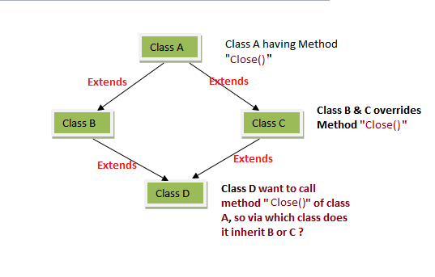

# Concepts of Programming

## General Concepts

### Variables and scoping

#### Closure

```js
function getClosure() {
  var text = "variable 1";
  return function () {
    return text;
  };
}

var closure = getClosure();
console.log(closure()); // 'variable 1'
```

```js
let i;
for (i = 0; i < 10; i++) {
  setTimeout(function () {
    console.log(i);
  }, 100);
}
// 10, 10, 10, 10, 10..
```

```js
let i;
for (i = 0; i < 10; i++) {
  (function (j) {
    setTimeout(function () {
      console.log(j);
    }, 100);
  })(i);
}
// 1, 2, 3, 4, 5, 6..
```

- Usually when a function is defined and used within a function, it is called a closure.
- It is the combination of a function bundled together (enclosed) with references to its surrounding state (the lexical environment).
- In other words, a closure gives you access to an outer function’s scope from an inner function. In JavaScript, closures are created every time a function is created, at function creation time.

#### Primitive data types

- (In JS) a primitive data type is data that is not an object and has no methods. There are 7 primitive data types in JS:
  - string
  - number(includes integer, float, Infinity and NaN)
  - [bigint](https://developer.mozilla.org/en-US/docs/Web/JavaScript/Reference/Global_Objects/BigInt)
  - boolean
  - undefined
  - null
  - [symbol](https://developer.mozilla.org/en-US/docs/Web/JavaScript/Reference/Global_Objects/Symbol) : a type that contains a unique identifier for an object
- Most of time its value is represented directly at the lowerest level of the language implementation.
- Primitives are immutable i.e. they cannot be altered.

### Type System

- Type is an attribute of data that signifies properties of the data.
- A type is defined in terms of its physical representation and composition.
  - int8: 8 buts thaht represent a natural number
  - float32: 32bits that represents a real number
  - bool: a value that can represent the two logical states of true or false
  - grapheme: a single valid unicode grapheme / glyph?
  - pair: a pair of values `<int, int>`
  - union: value that may have several formats within the same positionh in memory: `{int, float, string, array, object}`

#### Static/dynamic typing

- Static typing
  - Type checking is performed at compile-time.
  - For some languages, user must specify what type each variable is.
  - Once variable's type is set, it cannot be changed.
  - Bug can be caught at a very early stage.
  - Generally it's faster, because compiler knows the exact data type already.
  - C, C++, Java, Haskell, Rust, Go, Typescript

```java
// java

int data;
data = 50;
data = "Hello World!"; // compilation error!
```

- Dynamic typing
  - Type checking is performed at run-time.
  - After variable's type is set, it can be changed later.
  - You can make faster progress but bug might not be caught in early stage.
  - Generally it's less optimized, because compiler doesn't know the exact data type already.
  - It depends on type inference.
  - Python, Ruby, Javascript

```js
// js
let data = "2" + 2;
console.log(data); // "22"
```

#### Typing

##### Structural Typing

```ts
type Person = {
  name: string;
  age: number;
};

type Student = {
  name: string;
  age: number;
};

const person: Person = {
  name: "John",
  age: 30,
};

const doe: Student = person; // no problem
console.log(doe); // { name: "John", age: 30 }
```

- It is a system that uses structure to define the type of data. If structure is same, it's considered to be the same type.
- i.e. if `x` has at least the same members as `y`, `y` is compatible with `x`.

##### Nominal Typing

```ts
type Person = {
  name: string;
  age: number;
};

type Student = {
  name: string;
  age: number;
};

const person: Person = {
  name: "John",
  age: 30,
};

const doe: Student = person;
// Error: Person is not assignable to Student
```

- It is a system that uses names to define the type of data.
- Object can be only considered as a type if it's explicitly declared to be, so it has a reduced flexibility.

##### Duck Typing

```js
class Duck {
  sound() {
    console.log("Quack");
  }
}

class Dog {
  sound() {
    console.log("Woof");
  }
}

const duck = new Duck();
const dog = new Dog();
[duck, dog].forEach((animal) => animal.sound()); // Quack, Woof
```

- It's a dynamic typing, set of variables and methods of an object determines the type of the object.
- If two or more unrelated objects respond to the same set of methods, they are considered to be compatible.

### Type inference

- Type inference refers to the automatic detection of the type of an expression. It is a process of analyzing the code and figuring out what type of data is being used.

```ts
let x: number = 3; // x: number type
let y = 3; // y: infered to number type

// best common type
let x = [0, 1, null]; // x: array type of num or null

// no type inference, no explicit typing
let zoo = [new Rhino(), new Elephant(), new Snake()];
// zoo: union array type of rhino or elephant or snake

let zoo: Animal[] = [new Rhino(), new Elephant(), new Snake()];
// zoo: type array of animal with explicit type
```

- Contextual Type

```ts
// checking types in other direction too
window.onMouseDown = function (mouseEvent) {
  console.log(mouseEvent.button); //<- OK
  console.log(mouseEvent.kangaroo); //<- error!
};
```

- Here, the TypeScript type checker used the type of the Window.onmousedown function to infer the type of the function expression on the right hand side of the assignment. When it did so, it was able to infer the type of the mouseEvent parameter, which does contain a button property, but not a kangaroo property.

[Type inference in TS](https://www.typescriptlang.org/docs/handbook/type-inference.html)

## Object-oriented concepts

- Classes and objects

- Class is a special function that is a template for creating objects.
- In JS ES6, it's built on prototypes but it still has syntax and semantics for it.
- It encapsulates data with code to manipulate that data.

### Encapsulation

- it is used to hide the value or state of object inside a class, preventing accidental access to it.
- property access method
  - public: can be accessed from anywhere
  - protected: cannot be accessed from anywhere but the child class
  - private members cannot be accessed from anywhere but the class itself

```cpp
// cpp

#include <iostream>
using namespace std;

class Rectangle {
private:
  int w, h;

public:
  void size(int length, int height) {
    w = length;
    h = height;
  }
  int area() { return w * h; }
};

int main() {
  Rectangle r1, r2;
  r1.size(2, 3);
  r2.size(4, 5);
  cout << "Area of r1: " << r1.area() << endl;
  cout << "Area of r2: " << r2.area() << endl;
  return 0;
}
```

### Inheritance

- Inheritance is the process of copying all the members of a parent class to a child class.
- It is used to share code and behavior.
- member property cannot be overridden.
- member function can be overridden in child class.

#### Javascript single inheritance

```js
class Person {
  constructor(first, last) {
    this.name = { first, last };
  }

  // public on default
  intro() {
    return "I'm not a student and my name is " + this.name.first;
  }
}

// inherits Person class
class Student extends Person {
  // private member
  #grade;

  constructor(first, last, subject, grade) {
    // calling parent constructor
    super(first, last);

    // now 'this' is initialized
    this._subject = subject; // use '_' to create a separated value to store
    this.#grade = grade;
  }

  // method override
  intro() {
    return "I'm a student and my name is " + this.name.first;
  }

  get subject() {
    return this._subject;
  }

  set subject(newSubject) {
    this._subject = newSubject;
  }
}

const p = new Person("John", "Doe");
const j = new Student("Jongwoo", "Park", "CoP", 100);

console.log(p.intro()); // I'm not a student..
console.log(j.intro()); // I'm a student..
console.log(j.name); // {first: "Jongwoo", last: "Park"}
console.log(j.grade); // undefined
console.log(j.subject); // getter, "CoP"
j.subject = "FE"; // setter
console.log(j.subject); // "FE"
```

#### Typescript Interface inheritance

```ts
interface ITodo {
  id: number;
  content: string;
  completed: boolean;
}

// Todo class must use ITodo interface with implements keyword
class Todo implements ITodo {
  constructor(
    public id: number,
    public content: string,
    public completed: boolean
  ) {}
}

const todo = new Todo(1, "CoP", false);

console.log(todo); // Todo: {id: 1, content: "CoP", completed: false}
```

### Multiple inheritance

- Multiple inheritance allows a child class to inherit from more than one parent class.



- Diamond Problem: If a child class inherits from more than one parent class of same function member or method, it gets collide.

### Polymorphism


- It is a practice of designing objects to share behaviors and to be able to override shared behaviors with specific ones.
- Method overriding is when a subclass inherits a method from its super class and its customising or completely replacing the behaviour of that method. So the methods in different classes can share the same name, same parameters but different functionality.

```js
// polymorphism

// parent class
class Person {
  constructor(age, weight) {
    this.age = age;
    this.weight = weight;
  }

  getInfo() {
    return this.age + " years old " + "and weighs " + this.weight + "kg.";
  }
}

// child class
class Employee extends Person {
  constructor(age, weight, salary) {
    super(age, weight);
    this.salary = salary;
  }

  // method override
  getInfo() {
    return "Salary is " + this.salary + " and " + super.getInfo() + ".";
  }
}

const person = new Person(50, 90);
const employee = new Employee(30, 70, 99999);

// same method, different result
console.log(person.getInfo()); // 50 years old..
console.log(employee.getInfo()); // My salary is ..
```

## Functional programming concepts

### Pure functions

```js
// impure function
const arr = [1, 2, 3];
const addElement = (arr, element) => {
  arr.push(element); // altering the original arr
  return arr;
};

// pure function
const arr = [1, 2, 3];
const addElement = (arr, element) => {
  // return new array while original arr is not changed
  return [...arr, element];
};
```

- A pure function is a function that

  - is deterministic, given the same input, always returns the same output.
  - produces no side effects.
  - is easier to test because mocking is not needed.
  - is easy to construct and reconfigure.
    - Because simple functions are written first and further combined at a higher level.

- Code with **referential transparency** has following characteristics

  1. self-contained, it doesn't depend on the code outside of the function, user only need to provide valid argument/parameters.
  2. deterministic, it always produces the same output given the same input.
  3. No exception, out of memory/stack overflow error is considered bug and beyond the control of user.
  4. Don't create conditions for other code e.g. not changing the value of parameter or change the data outside of the function
  5. Operation doesn't depend on external condition e.g. database, file system or network

### Anonymous functions and lambda expressions

#### Anonymous Function

```js
someButton.click(function (event) {
  /*do something*/
});
```

- It is a function that doesn't have any name related to it.
- It's not accessible after its initial creation.
- It's often used as a callback function.

##### Arrow Function

```js
someButton.click((e) => {
  /*do something*/
});

const buttonClicked = SomeButton.click((e) => {
  /*do something*/
});
```

- It's a shorthand for declaring anonymous function in ES6.
- It can be assigned to a variable for later use.

### Higher-order functions

- It's a functions that operate on other function, either by taking them as argument or by returning them.
- i.e. it receives a function as an argument or returns the function as output.

#### Map

```js
// without higher order function
const arr1 = [1, 2, 3];
const arr2 = [];

for (let i = 0; i < arr1.length; i++) {
  arr2.push(arr1[i * 2]);
}

console.log(arr2); // [2, 4, 6]
```

```js
// with higher order function
const arr1 = [1, 2, 3];
const arr2 = arr1.map((i) => i * 2);
console.log(arr2); //[2, 4, 6]
```

- Map method creates a new array by calling the callback function provided as an argument on **every** element in the input array.
- It creates a new array with the value from the callback function inside.

#### Filter

```js
// without higher order function
const persons = [
  { name: "Peter", age: 16 },
  { name: "Mark", age: 18 },
  { name: "John", age: 27 },
  { name: "Jane", age: 14 },
  { name: "Tony", age: 24 },
];

const fullAge = [];

for (let i = 0; i < persons.length; i++) {
  if (persons[i].age >= 18) {
    fullAge.push(persons[i]);
  }
}
console.log(fullAge);
```

```js
const persons = [
  { name: "Peter", age: 16 },
  { name: "Mark", age: 18 },
  { name: "John", age: 27 },
  { name: "Jane", age: 14 },
  { name: "Tony", age: 24 },
];

const fullAge = persons.filter((person) => person.age >= 18);
console.log(fullAge);
```

- Filter method creates a new array with all elements that pass the condition provided by the callback function.
- The callback passed to the filter() accepts 3 arguments: element, index and array.

#### Reduce

```js
// without higher order function
const arr = [1, 3, 5, 7];

function sum(arr) {
  let sum = 0;
  for (let i = 0, i < arr.length; i++) {
    sum += arr[i];
  }
  return sum;
}
console.log(sum(arr)); // 16
```

```js
// with higher order function
const arr = [1, 3, 5, 7];

function sum(arr) {
  const reducer = (sum, val) => sum + val;
  const initialValue = 0;
  return arr.reduce(reducer, initialValue);
}

console.log(sum(arr)); // 16)
```

- Reduce method executes the callback on each member of the array which results in a single output value.
- reduce() accepts two parameters: reducer function(callback) and optional initial value.
- Callback reducer function accepts four params: accumulator, currentValue, index and array.
- If initialValue is not provided, it takes first element of the input array.

#### Recursion

```js
const sumRange = (n) => {
  if (n === 1) {
    return 1;
  }
  return n + sumRange(n - 1);
};

// sumRange(3)
//          3 + sumRange(2)
//                       2 + sumRange(1)
//                                    1
//                                    break
// 6
```

- It is a process or function that calls itself until the base condition is met.
- It is often used to solve problems that conotain smaller sub-problems.

#### Currying

```js
const transferMoney = (name) => {
  return function (amount) {
    return function (fromAccount) {
      return function (toAccount) {
        return `${name} transfered €${amount} from ${fromAccount} to ${toAccount} account.`;
      };
    };
  };
};

console.log(transferMoney("Jongwoo")(9999)("Savings")("Checking"));
// Jongwoo transfered €9999 from Savings to Checking account.
```

- It's a transformation of function that takes multiple arguments into a sequence of functions, each expecting a single argument.
- It is a checking method to make sure that everything checks in before you proceed.
- It divides functions into smaller chunk, making functions more pure and less prone to error.

## Advanced Topics

- Memory Management
  - Heap and stack
  - Manual cleanup vs. garbage collection
- Reflection
- Generics
- Language Implementation (Compilers/Interpreters)
  - Lexical analysis
  - Parsing
  - Semantic analysis (type checking, static analysis)
  - Code optimization
  - Code generation
