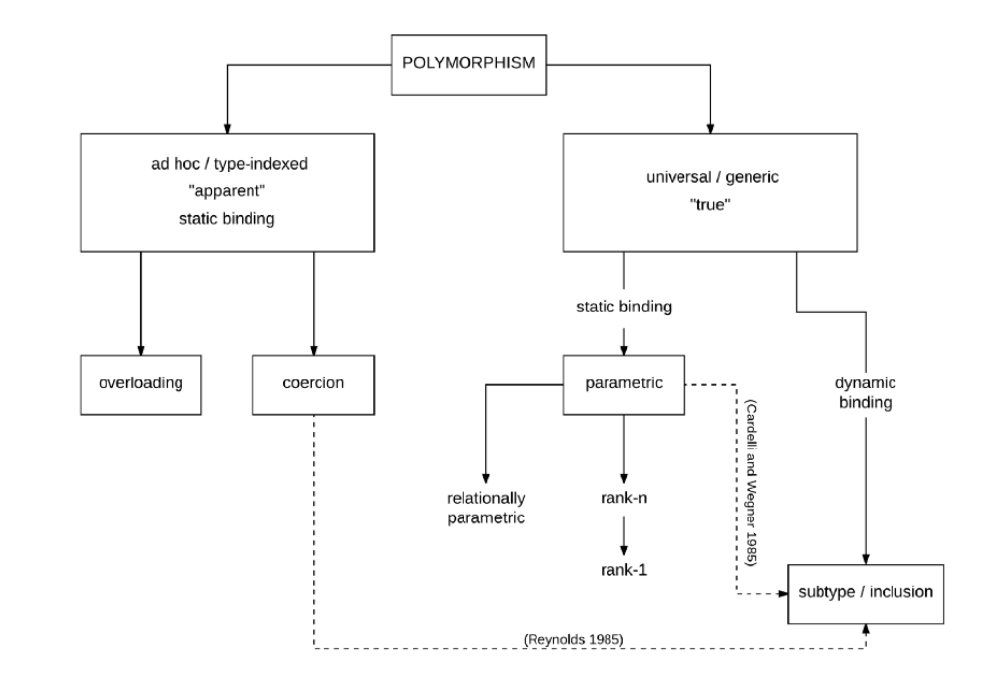

# Concepts of Programming

## General Concepts

### Variables and scoping

#### Primitive data types

- (In JS) a primitive data type is data that is not an object and has no methods. There are 7 primitive data types in JS:
  - string
  - number(includes integer, float, Infinity and NaN)
  - [bigint](https://developer.mozilla.org/en-US/docs/Web/JavaScript/Reference/Global_Objects/BigInt)
  - boolean
  - undefined
  - null
  - [symbol](https://developer.mozilla.org/en-US/docs/Web/JavaScript/Reference/Global_Objects/Symbol)
- Most of time its value is represented directly at the lowerest level of the language implementation.
- Primitives are immutable i.e. they cannot be altered.
- It is important not to confuse a primitive itself with a variable assigned a primitive value. The variable may be reassigned a new value, but the existing value cannot be changed in the ways that objects, arrays, and fuunctions can be altered.

### Type System

- Type is an attribute of data that signifies properties of the data.
- A type is defined in terms of its physical representation and composition.
  - int8: 8 buts thaht represent a natural number
  - float32: 32bits that represents a real number
  - bool: a value that can represent the two logical states of true or false
  - grapheme: a single valid unicode grapheme / glyph?
  - pair: a pair of values `<int, int>`
  - union: value that may have several formats within the same positionh in memory: `{int, float, string, array, object}`

#### Static/dynamic typing

- Static typing
  - Type checking is performed at compile-time.
  - For some languages, programmer must specify what type each variable is.
  - Once variable's type is set, it cannot be changed.
  - Bug can be caught at a very early stage.
  - Generally it's faster, because compiler knows the exact data type already.
  - C, C++, Java, Haskell, Rust, Go, Typescript

```java
// java

int data;
data = 50;
data = "Hello World!"; // compilation error!
```

- Dynamic typing
  - Type checking is performed at run-time.
  - After variable's type is set, it can be changed later.
  - You can make faster progress but bug might not be caught in early stage.
  - Generally it's less optimized, because compiler doesn't know the exact data type already.
  - It depends on type inference.
  - Python, Ruby, Javascript

```js
// js
let data = "2" + 2;
console.log(data); // "22"
```

### Type inference

- Type inference refers to the automatic detection of the type of an expression. It is a process of analyzing the code and figuring out what type of data is being used.

```ts
// ts

let x: number = 3; // x: number type
let y = 3; // y: infered to number type
const z = 3; // z: infered to 3 type

// best common type
let x = [0, 1, null]; // x: array type of num or null

// no type inference, no explicit typing
let zoo = [new Rhino(), new Elephant(), new Snake()];
// zoo: union array type of rhino or elephant or snake

let zoo: Animal[] = [new Rhino(), new Elephant(), new Snake()];
// zoo: type array of animal with explicit type
```

- Contextual Type

```ts
// checking types in other direction too
window.onMouseDown = function (mouseEvent) {
  console.log(mouseEvent.button); //<- OK
  console.log(mouseEvent.kangaroo); //<- error!
};
```

[Type inference in TS](https://www.typescriptlang.org/docs/handbook/type-inference.html)

## Object-oriented concepts

- Classes and objects

- Class is a special function that is a template for creating objects.
- In JS ES6, it's built on prototypes but it still has syntax and semantics for it.
- It encapsulates data with code to manipulate that data.

### Encapsulation

- it is used to hide the value or state of object inside a class, preventing accidental access to it.
- access method
  - public: can be accessed from anywhere
  - protected: cannot be accessed from anywhere but the child class
  - private: cannot be accessed from anywhere but the class itself

```cpp
// cpp

#include <iostream>
using namespace std;

class Rectangle {
private:
  int w, h;

public:
  void size(int length, int height) {
    w = length;
    h = height;
  }
  int area() { return w * h; }
};

int main() {
  Rectangle r1, r2;
  r1.size(2, 3);
  r2.size(4, 5);
  cout << "Area of r1: " << r1.area() << endl;
  cout << "Area of r2: " << r2.area() << endl;
  return 0;
}
```

### Inheritance

- Inheritance is the process of copying all the members of a parent class to a child class.
- It is used to share code and behavior.
- member property cannot be overridden.
- member function can be overridden in child class.

#### Javascript single inheritance

```js
class Person {
  constructor(first, last) {
    this.name = { first, last };
  }

  // public on default
  intro() {
    return "I'm not a student and my name is " + this.name.first;
  }
}

// inherits Person class
class Student extends Person {
  // private member
  #grade;

  constructor(first, last, subject, grade) {
    // calling parent constructor
    super(first, last);

    // now 'this' is initialized
    this._subject = subject; // use '_' to create a separated value to store
    this.#grade = grade;
  }

  // method override
  intro() {
    return "I'm a student and my name is " + this.name.first;
  }

  get subject() {
    return this._subject;
  }

  set subject(newSubject) {
    this._subject = newSubject;
  }
}

const p = new Person("John", "Doe");
const j = new Student("Jongwoo", "Park", "CoP", 100);

console.log(p.intro()); // I'm not a student..
console.log(j.intro()); // I'm a student..
console.log(j.name); // {first: "Jongwoo", last: "Park"}
console.log(j.grade); // undefined
console.log(j.subject); // getter, "CoP"
j.subject = "FE"; // setter
console.log(j.subject); // "FE"
```

#### Typescript Interface inheritance

```ts
interface ITodo {
  id: number;
  content: string;
  completed: boolean;
}

// Todo class must use ITodo interface with implements keyword
class Todo implements ITodo {
  constructor(
    public id: number,
    public content: string,
    public completed: boolean
  ) {}
}

const todo = new Todo(1, "CoP", false);

console.log(todo); // Todo: {id: 1, content: "CoP", completed: false}
```

### Multiple inheritance

- Multiple inheritance allows a child class to inherit from more than one parent class.


- Diamond Problem: If a child class inherits from more than one parent class of same function member or method, it gets collide.

### Polymorphism



- It is a practice of designing objects to share behaviors and to be able to override shared behaviors with specific ones.
- Method overriding is when a subclass inherits a method from its super class and its customising or completely replacing the behaviour of that method. So the methods in different classes can share the same name, same parameters but different functionality.

```js
// polymorphism

// parent class
class Person {
  constructor(age, weight) {
    this.age = age;
    this.weight = weight;
  }

  getInfo() {
    return this.age + " years old " + "and weighs " + this.weight + "kg.";
  }
}

// child class
class Employee extends Person {
  constructor(age, weight, salary) {
    super(age, weight);
    this.salary = salary;
  }

  // method override
  getInfo() {
    return  My salary is " + this.salary + " and " + super.getInfo() + ".";
  }
}

const person = new Person(50, 90);
const employee = new Employee(30, 70, 99999);

// same method, different result
console.log(person.getInfo()); // 50 years old..
console.log(employee.getInfo()); // My salary is ..
```

## Functional concepts

- Pure functions and referential transparency
- Anonymous functions and lambda expressions
- Higher-order functions (e.g., map, filter, reduce)

## Advanced Topics

- Memory Management
  - Heap and stack
  - Manual cleanup vs. garbage collection
- Reflection
- Generics
- Language Implementation (Compilers/Interpreters)
  - Lexical analysis
  - Parsing
  - Semantic analysis (type checking, static analysis)
  - Code optimization
  - Code generation
