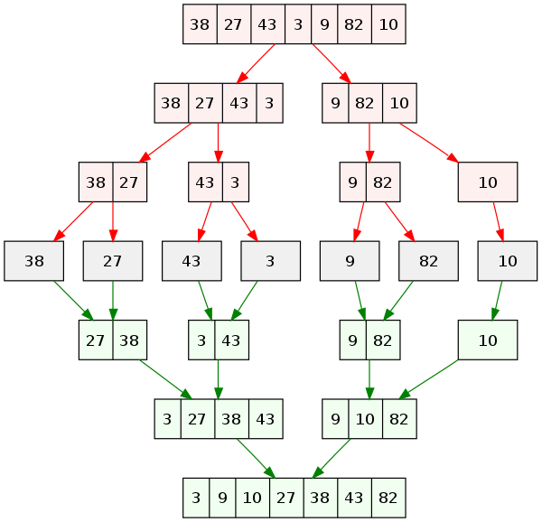

<!-- @import "[TOC]" {cmd="toc" depthFrom=1 depthTo=6 orderedList=false} -->
__CODE University 2021 Fall Semester<br />__
__SE_02 Algorithms and Data Structures<br />__
Jongwoo Park<br />
***
<!-- code_chunk_output -->

- [Algorithms](#algorithms)
  - [1. Analysis of Algorithms](#1-a-nameanalysisofalgorithmsaanalysis-of-algorithms)
    - [1.1. What's The Goal of The Algorithm?](#11-a-namewhatsthegoalofthealgorithmawhats-the-goal-of-the-algorithm)
    - [1.2. Time and Space Complexity Theory](#12-a-nametimeandspacecomplexitytheoryatime-and-space-complexity-theory)
      - [1.2.1. Time Complexity](#121-a-nametimecomplexityatime-complexity)
      - [1.2.2. Space Complexity](#122-a-namespacecomplexityaspace-complexity)
    - [1.3. Big O Notation](#13-a-namebigonotationabig-o-notation)
      - [1.3.1. Definition](#131-a-namedefinitionadefinition)
        - [Big O Example 1](#big-o-example-1)
        - [Big O Example 2](#big-o-example-2)
        - [Big O Example 3](#big-o-example-3)
      - [1.3.2. Constants Don't Matter](#132-a-nameconstantsdontmatteraconstants-dont-matter)
      - [1.3.3. Smaller Terms Don't Matter](#133-a-namesmallertermsdontmatterasmaller-terms-dont-matter)
      - [1.3.4. Best, Average and Worst Case](#134-a-namebestaverageandworstcaseabest-average-and-worst-case)
      - [1.3.5. Shorthands For Big O Notation](#135-a-nameshorthandsforbigonotationashorthands-for-big-o-notation)
      - [1.3.6. Logarithms](#136-a-namelogarithmsalogarithms)
      - [1.3.7. Visualizing Complexities](#137-a-namevisualizingcomplexitiesavisualizing-complexities)
    - [1.4. Recursion](#14-a-namerecursionarecursion)
      - [1.4.1. Definition](#141-a-namedefinition-1adefinition)
      - [1.4.2. Call Stack](#142-a-namecallstackacall-stack)
      - [1.4.3. Why Recursion?](#143-a-namewhyrecursionawhy-recursion)
      - [1.4.4. Base Case](#144-a-namebasecaseabase-case)
      - [1.4.5. Example of Recursion 1](#145-a-nameexampleofrecursion1aexample-of-recursion-1)
      - [1.4.6. Example of Recursion 2](#146-a-nameexampleofrecursion2aexample-of-recursion-2)
    - [1.5. Searching Algorithms](#15-a-namesearchingalgorithmsasearching-algorithms)
      - [1.5.1. Linear Search](#151-a-namelinearsearchalinear-search)
        - [Linear Search Example](#linear-search-example)
      - [1.5.2. Binary Search](#152-a-namebinarysearchabinary-search)
        - [Divide and Conquer](#divide-and-conquer)
        - [Binary Search Example](#binary-search-example)
      - [1.5.3. Naive String Search](#153-a-namenaivestringsearchanaive-string-search)
        - [Naive String Searach Example](#naive-string-searach-example)
    - [1.6. Sorting](#16-a-namesortingasorting)
      - [1.6.1. What is Sorting?](#161-a-namewhatissortingawhat-is-sorting)
      - [1.6.2. swap(): sorting helper function](#162-a-nameswapsortinghelperfunctionaswap-sorting-helper-function)
      - [1.6.3. Bubble Sort](#163-a-namebubblesortabubble-sort)
        - [How it works?](#how-it-works)
        - [Bubble Sort Example](#bubble-sort-example)
        - [Bubble Sort Optimization](#bubble-sort-optimization)
        - [Big O of Bubble Sort](#big-o-of-bubble-sort)
      - [1.6.4. Selection Sort](#164-a-nameselectionsortaselection-sort)
        - [Example of Selection Sort](#example-of-selection-sort)
        - [Big O of Selection Sort](#big-o-of-selection-sort)
      - [1.6.5. Insertion Sort](#165-a-nameinsertionsortainsertion-sort)
        - [Example of Insertion Sort](#example-of-insertion-sort)
        - [Big O of Insertion Sort](#big-o-of-insertion-sort)
      - [1.6.6. Comparing Bubble, Selection and Insertion Sort](#166-a-namecomparingbubbleselectionandinsertionsortacomparing-bubble-selection-and-insertion-sort)
      - [1.6.7. Merge Sort](#167-a-namemergesortamerge-sort)
        - [Merge Helper Function](#merge-helper-function)
        - [Example of Merge Sort](#example-of-merge-sort)
        - [Big O of Merge Sort](#big-o-of-merge-sort)
      - [1.6.8. Quick Sort](#168-a-namequicksortaquick-sort)
        - [Quick Sort Pivot Helper Function](#quick-sort-pivot-helper-function)
        - [Picking a Pivot](#picking-a-pivot)
        - [Pivot Helper Pseudocode](#pivot-helper-pseudocode)
        - [Pivot Helper](#pivot-helper)
        - [Quicksort Pseudocode](#quicksort-pseudocode)
        - [Quicksort Implementation](#quicksort-implementation)
        - [Big O of Quick Sort](#big-o-of-quick-sort)

<!-- /code_chunk_output -->


***

# Algorithms

## 1. <a name='AnalysisofAlgorithms'></a>Analysis of Algorithms

### 1.1. <a name='WhatsTheGoalofTheAlgorithm'></a>What's The Goal of The Algorithm?

The scale of the program grows over time and the amount of data that needs to be processed increases. If the amount of input data is small, ignoring it may not matter much. But if the amount of it is large, the difference in efficiency between algorithms will inevitably increase.

Below code is famous example of necessity of good algorithm, the [fast inverse square root implementation from Quake 3 Arena(1999)](https://www.wikiwand.com/en/Fast_inverse_square_root#/Aliasing_to_an_integer_as_an_approximate_logarithm), which was used in lighting effect part in the game. The purpose of this function was used in digital signal processing for computing the reflection of lighting and shading, expecting to have a return of normalized vector.

```cpp
float Q_rsqrt( float number )
{
 long i;
 float x2, y;
 const float threehalfs = 1.5F;

 x2 = number * 0.5F;
 y  = number;
 i  = * ( long * ) &y;                       // evil floating point bit level hacking
 i  = 0x5f3759df - ( i >> 1 );               // what the fuck? 
 y  = * ( float * ) &i;
 y  = y * ( threehalfs - ( x2 * y * y ) );   // 1st iteration
// y  = y * ( threehalfs - ( x2 * y * y ) );   // 2nd iteration, this can be removed

 return y;
}
```

I still don't fully understand the implementation detail of this function but the the gist of it is, the programmer tried to simplify the existing algorithm to be more efficient with pointer reference, shifiting bit, deduction and multiplication. The function didn't necessarily need to calculate the precise float values, rather a approximation of a certain duducted constant which in this case was `0x5f3759df`. The result was a very fast function that allows a bit of margin of error but much faster performance.

<p align="center">
  
  <center>The difference between fast InvSqrt() and the original libstdc direct inversison of square root</center>
</p>

### 1.2. <a name='TimeandSpaceComplexityTheory'></a>Time and Space Complexity Theory

#### 1.2.1. <a name='TimeComplexity'></a>Time Complexity

- Time Complexity refers to the time it takes to solve a problem and a function of the input.
- It quantifies the amount of time by taking an algorithm that works as a function of the length of the represented input.
- It is usually expressed using Big O Notation, which is a method of excluding coefficient and low-order terms from a mathematical expression.
- It doesn't indicate the absolute execution time of an algorithm, rather indicates how many operations are performed to execute an algorithm.

#### 1.2.2. <a name='SpaceComplexity'></a>Space Complexity

- Space Complexity refers to the amount of resource space required to complete a program after running it.
- Total space requirement can be fixed and variable space.
- Fixed space refers to the requirement for space regardless of the number or size of input and output.
- Variable space is the space required for structured variables that its size depends on the particular instance of the calculation, i.e. the dynamic space.

To my understanding, time and space tend to be inversly proportional, the algorithm's quality is usually basaed on time complexity. But it'll depend on the problem.

### 1.3. <a name='BigONotation'></a>Big O Notation

#### 1.3.1. <a name='Definition'></a>Definition

- Big O Notation is a way of generalizing code and comparing its performance to other pieces of code regardless of machine/runtime it is running on.
- It is way to formalize the time and space complexity of an algorithm.
- It cares about trend, not the detail(constant) inside.
- Big O Notation can be expressed as `O(n)`.

Let's say make a function that takes an array of integers and returns the sum of all the integers in the array.

##### Big O Example 1

```js
function addUpTo(n) {
  let total = 0;
  for (let i = 1; i <= n; i++) {
    total += i;
  }
  return total;
}
```

The number of operation is eventually bounded by a multiple of n. this function takes an argument of interger `n` and returns the sum of all the integers from 1 to `n`. In this case, Big O of this function is `O(n)`.

```js
function addUpTo(n) {
  return (n * (n + 1)) / 2;
}
```

This function has always 3 operations no matter what argument is, so Big O of this function is `O(1)`.

##### Big O Example 2

```js
function countUpAndDown(n) {
  console.log("going up");
  for (let i = 0; i < n; i++) {
    console.log(i);
  }
  console.log("At the top! \n Going down");
  for (let j = n - 1; j >= 0; j--) {
    console.log(j);
  }
  console.log("Back to the ground. bye");
}
```

`countUpAndDown()` prints out the message n times, then prints out the message at exact n, and it goes down till it reaches the baseline 0. This functions has n + n + 1 operations, so Big O of this function is `O(n)`.

##### Big O Example 3

```js
function printAllPairs(n) {
  for (let i = 0; i < n; i++) {
    for (let j = 0; j < n; j++) {
      console.log(i, j);
    }
  }
}
```

`printAllPairs()` is consist of O(n) operation inside of an O(n) operation, so Big O is O(n^2), a exponential growth of calculation.

#### 1.3.2. <a name='ConstantsDontMatter'></a>Constants Don't Matter

- In general, proportional input of constant doesn't affect the time complexity much.

```
O(2n)       // wrong
O(n)        // right

O(500)      // wrong
O(1)        // right

O(13n^2)    // wrong
O(n^2)      // right
```

#### 1.3.3. <a name='SmallerTermsDontMatter'></a>Smaller Terms Don't Matter

```
O(n+10)        // wrong
O(n)           // right

O(100n + 50)   // wrong
O(n)           // right

O(n^2 + 5n + 8)// wrong
O(n^2)         // right
```

#### 1.3.4. <a name='BestAverageandWorstCase'></a>Best, Average and Worst Case

Asymptotic notations can be refered to best, average and worst case. In reality, worst case Big O is often most used because many times algorithms can be O(1) if a specific data or edge case is provided.

- Big O Notation
  - Worst, it gives a lower bound  for the time complexity.
- Big Theta Notation
  - Average of big O and big Omega, it gives a middle bound for the time complexity.
- Big Omega Notation
  - Best case, any algorithm for same problem can't be faster than Big Omega Notation.

#### 1.3.5. <a name='ShorthandsForBigONotation'></a>Shorthands For Big O Notation

- Arithmetic operations(addition, subtraction, multiplication, division) are usually constant
- Variable assignment is usually constant.
- Accessing elements in an array (by index) or object(by key) is constant.
- In a loop, the complexity is the length of the loop times the complexity of whatever happens inside the loop.

```
1. O(n + 10) -> O(n)
2. O(100\*n) -> O(n)
3. O(25) -> O(1)
4. O(n^2 + n^3) -> O(n^3)
5. O(n + n + n + n) -> O(n)
```

<!-- FIXME logarithm markdown formatting  -->
#### 1.3.6. <a name='Logarithms'></a>Logarithms

- Logarithm is the inverse of exponentiation
- $log{_2}{(8)} = 3$
- $log{_2}{(value)} = exponent$
- $2^{exponent} = value$
- We can omit the base `2` ($log$ === $log{_2}$)

- The logarithm of a number roughly measures the number of times you can divide that number by 2 **before you get a value that's less than or equal to one**
- Certain searching algorithms have logarithmic time complexity
- Efficient sorting algorithms involve log
- Recursion sometimes involves logarithmic space complexity

#### 1.3.7. <a name='VisualizingComplexities'></a>Visualizing Complexities


<!-- ### Problem Solving Approach

- A process or set of steps to accomplish a certain task
- The steps are usually small and easy to understand

####  1.3.8. <a name='UnderstandProblems'></a>Understand Problems

- Can I restate the problem in my own words?
- Checking out what's in and out
  - what are the inputs that go into the problem?
  - what are the outputs that should come from the solution to the problem?
- Can the outputs be determined from the inputs?
- Do I have enough information to solve the problem?

####  1.3.9. <a name='RefactoringQuestions'></a>Refactoring Questions

- Can you check the result?
- Can you derive the result differently?
- Can you understand it at a glance?
- Can you use the result or method for some other problem?
- Can you improve the performance of your solution?
- Can you think of other ways to refactor?
- How have other people solved this problem? -->

### 1.4. <a name='Recursion'></a>Recursion

#### 1.4.1. <a name='Definition-1'></a>Definition

- A process or function that calls itself.
- e.g. JSON.parse, JSON.stringify, document.getElementById(), DOM traversal algorithms, object traversal and so on.

#### 1.4.2. <a name='CallStack'></a>Call Stack

- In most program languages, there is a built-in data structure that manages what happens when functions are invoked.
- Any time a function is invoked, it is placed(pushed) on top of the call stack.
- When Javascript sees the `return` keyword or when the function ends, the compiler will remove(pop).

#### 1.4.3. <a name='WhyRecursion'></a>Why Recursion?

- In general, functions are being pushed on the call stack and popped off when they are done.
- When writing recursive functions, we keep pushing new functions onto the call stack.

#### 1.4.4. <a name='BaseCase'></a>Base Case

- The condition where recursion ends.

#### 1.4.5. <a name='ExampleofRecursion1'></a>Example of Recursion 1

```js
function countDown(n) {
  for (let i = n; i>0; i--) {
    console.log(i);
  }
  console.log("Done!");
}

// print n
// print n-1
// print n-2
// ...
// print "Done!"

function countDownRecursively(n) {
  if (n <= 0) { // base case
    console.log("Done!");
    return;
  }
  console.log(n);
  n--;
  countDown(n);
}

// print n
// countDown(n-1)
// print n-1
// countDown(n-2)
// print n-2
// ...
// print Done!
```

- `countDown()` uses for loop to print out the numbers from n to 0, then it prints out the message.
- `countDownRecursively()` checks the condition if `n` is smaller than 0, then proceeds to print out the n and then it calls it self again recursively.

#### 1.4.6. <a name='ExampleofRecursion2'></a>Example of Recursion 2

```js
function sumRange(n) {
  if (n === 1) {
    return 1;
  }
  return n + sumRange(n-1);
}

// sumRange(3)
//   return 3 + sumRange(2)
//                return 2 + sumRange(1)
//                             return 1
// 6
```

### 1.5. <a name='SearchingAlgorithms'></a>Searching Algorithms

#### 1.5.1. <a name='LinearSearch'></a>Linear Search

- It's the simplest search algorithm, checking every single element at a time. e.g. indexOf(), includes(), find(), findIndex()
- Linear searcch accepts an array and a value, looking through the array. And it checks if the current array element is equal to the value.
- If the value is not found, return `-1`.

##### Linear Search Example

```js
function linearSearch(arr, value) {
  for (let i = 0; i < arr.length; i++) {
    if (arr[i] == value) {
      return i;
    }
  }
  return -1;
}
```

- Time complexity grows as the length of `arr` grows, so big O of this linear searach is `O(n)`.

#### 1.5.2. <a name='BinarySearch'></a>Binary Search

- It's a search algorithm that works by comparing the middle element of the array with the value.
- Rather than eliminating one element at a time sequentially, it eliminates half of the array at a time.
- So it's much faster than linear search but __only__ works on sorted array.

##### Divide and Conquer

- Pick a pivot point(usually half length of array) and check the left and right side to find the value.
- If the value is in the left side, then it checks the left side and same goes for right side too.

##### Binary Search Example

```js
function binarySearch(arr, value) {
  let left = 0;
  let right = arr.length - 1;
  while (left <= right) {
    let mid = Math.floor(left + right) / 2;
    if (arr[mid] === value) {
      return mid;
    }
    if (arr[mid] < value) {
      left = mid + 1;
    } else {
      right = mid - 1;
    }
  }
  return -1;
}
```

- This function accepts a __sorted__ array and a value
- Create a left pointer at the start of the array and a right pointer at the end of the array(length - 1)
- While the left pointer comes before the right pointer, check if the middle element is equal to the value.
- If the value is too small, move the left pointer to the middle + 1.
- If the value is too large, move the right pointer to the middle - 1.
- If no value, just return -1.
- Best case would be O(1) and worst/average case would be O(log n).

#### 1.5.3. <a name='NaiveStringSearch'></a>Naive String Search

- It's a search algorithm that checks a smaller string appears in a longer string.
- Naive string search involves checking pairs of character individudally.

##### Naive String Searach Example

```js
let long = "hello world goodbye earth";
let short = "bye";
function naiveStringSearch(long, short) {  
  for (let i = 0; i < long.length; i++) {
    if (long[i] === short[0]) {
      let j = 1;
      while (long[i + j] === short[j]) {
        j++;
        if (j === short.length) {
          return i;
        }
      }
    }
  }
}
```

- First, define a long string and a short string
- Loop over the longer string
- Loop over the shorter string
- If characters don't match, move to the next character in the longer string / break the loop
- If characters do match, keep going
- If character matching complete, increment the count of matches
- return the count of matches
- The best case would be `O(n)` and the worst would show exponential growth of `O(n^2)`

### 1.6. <a name='Sorting'></a>Sorting

#### 1.6.1. <a name='WhatisSorting'></a>What is Sorting?

- It is a process of rearranging the items in a collection so that the items are in order.
- e.g.
  - Numbers from small to large
  - Names in alphabetical order
  - Items in a yearly basis
  - Objects in a price basis
  - [Visualization](https://www.youtube.com/watch?v=kPRA0W1kECg) and [Comparison](https://www.toptal.com/developers/sorting-algorithms) on various sorting algorithms
  - Efficiency is depend on the shape of the data, the number of items and the number of comparisons.

#### 1.6.2. <a name='swap:sortinghelperfunction'></a>swap(): sorting helper function

- Most sorting algorithms commonly involve swapping theh items.

```js
const swap = (arr, index1, index2) =>{
  [arr[index1], arr[index2]] = [arr[index2], arr[index1]];
}
```

#### 1.6.3. <a name='BubbleSort'></a>Bubble Sort

- Not very efficient, but it's a good example of how to implement a sorting algorithm.
- It's called bubble because largest value bubbles up to the top.

##### How it works?

- It loops through each item and compares it to the next item.
- If it's larger than what's comparing it, it swap with it.
- Loop till the largest number goes to the end of array.
- Start over from the beginning, comparing/swapping again till it reaches the next biggest value to the end.
- [Bubble Sort visualization](https://visualgo.net/en/sorting)

##### Bubble Sort Example

```js
function bubbleSort(arr) {
  for (let i = arr.length; i > 0; i--) {
    for (let j = 0; j < i - 1; j++) {
      console.log(arr, arr[j], arr[j + 1]);
      if (arr[j] > arr[j + 1]) {
        swap(arr, j, j + 1);
      }
    }
  }
  return arr;
}
```

- Make a function that accepts an array(assuming unordered numbers)
- Start looping with a variable `i` at the end of the array towards the beginning i.e. shrinking the array backwards.
- Start looping with a variable `j` at the beginning of the array towards the end i.e. expanding the array forwards
- If arr[j] is greater than arr[j+1], swap them.
- Return the sorted array

##### Bubble Sort Optimization

- Within above logic, swap checking happens till it reachs to the end point.
- Make a condition that checks if swap happened or not and if there's no swap, consider it's ordered array without actually looping all over the array, make the loop break.
- Works best with nearly sorted array!
  
```js
function bubbleSort(arr) {
  let noSwap;
  for (let i = arr.length; i > 0; i--) {
    for (let j = 0; j < i - 1; j++) {
      console.log(arr, arr[j], arr[j + 1]);
      if (arr[j] > arr[j + 1]) {
        swap(arr, j, j + 1);
      } else {
        noSwap = false;
      }
    }
    if (noSwap) break;
  }
  return arr;
}
```

##### Big O of Bubble Sort

- In general, it's O(n^2), there's two nested for loops.
- If it's nearly ordered array, it's almost O(n) because of noSwap condition checking.

#### 1.6.4. <a name='SelectionSort'></a>Selection Sort


- It works by finding the smallest element in the array and swapping it with the first element.
- In the first loop, Compare first two value, find the small value and set the index on it and move on till find a smaller value.
- When hit the baseline, swap the first value with the smallest value that was found.
- Repeat the process with second starting point and so on till every element is sorted.
- For optimal result: if minimum is not the one to begin with, swap the two values.

##### Example of Selection Sort

```js
function selectionSort(arr) {
  for (let i = 0; i < arr.length; i++) {
    let min = i;
    for (let j = i + 1; j < arr.length; j++) {
      // comparing the current min with the next value
      console.log(i, j);
      // assign the smaller to the min
      if (arr[j] < arr[min]) {
        min = j;
      }
    }]
    // min is not the first value, swap them
    if (i !== min) {
      swap(arr, i, min);
    }
    // swap the index of the min with the first index
    let temp = arr[i];
    arr[i] = arr[min];
    arr[min] = temp;
  }
  return arr;
}
```

##### Big O of Selection Sort

- In general, it's O(n^2), because of two nested for loops.
- It compares a lot but only swaps one time at the end of the loop.
- It's only effective when trying to minimize the number of swapping.
  
<!-- NOTE very confusing one -->
#### 1.6.5. <a name='InsertionSort'></a>Insertion Sort

- It builds up the sort by gradually creating a larger left half which is always sorted.
- It takes each element and place it where it should go in the sorted half.
- The value being compared moves to the left sorted array by comparing it to the value to the left.
- It gets slower as array grows larger,


##### Example of Insertion Sort

```js
function insertionSort(arr) {
  // we already know the first is sorted
  for (let i = 1; i < arr.length; i++) {
    let currentVal = arr[i];
    let j = i - 1;
    // only compare when the value is smaller than the left
    while (j >= 0 && arr[j] > currentVal) {
      arr[j + 1] = arr[j];
      j--;
    }
    arr[j + 1] = currentVal;
  }
  return arr;
}
```

- First, pick up the second element in the array.q
- Compares the picked up element with the left one and swap it if it's needed.
- Go to next element and if it's in wrong order(or smaller), swap it with the left one.
- Repeat until the array is sorted.

##### Big O of Insertion Sort

- In general, Insertion Sort time complexity is O(n^2) when the array is completely inversed, because of two nested loops.
- Best case would be when the data is almost sorted, it's O(n) because it only swaps once.
- Best usage could be a stream of data in real time, where the items are already pretty much sorted.

#### 1.6.6. <a name='ComparingBubbleSelectionandInsertionSort'></a>Comparing Bubble, Selection and Insertion Sort

<!-- FIXME move these two visual aid after finising sorting part -->
[](https://www.youtube.com/watch?v=kPRA0W1kECg "15 Sorting Algorithms in 6 Minutes")
Visual Comparison of Sorting Algorithms


Sorting Algorithms with Animation

| Algorithm      | Big Omega(best) | Big Theta(avg) | Big O(worst) | Space Complexity |
|----------------|-----------------|----------------|--------------|------------------|
| Bubble Sort    | O(n)            | O(n^2)         | O(n^2)       | O(1)             |
| Insertion Sort | O(n)            | O(n^2)         | O(n^2)       | O(1)             |
| Selection Sort | O(n^2)          | O(n^2)         | O(n^2)       | O(1)             |

|   10^5 rnd int arr  | Bubble Sort | Selection Sort | Insertion Sort |
|:-------------------:|:-----------:|:--------------:|:--------------:|
|       Time took     |     21s     |       6s       |       3s       |

- Bubble and Insertion Sort works well with nearly sorted data but inefficient in most scenario. i.e. don't scale properly
- Selection Sort doesn't work well with nearly sorted data.
- Space Complexities are all same because it is not creating any space(new array or object).
- Though it's inefficient compared to more complex algorithms, all in all it still works well in the small set of data.

#### 1.6.7. <a name='MergeSort'></a>Merge Sort



[Merge Sort Analysis](https://www.wikiwand.com/en/Merge_sort)

- It's a combination of splitting, merging and sorting.
- Arrays of 0 or 1 element are always sorted.
- It works by decomposing an array into smaller arrays of 0 or 1 elements, then building up a newly sorted array(divide and conquer)

##### Merge Helper Function

- For implementing merge sort, it's useful to first implement a separated function for merging two sorted arrays.
- Given two sorted arrays, this helper function will create a new array which is also sorted, and consists of all the elements from the two arrays.
- This function should run in O(n+m) time and O(n+m) space, and should not modify the parameters passed in.

```js
function merge(arr1, arr2) {
  let result = [];
  let i = 0;
  let j = 0;
  while (i < arr1.length && j < arr2.length) {
    if (arr1[i] < arr2[j]) {
      result.push(arr1[i]);
      i++;
    } else {
      result.push(arr2[j]);
      j++;
    }
  }
  while (i < arr1.length) {
    result.push(arr1[i]);
    i++;
  }
  while (j < arr1.length) {
    result.push(arr2[j]);
    j++;
  }
  return result;
}

// or

function merge(arr1, arr2) {
  let result = [];
  while (arr1.length && arr2.length) {
    if (arr1[0] < arr2[0]) {
      result.push(arr1.shift());
    } else {
      result.push(arr2.shift());
    }
  }
  return result.concat(arr1, arr2);
} 
```

- Create an empty array, take a look at the smallest values in each input array.
- While there are still left over values:
  - If the value in the first array is SMALLER than the value in the second array, push the valaue in the first array into our results and move on to the next value in the first array.
  - If the value in the first array is LARGER than the value in the second array, push the value in the second array into our results and move on to the next value in the second array.
  - Once we finish one array, push in all remaining values from the other array.

##### Example of Merge Sort

```js
function mergeSort(arr) {
  if (arr.length <= 1) {
    return arr;
  }
  let mid = Math.floor(arr.length / 2);
  let left = mergeSort(arr.slice(0, mid));
  let right = mergeSort(arr.slice(mid));
  return merge(left, right);
}
```

- Break up the array into halves until you have arrays that are empty or have one element.
- Once you have smaller sorted arrays, merge those arrays with other sroted arrays until you have one sorted array.
- Once the array has been merged back together, return the merged/sorted array.


##### Big O of Merge Sort

| Best       | Avg        | Worst      | Space Complexity |
|------------|------------|------------|------------------|
| O(n log n) | O(n log n) | O(n log n) | O(n)             |

- Best, average and worst case all have the same time complexity.
- No edge case, it doesn't matter if the array is sorted or not, it's still O(n log n).
- Time complexity O(n log n) comes from:
  - `merge()`, it takes O(n) as a size of array to merge grows linearly.
  - `mergeSort()`, it takes O(log n) as the size of array grows logarithmically.
- Space complexity O(n) takes linear growth of the size of the array, It doesn't work well with large data.


#### 1.6.8. <a name='QuickSort'></a>Quick Sort


- First, like merge sort, it exploits the fact that arrays of 0 or 1 elements are always sorted.
- it works by selecting one element(pivot) and and finding the index where the pivot should end up in the sorted array.
- once the pivot is positionted properly, quick sort can be applied on either side of the pivot recursively.

##### Quick Sort Pivot Helper Function

- in order to implement quick sort, it's useful to first implement a function responsible for arranging elements in an array on either side of a pivot(partition).
- Given an array, this helper function should designate an element as the pivot.
  - it should then rearrange elements in the array so that all values less than the pivot are moved to the left of the pivot,
  - and all values greater than the pivot are moved to the right of the pivot.
- the order of elements on either side of the pivot doesn't matter.
- this helper function should do this in place, should not create a separated array.
- finally, this function should return the index of the pivot.

##### Picking a Pivot

- the runtime of quick sort depends in part on how one select the pivot.
- the best pivot is the median of the first, middle and last element of the array. But we still don't know the shape of the data beforehand.
  - e.g. if the array is [1, 2, 3, 4, 5, 6, 7, 8, 9, 10], the median is 5.
- for simple implementation, the first element of the data will be used as the pivot.

##### Pivot Helper Pseudocode

- It accepts three argument: an array, start index and end index.
- Grab the pivot from the start of the array.
- Store the current pivot index in a variable(this will keep track of where the pivot should end up).
- Loop through the array from the start to the end.
  - If the pivot is greater than the current element, increment the pivot index variable and then swap the current element with the element at the pivot index.
- Swap the starting element(pivot) with the pivot index.
- Return the pivot index.

##### Pivot Helper

```js
function pivot(arr, start = 0, end = arr.length + 1) {
  const swap = (arr, idx1, idx2) => {
    [arr[idx1], arr[idx2]] = [arr[idx2], arr[idx1]];
  };
  // first element as pivot
  const pivot = arr[start];
  let swapIdx = start;
  // loop while omit the first element
  for (let i = start + 1; i < arr.length; i++) {
    // compare pivot to current element
    if (pivot > arr[i]) {
      // move to next
      swapIdx++;
      swap(arr, swapIdx, i);
    }
  }
  swap(arr, start, swapIdx);
  return swapIdx;
}

const arr = [4, 8, 2, 1, 5, 7, 6, 3]
const pivotRes = pivot(arr);
// 3
```

##### Quicksort Pseudocode

- First, call the pivot helper on the array.
- When the helper returnes the index of the pivot, recursively call the pivot helper on the subarray to the left of the pivot, and the subarray to the right of the pivot.
- Base case happens when there is a subarray with less than 2 elements.

##### Quicksort Implementation

```js
function quickSort(arr, left = 0, right = arr.length - 1) {
  if (left < right) {
    // call the pivot helper to get the pivot index and save it
    let pivotIndex = pivot(arr, left, right);
    // recursively call the quick sort on the sub arrays
    // left
    quickSort(arr, left, pivotIndex - 1);
    // right
    quickSort(arr, pivotIndex + 1, right);
  }
  return arr;
}

const arr = [4, 8, 2, 1, 5, 7, 6, 3]
const qsRes = quickSort(arr);
console.log(qsRes);
// [ 1, 2, 3, 4, 5, 6, 7, 8 ]
```

##### Big O of Quick Sort

| Best Time Complexity | Average    | Worst  | Space Complexity |
|----------------------|------------|--------|------------------|
| O(n log n)           | O(n log n) | O(n^2) | O(log n)         |

```
       8
   4         12
 2   6   10      14
1  3 5 7 9  11  13  15 
```

- At best,
  - it consists of 5 decomposition O(log n) steps and each decomposition process
  - it also has a O(n) comparisons per each decomposition process, so best case is O(n log n).

```
[1, 2, 3, 4, 5, 6, 7, 8, 9, 10, 11, 12, 13, 14, 15]
1
 2
  3
   4
    5
     6
      7
       8
        9
         10
          11
           12
            13
             14
              15
```

- At worst is already sorted data,
  - in this case 1 would be the pivot, compares to every single item in the array but it's still the smallest, i.e. decomposition only returns a single item.
  - eventually each decomposition always returns only single item till the end of array.
  - then the time complexity is O(n^2), quadratic time for the worst case.
  - it occurs when pivot is min value in the array or max value in the array all the time.
  - random pivot or median pivot can solve the problem but there is a chance that next decomposition will return only single item.

***
