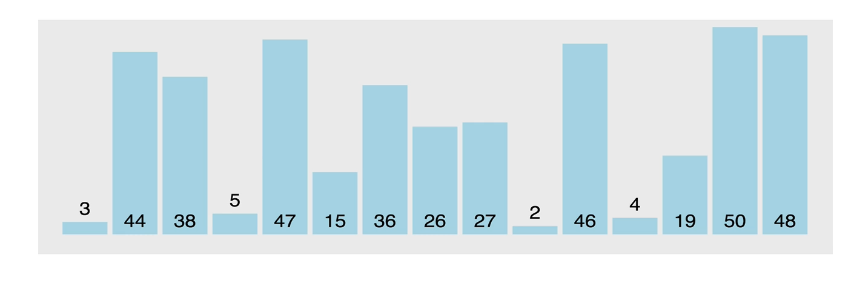
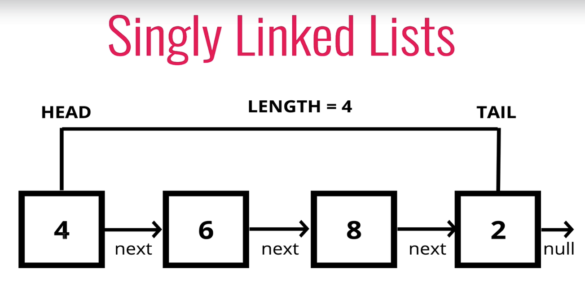
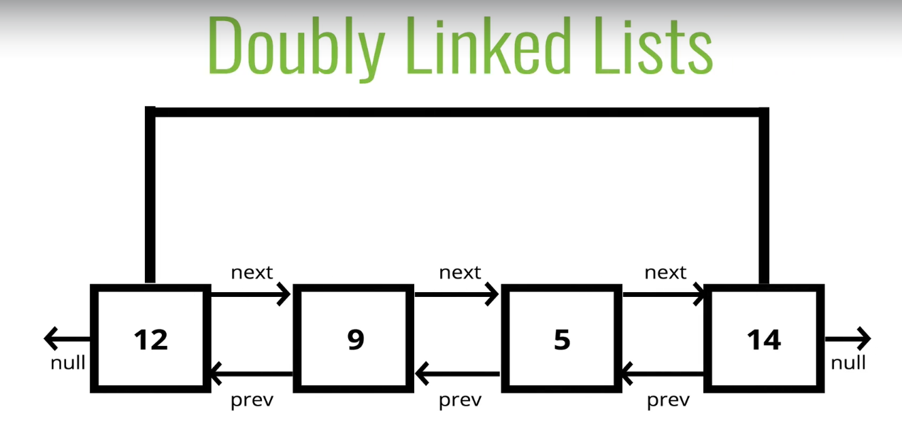
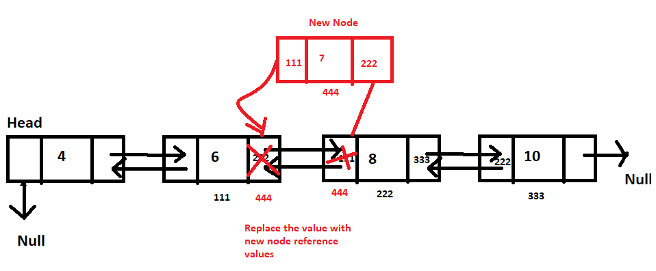
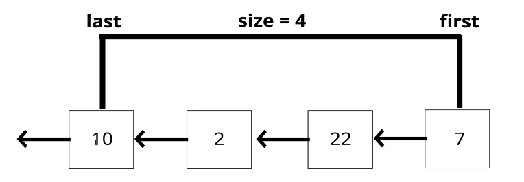

__CODE University 2021 Fall Semester<br />__
__SE_02 Algorithms and Data Structures<br />__
Jongwoo Park<br />
***

- [Data Structure](#data-structure)
  - [Analysis of Data Structures](#analysis-of-data-structures)
    - [Before get started with Javascript..](#before-get-started-with-javascript)
      - [Class](#class)
    - [Arrays](#arrays)
    - [Linked List](#linked-list)
      - [What is a Linked List?](#what-is-a-linked-list)
      - [Comparisons with Array](#comparisons-with-array)
      - [Singly Linked List](#singly-linked-list)
        - [Push](#push)
          - [Push pseudocode](#push-pseudocode)
          - [Push implementation](#push-implementation)
        - [Pop](#pop)
          - [Pop pseudocode](#pop-pseudocode)
          - [Pop implementation](#pop-implementation)
        - [Shift](#shift)
          - [Shift pseudocode](#shift-pseudocode)
          - [Shift implementation](#shift-implementation)
        - [Unshift](#unshift)
          - [Unshift pseudocode](#unshift-pseudocode)
          - [Unshift implementation](#unshift-implementation)
        - [Get](#get)
          - [Get pseudocode](#get-pseudocode)
          - [Get implementation](#get-implementation)
        - [Set](#set)
          - [Set pseudocode](#set-pseudocode)
          - [Set implementation](#set-implementation)
        - [Insert](#insert)
          - [Insert pseudocode](#insert-pseudocode)
          - [Insert implementation](#insert-implementation)
        - [Remove](#remove)
          - [Remove pseudocode](#remove-pseudocode)
          - [Remove implementation](#remove-implementation)
        - [Reverse](#reverse)
          - [Reverse pseudocode](#reverse-pseudocode)
          - [Reverse implementation](#reverse-implementation)
        - [Big O of Singly Linked Lists](#big-o-of-singly-linked-lists)
      - [Doubly Linked List](#doubly-linked-list)
        - [Doubly Linked List Constructor](#doubly-linked-list-constructor)
        - [Push](#push-1)
          - [Push pseudocode](#push-pseudocode-1)
          - [Push implementation](#push-implementation-1)
        - [Pop](#pop-1)
          - [Pop pseudocode](#pop-pseudocode-1)
          - [Pop implementation](#pop-implementation-1)
        - [Shift](#shift-1)
          - [Shift pseudocode](#shift-pseudocode-1)
          - [Shift implementation](#shift-implementation-1)
        - [Unshift](#unshift-1)
          - [Unshift pseudocode](#unshift-pseudocode-1)
          - [Unshift implementation](#unshift-implementation-1) 
        - [Get](#get-1)
          - [Get pseudocode](#get-pseudocode-1)
          - [Get implementation](#get-implementation-1)
        - [Set](#set-1)
          - [Set pseudocode](#set-pseudocode-1)
          - [Set implementation](#set-implementation-1)
        - [Insert](#insert-1)
          - [Insert pseudocode](#insert-pseudocode-1)
          - [Insert implementation](#insert-implementation-1)
        - [Remove](#remove-1)
          - [Remove pseudocode](#remove-pseudocode-1)
          - [Remove implementation](#remove-implementation-1)
        - [Reverse](#reverse-1)
          - [Reverse pseudocode](#reverse-pseudocode-1)
          - [Reverse implementation](#reverse-implementation-1)
        - [Big O of Doubly Linked Lists](#big-o-of-doubly-linked-lists)
        - [Comparison with singly linked list](#comparison-with-singly-linked-list)
    - [Stacks and Queues](#stacks-and-queues)
      - [Stack](#stack)
        - [Where Sttacks are Used](#where-stacks-are-used)
        - [Create Stack](#create-stack)
          - [With Array](#with-array)
          - [From Scratch](#from-scratch)

# Data Structure
## Analysis of Data Structures

- Data structures are collections of values, the relationships among them, and the functions or operations that canbe applied to the data.
- It's a essential for computer science and each has their own advantages and disadvantages.
- e.g. 
  - For map/location data, graph would be the best data structure. (for shortest path/distance/GPS data/coordinates etc)
  - For input job for adding a value at the beginning/end of the ordered list, linked list could be the best case.
  - For scraping nested HTML, tree structure could be the best data structure.

### Before get started with Javascript..

Javascript is prototype based language and doesn't have OOP concept per se but there are some syntactic sugar for it since ES2015.
#### Class

A blueprint for creating objects with pre-defined properties and methods.

```js
// define a pattern
class Student {
  constructor(firstName, lastName, point, items) {
    this.firstName = firstName;
    this.lastName = lastName;
    this.point = point; 
    this.items = [];
  }
  // method that is.. public to the instances?
  fullName() {
    return `Full name is ${this.firstName} ${this.lastName}.`;
  }
  markPoint(n) {
    this.point += n;
    return `${this.firstName} ${this.lastName} got ${this.point} grade point.`;
  }
  addItems(item) {
    this.items.push(item);
    return `${this.firstName} got ${this.items}.`;
  }

  // utility subclass / function
  static enrollStudents(...students) {
    return `${students.length} has enrolled.`;
  }
}

// instantiate an object
let okja = new Student("Okja", "The Cute Dog", 3, "Carrot");

// okja.lastName -> "The Cute Dog"
// okja.fullName(); -> "Full name is Okja The Cute Dog." 
// okja.markPoint(-2); -> "Okja got 1 grade point."
// okja.addItems("Carrot"); -> "Okja got Carrot."
// okja.enrollStudents(okja, jongwoo); -> error
// Student.enrollStudents(okja, jongwoo); -> "2 has enrolled."
```
- The method to create new objects __must__ be called `constructor`.
- The class keyword create a constant, you can't change the structure of the class.
- Class instances are created with `new` keyword.
- `this` keyword is used to access the properties and methods of the class, it refers to the object created from that class.
- `static` keyword defines a static method or property for a class, which can be called without instantiating an object from the class and can't be called through individual instances.  [MDN static reference ](https://developer.mozilla.org/en-US/docs/Web/JavaScript/Reference/Classes/static)

### Arrays


- push: O(1)
- pop: O(1)
  - both are basic accessing

- shift: O(n)
- unshift: O(n)
  - basic accessing with shifting all the indexes afterwards

- concat: O(n)
  - merge two or more array into one
- slice: O(n)
  - returns a shallow copy of a portion of an array into a new array that is selected from begin to end, original array will not be modified
- splice: O(n)
  - changes the content of an array by removing existing elements and/or adding new elements

- sort: O(n*log N)
  - slowest among all the array methods

- forEach/map/filter/reduce: O(n)
  - whatever methods doing, it involves on each element

### Linked List

#### What is a Linked List?

- A data structure that contains a head(beginning), tail(end) and length property.
- Linked lists consist of nodes(each element), and each node has a value and a pointer to another node or null.
- E.g. 
  - Singly linked list has each node that is only connected to next node in one direction.
  - Double linked list has each node that is connected to next node in both direction.



#### Comparisons with Array
- List:
  - There is no indexes.
  - Connected via nodes with a __next__ pointer.
  - Raandom access is not possible.
  - Insertion/Deletion is cheap.
- Array:
  - Indexed in order.
  - Insertion and deletion is expensive, every node has to be re-indexed.
  - Node can be accessed quickly with a specific index.

#### Singly Linked List

- linked list has a pointer to the head of the list and a pointer to the tail.

##### Push
- push add a value at the end of the list.

###### Push pseudocode
  - this function should accept a value.
  - create a new node using the value passed to the function.
  - if there is no head property on the list, set the head and tail to be the newly created node.
  - otherwise set the next property on the tail to be the new node and set the tail property on the list to be the newly created node.
  - increment the length by one.
  - return the linked list.

###### Push implementation
```js
// push
class Node {
  constructor(val) {
    this.val = val;
    this.next = null;
  }
}

class SinglyLinkedList {
  constructor() {
    this.head = null;
    this.tail = null;
    this.length = 0;
  }
  push(val) {
    const newNode = new Node(val);
    if (!this.head) {
      this.head = newNode;
      this.tail = this.head;
    } else {
      this.tail.next = newNode;
      this.tail = newNode;
    }
    this.length++;
    return this;
  }
}

const list = new SinglyLinkedList()
list.push("goodbye");
list.push("cruel");
list.push("world");

consoole.log(list);
// SinglyLinkedList {
//   head: Node { val: 'goodbye', next: Node { val: 'cruel', next: [Node] } },
//   tail: Node { val: 'world', next: null },
//   length: 3
// }
```

##### Pop
- pop removes the last element of the list.

###### Pop pseudocode
  - if there are no nodes in the list, return undefined
  - loop through the list until you reach the tail
  - set the next property of the 2nd to last node to be null.
  - set the tail to be the second to last node.
  - decrement the length of the list by 1.
  - return the value of the node removed.

###### Pop implementation
```js
...SinglyLinkedList

pop() {
  if (!this.head) return undefined;
  let current = this.head;
  let newTail = current;
  while (current.next) {
    newTail = current;
    current = current.next;
  }
  this.tail = newTail;
  this.tail.next = null;
  this.length--;
  // in case list is empty
  if (this.length === 0) {
    this.head = null;
    this.tail = null;
  } 
  return current;
}

...
```

##### Shift
- shift removes a new node from the beginning of the linked list and return it.

###### Shift pseudocode
  - If there are no nodes, return undefined
  - store the current head property in a variable
  - update the head property to be the current head's next property
  - decrement the length by 1
  - return the value of the node removed

###### Shift implementation
```js
...SingglyLinkedList
shift() {
  if (!this.head) return undefined;
  let currentHead = this.head;
  this.head = currentHead.next;
  this.length--;
  if (this.length === 0) {
    this.tail = null;
  }
  return currentHead;
} 
...
```

##### Unshift
- opposite of shift, it adds a anew node to the beginning of the linked list.
###### Unshift pseudocode
  - unshift accepts a value to be put.
  - create a new node using the value passed to the function.
    - if there is no head property in the list, set the head and tail to be the newly created node.
  - set the newly created node's next property to be the current head property in the list.
  - set the head property on the list to be that newly created node.
  - increment the length of the list by 1
  - return the linked list.

###### Unshift implementation
```js
...SinglyLinkedList
unshift() {
  let newNode = new Node(val);
  if (!this.head) {
    this.head = newNode;
    this.tail = this.head;
  } else {
    newNode.next = this.head;
    this.head = newNode;
  }
  this.length++;
  return this;
}
...
```

##### Get
- get is a method that takes a number(index) and returns the item in that position.
- i.e. it takes a number and traverse the list n times to get the item at that index.
###### Get pseudocode
  - it should take an index as a argument.
  - if the index is less than 0 or greater than or equal to the length of the list, return undefined.
  - loop through the list until you reach the index and return the node at that specific index.

###### Get implementation
```js
...SinglyLinkedList
get(index) {
  if(index < 0 || index >= this.length) return undefined;
  let counter = 0;
  let current = this.head;
  while (counter !== index) {
    current = current.next;
    counter++;
  }
  return current;
}
...
```

##### Set
- method set is same as get() but it changes to the given value at the given position.

###### Set pseudocode
- it accepts a value and an index.
- use get() to find the note at the given index.
  - if there is no node, return false.
  - else there is a node, set the node's value to be the given value and return true.
  
###### Set implementation
```js
...SinglyLinkedList
set(index, val) {
  let foundNode = this.get(index);
  if (foundNode) {
    foundNode.val = val;
    return true;
  } 
  return false;
}
...
```

##### Insert
- similar to set(), it accepts an index and a value but it inserts the value at the given index. 

###### Insert pseudocode
- it accepts an index and a value.
- if the index is less than zero or greather than the length, return false.
- if the index is the same as the length(end of list), just use push() a new node to the end of the list.
- if the index is 0(beginning of list), just use unshift() a new node to the beginning of the list.
- else, use get() to find the node at the given index - 1 to prepare insertion.
  - set the next property on that node to be the new node.
  - set the next property on the new node to be the previous next.
- increment the length of the list by 1.
- return true.

###### Insert implementation
```js
...SinglyLinkedList
insert(index, val) {
  if (index < 0 || index > this.length) return false;
  // double negation to return bool of true in this case
  if (index === this.length) return !!this.push(val); 
  if (index === 0) return !!this.unshift(val);

  let newNode = new Node(val);
  let prev = this.get(index-1);
  let temp = prev.next;
  newNode.next = temp;
  this.length++;
  return true;
}
...
```

##### Remove
- it's a method that removes a node from the linked list at a specific position.

###### Remove pseudocode
- if the index is less than zero or greater than the length, return undefined.
- if the index is the same as the last(length - 1), pop the last node.
- if the index is 0 at the beginning, shift the note from the beginning of the list.
- otherwise, using get() method, access the node at the index - 1.
  - set the next property on that node to be the next of the next node. 
  - decrement the length.
  - return the value of the node removed.

###### Remove implementation
```js
...SinglyLinkedList
remove(index) {
  if (index < 0 || index >= this.length) return undefined;
  if (index === this.length - 1) return this.pop();
  if (index === 0) return this.shift();

  let prev = this.get(index - 1);
  let removed = prev.next;
  prev.next = removed.next;
  this.length--;
  return removed;
}
...
```

##### Reverse
- Opposite of traverse, it reverses the linked list by replacing heads and tails in an opposite direction.

###### Reverse pseudocode
- swap the head and tail
- create a variable called next 
- create a variable called prev
- create a variable called node and initialize it to the head property
- loop through the list
- set next to be the next property on whataever node is
- set the next property on the node to be whatever prev is
- set prev to be the value of the node variable
- set the node variable to be the value of the next variable

###### Reverse implementation

```
// 13 -> 27 -> 32 -> 71
// (h to 27)         t

// 13 <- 27 <- 32 <- 71
// (t to 27)         h
```
```js
...SinglyLinkedList
reverse() {
  let node = this.head;
  this.head = this.tail;
  this.tail = node;

  let next;
  let prev = null;

  for (let i = 0; i < this.length; i++) {
    next = node.next;
    node.next = prev;
    prev = node;
    node = next;
  }
  return this;
}
...
```

##### Big O of Singly Linked Lists

|           | Time Complexity | Comparison                                                                 |
|-----------|-----------------|----------------------------------------------------------------------------|
| Insertion | O(1)            | much faster iteration than array O(n)                                      |
| Removal   | O(1) or O(n)    | If it's start, it's O(1) but gets difficult if popping is at the end, O(n) |
| Searching | O(1) or O(n)    |                                                                            |
| Access    | O(n)            |                                                                            |

- Singly linked lists excel when __insertion__ and __deletion__ at the beginning are required.
- The idea of a list data structure that consists of head, tail and nodes is the foundation for other data structures like Stacks and Queues. 


#### Doubly Linked List



- almost identical to singly linked list, except every node has another pointer to the previous node.
- Comparing to singly linked list, it takes more space(memory) but more flexible.
##### Doubly Linked List Constructor
```js
class Node {
  constructor(val) {
    this.val = val;
    this.next = null;
    this.prev = null;
  }
}

class DoublyLinkedList {
  constructor() {
    this.head = null;
    this.tail = null;
    this.length = 0;
  }
}
// Same as singly linked list but has 'prev' node
```

##### Push

- it adds a node to the end of the doubly linked list.
- it finds the tail at the end and add a next node with prev property.

###### Push pseudocode

- Create a new node with the value passed to the function.
- If the head property is null, set the head and tail to be the newly created node.
-  if not, set th next property on the tail to be that node.
- set the previous property on the newly created node to be the tail.
- set the tail to be the newly created node.
- increment the length.
- return the doubly linked list.

###### Push implementation
```js
...DoublyLinkedList

push(val) {
    let newNode = new Node(val);
    if (this.length === 0) {
      this.head = newNode;
      this.tail = newNode;
    } else {
      this.tail.next = newNode;
      newNode.prev = this.tail;
      this.tail = newNode;
    }
    this.length++;
    return this;
  }
```

##### Pop
- it removes a node from the end of the doubly linked list and return it.

###### Pop pseudocode
- first check if there is no head, return undefined.
- store the current tail in a variable to return later.
- if the length is 1, set the head and tail to be null
- update the tail to be the previous node.
- set the new tail's next to be null.
- decrement the length.
- return the value removed.

###### Pop implementation
```js
pop() {
  if (!this.head) return undefined
  let poppedNode = this.tail;
  if (this.length === 1) {
    this.head = null;
    this.tail = null;
  } else {
    this.tail = poppedNode.prev;
    this.tail.next = null;
    poppedNode.prev = null;
  }
  this.length--;
  return poppedNode;
}
```

##### Shift
- it removes a node from the beginning of the doubly linked list and return it.
- it finds the head at the beginning and remove it.

###### Shift pseudocode
- if length is 0, return undefined.
- store the current head property in a variable as an old head.
- if the length is one.
  - set the head to be null.
  - set the tail to be null.
- update the head to be the next of the old head.
- set the head's prev property to be null.
- set the old head's next to null.
- decrement the length.
- return old head.

###### Shift implementation
```js
shift() {
  if (this.length === 0) return undefined;
  let oldHead = this.head;
  if (this.length === 1) {
    this.head = null;
    this.tail = null;
  } else {
    this.head = oldHead.next;
    // remove the connection between old head and new head
    this.head.prev = null;
    oldHead.next = null;
  }
  this.length--;
  return oldHead
}
```

##### Unshift
- It adds a node to the beginning of the doubly linked list and return the list.

###### Unshift pseudocode
- create a new node with the value passed to the function.
- if the length is 0
  - set the head to be the new node.
  - set the tail to be the new node.
- else 
  - set the prev property on the head of the list tobe the new node.
  - set the next property on the new node to be the head property.
  - set the head property to be the new node.
- increment the length.
- return the list.

###### Unshift implementation
```js
unshift(val) {
    let newNode = new Node(val);
    if (this.length === 0) {
      this.head = newNode;
      this.tail = newNode;
    } else {
      this.head.prev = newNode;
      newNode.next = this.head;
      this.head = newNode;
    }
    this.length++;
    return this;
  }
```


##### Get
- it accesses a node in a doubly linked list by its position.
- it returns the value of the node at the position passed to the function.
- Same as get() in singly linked list, but it can start from the tail, depend on the index provided.

###### Get pseudocode
- if index is less than 0 or greater or equal to the length, return undefined.
- if index is less than or equal to half of the length 
  - loop through the list starting from the __head__ and loop towards the middle.
  - return the node once it is found.
- if index is greather than laf of the length
  - loop through the list starting from the __tail__ and loop towards the middle.
  - return the node once it is found.

###### Get implementation

```js
get(index) {
  let count, current;
  if (index < 0 || index >= this.length) return undefined;
  if (index <= this.length / 2) {
    count = 0;
    current = this.head;
    while (count !== index) {
      current = current.next;
      count++;
    }
  } else {
    count = this.length - 1;
    current = this.tail;
    while (count !== index) {
      current = current.prev;
      count--;
    }
  }
  return current;
}
```

##### Set
- it replaces the value of a node in a doubly linked list by its position.
- it works same as get(), but it update the given value of the node at the position passed to the function.

###### Set pseudocode
- create a variable which is the result of the get() method, at the index passed to the function.
  - if the get() returns a valid result, set the value of that node to be the given value and return true.
  - else, return false.

###### Set implementation
```js
set(index, val) {
    let foundNode = this.get(index);
    if (foundNode) {
      foundNode.val = val;
      return true;
    }
    return false;
  }
```

##### Insert
- it adds a node in a doubly linked list by a certain position and returns the list.
- it accepts an index, value and position and it creates a anew node with that value and adds it at the position to the lengthy list.
- it uses get() to retrieve the node at the index passed to the function.

###### Insert pseudocode
- if index is less than 0 or greater than or equal to the length, return false.
- if index is 0, unshift.
- if index is the same as the length, push.
- else, use get() to access the index -1.
  - set the next and prev properties on the correct nodes to link everything together
- increment the length.
- return true.


###### Insert implementation
```js
insert(index, val) {
  if (index < 0 || index > this.length) return false;
  if (index === 0) return !!this.unshift(val);
  if (index === this.length) return !!this.push(val);

  let newNode = new Node(val);
  let beforeNode = this.get(index - 1);
  let afterNode = beforeNode.next;

  beforeNode.next = newNode, newNode.prev = beforeNode;
  newNode.next = afterNode, afterNode.prev = newNode;
  this.length++;
  return true;
}
```

##### Remove
- it takes an index or position as argument and removes a node in a doubly linked list on a certain position and returns the removed item.
- it works similar as get() to check the position from head or tail.

###### Remove pseudocode
- if index is less than zero or greater than or equal to length, return undefined.
- if index is 0, shift.
- if index is the same as the length - 1, pop.
- otherwise, use get() to retrieve the item to be removed.
- update the next and prev properties to remove the found node from the list.
- set next and prev to null on the found node.
- decrement the length.
- return the removed node.

###### Remove implementation
```js
remove(index) {
  if (index < 0 || index >= this.length) return undefined;
  if (index === 0) return this.shift();
  if (index === this.length - 1) return this.pop();
  let removedNode = this.get(index);
  // connecting in between the nodes before and after the removed node
  let beforeNode = removedNode.prev;
  let afterNode = removedNode.next;
  beforeNode.next = afterNode;
  afterNode.prev = beforeNode;
  
  // remove the connection of the target node 
  removedNode.next = null;
  removedNode.prev = null;
  this.length--;
  return removedNode;
}
```
##### Big O of Doubly Linked Lists

|           | Big O |
|-----------|-------|
| Insertion | O(1)  |
| Removal   | O(1)  |
| Searching | O(n)  |
| Access    | O(n)  |

- insertion excels with both O(1), singly and doubly linked list.
- removal for doubly linked list is always constant, unlike traversing for same in singly linked list.
- searching is O(n/2) -> O(n) because it starts from start or end of the list to the middle.

##### Comparison with singly linked list
e
- doubly linked lists are almost same as singly linked list, except there is an additional pointer to previous node. 
- it fits in a situation where linear backward traversal is needed as much as forward. i.e. history, re/undo, etc.
- it works better than singly linked list for finding nodes and can be done in half the time.
- it takes more (almost twice )space given the extra pointer. 


### Stacks and Queues

#### Stack

- it is not a built-in data structure in Javascript.
- it is an abstracted collection of data that abide by LIFO data structure.
  - LIFO: Last In First Out i.e. last element added to the stack will be the first element removed from the stack.
  - e.g. STACKS of books, STACKS of plates and so on, as it being piled up, the last thing is what gets removed first.



##### Where Stacks Are Used

- managing function invocations as call stack 
- history object: undo/redo, backward/forward, routing

##### Create Stack 

###### With Array
- push, pop for last and shift, unshift for first node for LIFO can be used but adding node at the beginning with array is not efficient cause every rest of element need to be reindexed.
- that said, stack with array for push/pop might not be a good fit.

###### With Linked List Implementation
- stack is supposed to be constant time but push/pop with array occurs traversing, thus using stack with list makes more sense in this case.
- it uses similar structure of class constructor used above.

```js
class Stack {
  constructor() {
    // unlike linked list, terms are for LIFO
    this.first = null;
    this.last = null;
    this.size = 0;
  }
}

class Node {
  constructor(value) {
    this.value = value;
    this.next = null;
  }
}
```

###### Push pseudocode
- creeate a function push that create a node which  accept a value.
- if there are no nodes in the stack, set the first and last property to be the newly create node.
- if there is one node, create a varialble that stores the current first property on the stack.
- reset the first property to be the newly created node.
- set the next property on the node to be the previously created variable.
increment the size of the stack by 1.

```js
push(val) {
  let newNode = new Node(val);
  if (!this.first) {
    this.first = newNode;
    this.last = newNode;
  } else {
    let temp = this.first;
    this.first = newNode;
    this.first.next = temp;
  }
  return this.size++;
}
```

###### Pop pseudocode
- if there are no nodes in the stack, return undefined.
- create a temporary variable to store the first property on the stack.
- if there is only one node, set the first and last property to be null.
- otherwise, set the first property to be the next property on the current first.
- decrement the size by 1.
- return the value of the node removed.

```js
pop() {
  if (!this.first) return undefined;
  let temp = this.first;
  if (this.first === this.last) {
    this.last = null;
  }
  this.first = this.first.next;
  this.size--;
  return temp.value;
}
```

##### Big O of Stacks

|           | Big O |
|-----------|-------|
| Insertion | O(1)  |
| Removal   | O(1)  |
| Searching | O(n)  |
| Access    | O(n)  |

- stack is prioritized on push/pop and both are constant.
- searching/accessing individual node is same as O(n).

#### Queues

##### Where Queues Are Used
- 


