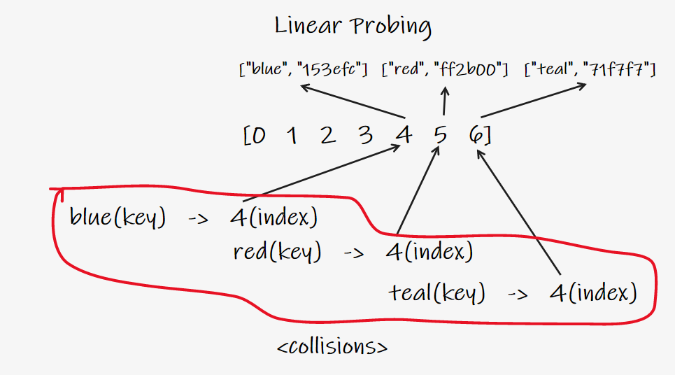

__CODE University 2021 Fall Semester<br />__
__SE_02 Algorithms and Data Structures<br />__
Jongwoo Park<br />
***

- [Data Structure](#data-structure)
  - [Analysis of Data Structures](#analysis-of-data-structures)
    - [Before get started with Javascript..](#before-get-started-with-javascript)
      - [Class](#class)
    - [Arrays](#arrays)
    - [Linked List](#linked-list)
      - [What is a Linked List?](#what-is-a-linked-list)
      - [Comparisons with Array](#comparisons-with-array)
      - [Singly Linked List](#singly-linked-list)
        - [Push](#push)
          - [Push pseudocode](#push-pseudocode)
          - [Push implementation](#push-implementation)
        - [Pop](#pop)
          - [Pop pseudocode](#pop-pseudocode)
          - [Pop implementation](#pop-implementation)
        - [Shift](#shift)
          - [Shift pseudocode](#shift-pseudocode)
          - [Shift implementation](#shift-implementation)
        - [Unshift](#unshift)
          - [Unshift pseudocode](#unshift-pseudocode)
          - [Unshift implementation](#unshift-implementation)
        - [Get](#get)
          - [Get pseudocode](#get-pseudocode)
          - [Get implementation](#get-implementation)
        - [Set](#set)
          - [Set pseudocode](#set-pseudocode)
          - [Set implementation](#set-implementation)
        - [Insert](#insert)
          - [Insert pseudocode](#insert-pseudocode)
          - [Insert implementation](#insert-implementation)
        - [Remove](#remove)
          - [Remove pseudocode](#remove-pseudocode)
          - [Remove implementation](#remove-implementation)
        - [Reverse](#reverse)
          - [Reverse pseudocode](#reverse-pseudocode)
          - [Reverse implementation](#reverse-implementation)
        - [Big O of Singly Linked Lists](#big-o-of-singly-linked-lists)
      - [Doubly Linked List](#doubly-linked-list)
        - [Doubly Linked List Constructor](#doubly-linked-list-constructor)
        - [Push](#push-1)
          - [Push pseudocode](#push-pseudocode-1)
          - [Push implementation](#push-implementation-1)
        - [Pop](#pop-1)
          - [Pop pseudocode](#pop-pseudocode-1)
          - [Pop implementation](#pop-implementation-1)
        - [Shift](#shift-1)
          - [Shift pseudocode](#shift-pseudocode-1)
          - [Shift implementation](#shift-implementation-1)
        - [Unshift](#unshift-1)
          - [Unshift pseudocode](#unshift-pseudocode-1)
          - [Unshift implementation](#unshift-implementation-1) 
        - [Get](#get-1)
          - [Get pseudocode](#get-pseudocode-1)
          - [Get implementation](#get-implementation-1)
        - [Set](#set-1)
          - [Set pseudocode](#set-pseudocode-1)
          - [Set implementation](#set-implementation-1)
        - [Insert](#insert-1)
          - [Insert pseudocode](#insert-pseudocode-1)
          - [Insert implementation](#insert-implementation-1)
        - [Remove](#remove-1)
          - [Remove pseudocode](#remove-pseudocode-1)
          - [Remove implementation](#remove-implementation-1)
        - [Reverse](#reverse-1)
          - [Reverse pseudocode](#reverse-pseudocode-1)
          - [Reverse implementation](#reverse-implementation-1)
        - [Big O of Doubly Linked Lists](#big-o-of-doubly-linked-lists)
        - [Comparison with singly linked list](#comparison-with-singly-linked-list)
    - [Stacks and Queues](#stacks-and-queues)
      - [Stack](#stack)
        - [Where Sttacks are Used](#where-stacks-are-used)
        - [Create Stack](#create-stack)
          - [With Array](#with-array)
          - [With Linked List Implemtation](#with-linked-list-implementation)
          - [Push pseudocode](#push-pseudocode-2)
          - [Pop pseudocode](#pop-pseudocode-2)
        - [Big O of Stacks](#big-o-of-stacks)
      - [Queue](#queue)
        - [Create Queue](#create-queue)
          - [With Array](#with-array-1)
          - [With Linked List Implementation](#with-linked-list-implementation-1)
          - [Enqueue pseudocode](#enqueue-pseudocode)
          - [Enqueue iimplementation](#enqueue-implementation)
          - [Dequeue pseudocode](#dequeue-pseudocode)
          - [Dequeue implementation](#dequeue-implementation)
        - [Big O of Queues](#big-o-of-queues)
    - [Hash Tables](#hash-tables)
      - [What is Hash Table?](#what-is-hash-table)
      - [Hash Functions](#hash-functions)
        - [More of Hash Function Basics](#more-of-hash-function-basics)
        - [Simple Hash Function Implementation](#simple-hash-function-implementation)
        - [Simple Hash Function Slightly Improved Implementation](#simple-hash-function-slightly-improved-implementation)
        - [Dealing With Cillisions](#dealing-with-cillisions)
        - [Hash Table Implementation](#hash-table-implementation)
        - [Set](#set-2)
        - [Get](#get-2)
      - [Hash Table Keys and Values Method](#hash-table-keys-and-values-method)
      - [Big O of Hash Tables](#big-o-of-hash-tables)
    - [Trees](#trees)
      - [What is Tree For?](#what-is-tree-for)
      - [Binary Tree](#binary-tree)
      - [Binary Search Tree](#binary-search-tree)
        - [Binary Search Tree Implementaion](#binary-search-tree-implementaion)
          - [Insertion pseudocode](#insertion-pseudocode)
          - [Insertion implementation](#insertion-implementation)
          - [Find pseudocode](#find-pseudocode)
          - [Find implementation](#find-implementation)
        - [Big O of Binary Search Tree](#big-o-of-binary-search-tree)
    - [Tree Traversal](#tree-traversal)
      - [Breadth-First Search](#breadth-first-search)
        - [Breadth-First Search pseudocode](#breadth-first-search-pseudocode)
        - [Breadth-First Search implementation](#breadth-first-search-implementation)
      - [Depth-First Search](#depth-first-search)
        - [DFS PreOrder](#dfs-preorder)
          - [DFS PreOrder pseudocode](#dfs-preorder-pseudocode)
          - [DFS PreOrder implementation](#dfs-preorder-implementation)
        - [DFS PostOrder](#dfs-postorder)
          - [DFS PostOrder pseudocode](#dfs-postorder-pseudocode)
          - [DFS PostOrder implementation](#dfs-postorder-implementation)
        - [DFS InOrder](#dfs-inorder)
          - [DFS InOrder pseudocode](#dfs-inorder-pseudocode)
          - [DFS InOrder implementation](#dfs-inorder-implementation)
      - [BFS or DFS Comparison](#bfs-or-dfs-comparison)
      - [DFS Variants Comparison](#dfs-variants-comparison)
      

# Data Structure
## Analysis of Data Structures

- Data structures are collections of values, the relationships among them, and the functions or operations that canbe applied to the data.
- It's a essential for computer science and each has their own advantages and disadvantages.
- e.g. 
  - For map/location data, graph would be the best data structure. (for shortest path/distance/GPS data/coordinates etc)
  - For input job for adding a value at the beginning/end of the ordered list, linked list could be the best case.
  - For scraping nested HTML, tree structure could be the best data structure.

### Before get started with Javascript..

Javascript is prototype based language and doesn't have OOP concept per se but there are some syntactic sugar for it since ES2015.
#### Class

A blueprint for creating objects with pre-defined properties and methods.

```js
// define a pattern
class Student {
  constructor(firstName, lastName, point, items) {
    this.firstName = firstName;
    this.lastName = lastName;
    this.point = point; 
    this.items = [];
  }
  // method that is.. public to the instances?
  fullName() {
    return `Full name is ${this.firstName} ${this.lastName}.`;
  }
  markPoint(n) {
    this.point += n;
    return `${this.firstName} ${this.lastName} got ${this.point} grade point.`;
  }
  addItems(item) {
    this.items.push(item);
    return `${this.firstName} got ${this.items}.`;
  }

  // utility subclass / function
  static enrollStudents(...students) {
    return `${students.length} has enrolled.`;
  }
}

// instantiate an object
let okja = new Student("Okja", "The Cute Dog", 3, "Carrot");

// okja.lastName -> "The Cute Dog"
// okja.fullName(); -> "Full name is Okja The Cute Dog." 
// okja.markPoint(-2); -> "Okja got 1 grade point."
// okja.addItems("Carrot"); -> "Okja got Carrot."
// okja.enrollStudents(okja, jongwoo); -> error
// Student.enrollStudents(okja, jongwoo); -> "2 has enrolled."
```
- The method to create new objects __must__ be called `constructor`.
- The class keyword create a constant, you can't change the structure of the class.
- Class instances are created with `new` keyword.
- `this` keyword is used to access the properties and methods of the class, it refers to the object created from that class.
- `static` keyword defines a static method or property for a class, which can be called without instantiating an object from the class and can't be called through individual instances.  [MDN static reference ](https://developer.mozilla.org/en-US/docs/Web/JavaScript/Reference/Classes/static)

### Arrays


- push: O(1)
- pop: O(1)
  - both are basic accessing

- shift: O(n)
- unshift: O(n)
  - basic accessing with shifting all the indexes afterwards

- concat: O(n)
  - merge two or more array into one
- slice: O(n)
  - returns a shallow copy of a portion of an array into a new array that is selected from begin to end, original array will not be modified
- splice: O(n)
  - changes the content of an array by removing existing elements and/or adding new elements

- sort: O(n*log N)
  - slowest among all the array methods

- forEach/map/filter/reduce: O(n)
  - whatever methods doing, it involves on each element

### Linked List

#### What is a Linked List?

- A data structure that contains a head(beginning), tail(end) and length property.
- Linked lists consist of nodes(each element), and each node has a value and a pointer to another node or null.
- E.g. 
  - Singly linked list has each node that is only connected to next node in one direction.
  - Double linked list has each node that is connected to next node in both direction.


#### Comparisons with Array
- List:
  - There is no indexes.
  - Connected via nodes with a __next__ pointer.
  - Raandom access is not possible.
  - Insertion/Deletion is cheap.
- Array:
  - Indexed in order.
  - Insertion and deletion is expensive, every node has to be re-indexed.
  - Node can be accessed quickly with a specific index.

#### Singly Linked List

- linked list has a pointer to the head of the list and a pointer to the tail.

##### Push
- push add a value at the end of the list.

###### Push pseudocode
  - this function should accept a value.
  - create a new node using the value passed to the function.
  - if there is no head property on the list, set the head and tail to be the newly created node.
  - otherwise set the next property on the tail to be the new node and set the tail property on the list to be the newly created node.
  - increment the length by one.
  - return the linked list.

###### Push implementation
```js
// push
class Node {
  constructor(val) {
    this.val = val;
    this.next = null;
  }
}

class SinglyLinkedList {
  constructor() {
    this.head = null;
    this.tail = null;
    this.length = 0;
  }
  push(val) {
    const newNode = new Node(val);
    if (!this.head) {
      this.head = newNode;
      this.tail = this.head;
    } else {
      this.tail.next = newNode;
      this.tail = newNode;
    }
    this.length++;
    return this;
  }
}

const list = new SinglyLinkedList()
list.push("goodbye");
list.push("cruel");
list.push("world");

consoole.log(list);
// SinglyLinkedList {
//   head: Node { val: 'goodbye', next: Node { val: 'cruel', next: [Node] } },
//   tail: Node { val: 'world', next: null },
//   length: 3
// }
```

##### Pop
- pop removes the last element of the list.

###### Pop pseudocode
  - if there are no nodes in the list, return undefined
  - loop through the list until you reach the tail
  - set the next property of the 2nd to last node to be null.
  - set the tail to be the second to last node.
  - decrement the length of the list by 1.
  - return the value of the node removed.

###### Pop implementation
```js
...SinglyLinkedList

pop() {
  if (!this.head) return undefined;
  let current = this.head;
  let newTail = current;
  while (current.next) {
    newTail = current;
    current = current.next;
  }
  this.tail = newTail;
  this.tail.next = null;
  this.length--;
  // in case list is empty
  if (this.length === 0) {
    this.head = null;
    this.tail = null;
  } 
  return current;
}

...
```

##### Shift
- shift removes a new node from the beginning of the linked list and return it.

###### Shift pseudocode
  - If there are no nodes, return undefined
  - store the current head property in a variable
  - update the head property to be the current head's next property
  - decrement the length by 1
  - return the value of the node removed

###### Shift implementation
```js
...SingglyLinkedList
shift() {
  if (!this.head) return undefined;
  let currentHead = this.head;
  this.head = currentHead.next;
  this.length--;
  if (this.length === 0) {
    this.tail = null;
  }
  return currentHead;
} 
...
```

##### Unshift
- opposite of shift, it adds a anew node to the beginning of the linked list.
###### Unshift pseudocode
  - unshift accepts a value to be put.
  - create a new node using the value passed to the function.
    - if there is no head property in the list, set the head and tail to be the newly created node.
  - set the newly created node's next property to be the current head property in the list.
  - set the head property on the list to be that newly created node.
  - increment the length of the list by 1
  - return the linked list.

###### Unshift implementation
```js
...SinglyLinkedList
unshift() {
  let newNode = new Node(val);
  if (!this.head) {
    this.head = newNode;
    this.tail = this.head;
  } else {
    newNode.next = this.head;
    this.head = newNode;
  }
  this.length++;
  return this;
}
...
```

##### Get
- get is a method that takes a number(index) and returns the item in that position.
- i.e. it takes a number and traverse the list n times to get the item at that index.
###### Get pseudocode
  - it should take an index as a argument.
  - if the index is less than 0 or greater than or equal to the length of the list, return undefined.
  - loop through the list until you reach the index and return the node at that specific index.

###### Get implementation
```js
...SinglyLinkedList
get(index) {
  if(index < 0 || index >= this.length) return undefined;
  let counter = 0;
  let current = this.head;
  while (counter !== index) {
    current = current.next;
    counter++;
  }
  return current;
}
...
```

##### Set
- method set is same as get() but it changes to the given value at the given position.

###### Set pseudocode
- it accepts a value and an index.
- use get() to find the note at the given index.
  - if there is no node, return false.
  - else there is a node, set the node's value to be the given value and return true.
  
###### Set implementation
```js
...SinglyLinkedList
set(index, val) {
  let foundNode = this.get(index);
  if (foundNode) {
    foundNode.val = val;
    return true;
  } 
  return false;
}
...
```

##### Insert
- similar to set(), it accepts an index and a value but it inserts the value at the given index. 

###### Insert pseudocode
- it accepts an index and a value.
- if the index is less than zero or greather than the length, return false.
- if the index is the same as the length(end of list), just use push() a new node to the end of the list.
- if the index is 0(beginning of list), just use unshift() a new node to the beginning of the list.
- else, use get() to find the node at the given index - 1 to prepare insertion.
  - set the next property on that node to be the new node.
  - set the next property on the new node to be the previous next.
- increment the length of the list by 1.
- return true.

###### Insert implementation
```js
...SinglyLinkedList
insert(index, val) {
  if (index < 0 || index > this.length) return false;
  // double negation to return bool of true in this case
  if (index === this.length) return !!this.push(val); 
  if (index === 0) return !!this.unshift(val);

  let newNode = new Node(val);
  let prev = this.get(index-1);
  let temp = prev.next;
  newNode.next = temp;
  this.length++;
  return true;
}
...
```

##### Remove
- it's a method that removes a node from the linked list at a specific position.

###### Remove pseudocode
- if the index is less than zero or greater than the length, return undefined.
- if the index is the same as the last(length - 1), pop the last node.
- if the index is 0 at the beginning, shift the note from the beginning of the list.
- otherwise, using get() method, access the node at the index - 1.
  - set the next property on that node to be the next of the next node. 
  - decrement the length.
  - return the value of the node removed.

###### Remove implementation
```js
...SinglyLinkedList
remove(index) {
  if (index < 0 || index >= this.length) return undefined;
  if (index === this.length - 1) return this.pop();
  if (index === 0) return this.shift();

  let prev = this.get(index - 1);
  let removed = prev.next;
  prev.next = removed.next;
  this.length--;
  return removed;
}
...
```

##### Reverse
- Opposite of traverse, it reverses the linked list by replacing heads and tails in an opposite direction.

###### Reverse pseudocode
- swap the head and tail
- create a variable called next 
- create a variable called prev
- create a variable called node and initialize it to the head property
- loop through the list
- set next to be the next property on whataever node is
- set the next property on the node to be whatever prev is
- set prev to be the value of the node variable
- set the node variable to be the value of the next variable

###### Reverse implementation

```
// 13 -> 27 -> 32 -> 71
// (h to 27)         t

// 13 <- 27 <- 32 <- 71
// (t to 27)         h
```
```js
...SinglyLinkedList
reverse() {
  let node = this.head;
  this.head = this.tail;
  this.tail = node;

  let next;
  let prev = null;

  for (let i = 0; i < this.length; i++) {
    next = node.next;
    node.next = prev;
    prev = node;
    node = next;
  }
  return this;
}
...
```

##### Big O of Singly Linked Lists

|           | Time Complexity | Comparison                                                                 |
|-----------|-----------------|----------------------------------------------------------------------------|
| Insertion | O(1)            | much faster iteration than array O(n)                                      |
| Removal   | O(1) or O(n)    | If it's start, it's O(1) but gets difficult if popping is at the end, O(n) |
| Searching | O(1) or O(n)    |                                                                            |
| Access    | O(n)            |                                                                            |

- Singly linked lists excel when __insertion__ and __deletion__ at the beginning are required.
- The idea of a list data structure that consists of head, tail and nodes is the foundation for other data structures like Stacks and Queues. 


#### Doubly Linked List


- almost identical to singly linked list, except every node has another pointer to the previous node.
- Comparing to singly linked list, it takes more space(memory) but more flexible.
##### Doubly Linked List Constructor
```js
class Node {
  constructor(val) {
    this.val = val;
    this.next = null;
    this.prev = null;
  }
}

class DoublyLinkedList {
  constructor() {
    this.head = null;
    this.tail = null;
    this.length = 0;
  }
}
// Same as singly linked list but has 'prev' node
```

##### Push

- it adds a node to the end of the doubly linked list.
- it finds the tail at the end and add a next node with prev property.

###### Push pseudocode

- Create a new node with the value passed to the function.
- If the head property is null, set the head and tail to be the newly created node.
-  if not, set th next property on the tail to be that node.
- set the previous property on the newly created node to be the tail.
- set the tail to be the newly created node.
- increment the length.
- return the doubly linked list.

###### Push implementation
```js
...DoublyLinkedList

push(val) {
    let newNode = new Node(val);
    if (this.length === 0) {
      this.head = newNode;
      this.tail = newNode;
    } else {
      this.tail.next = newNode;
      newNode.prev = this.tail;
      this.tail = newNode;
    }
    this.length++;
    return this;
  }
```

##### Pop
- it removes a node from the end of the doubly linked list and return it.

###### Pop pseudocode
- first check if there is no head, return undefined.
- store the current tail in a variable to return later.
- if the length is 1, set the head and tail to be null
- update the tail to be the previous node.
- set the new tail's next to be null.
- decrement the length.
- return the value removed.

###### Pop implementation
```js
pop() {
  if (!this.head) return undefined
  let poppedNode = this.tail;
  if (this.length === 1) {
    this.head = null;
    this.tail = null;
  } else {
    this.tail = poppedNode.prev;
    this.tail.next = null;
    poppedNode.prev = null;
  }
  this.length--;
  return poppedNode;
}
```

##### Shift
- it removes a node from the beginning of the doubly linked list and return it.
- it finds the head at the beginning and remove it.

###### Shift pseudocode
- if length is 0, return undefined.
- store the current head property in a variable as an old head.
- if the length is one.
  - set the head to be null.
  - set the tail to be null.
- update the head to be the next of the old head.
- set the head's prev property to be null.
- set the old head's next to null.
- decrement the length.
- return old head.

###### Shift implementation
```js
shift() {
  if (this.length === 0) return undefined;
  let oldHead = this.head;
  if (this.length === 1) {
    this.head = null;
    this.tail = null;
  } else {
    this.head = oldHead.next;
    // remove the connection between old head and new head
    this.head.prev = null;
    oldHead.next = null;
  }
  this.length--;
  return oldHead
}
```

##### Unshift
- It adds a node to the beginning of the doubly linked list and return the list.

###### Unshift pseudocode
- create a new node with the value passed to the function.
- if the length is 0
  - set the head to be the new node.
  - set the tail to be the new node.
- else 
  - set the prev property on the head of the list tobe the new node.
  - set the next property on the new node to be the head property.
  - set the head property to be the new node.
- increment the length.
- return the list.

###### Unshift implementation
```js
unshift(val) {
    let newNode = new Node(val);
    if (this.length === 0) {
      this.head = newNode;
      this.tail = newNode;
    } else {
      this.head.prev = newNode;
      newNode.next = this.head;
      this.head = newNode;
    }
    this.length++;
    return this;
  }
```


##### Get
- it accesses a node in a doubly linked list by its position.
- it returns the value of the node at the position passed to the function.
- Same as get() in singly linked list, but it can start from the tail, depend on the index provided.

###### Get pseudocode
- if index is less than 0 or greater or equal to the length, return undefined.
- if index is less than or equal to half of the length 
  - loop through the list starting from the __head__ and loop towards the middle.
  - return the node once it is found.
- if index is greather than laf of the length
  - loop through the list starting from the __tail__ and loop towards the middle.
  - return the node once it is found.

###### Get implementation

```js
get(index) {
  let count, current;
  if (index < 0 || index >= this.length) return undefined;
  if (index <= this.length / 2) {
    count = 0;
    current = this.head;
    while (count !== index) {
      current = current.next;
      count++;
    }
  } else {
    count = this.length - 1;
    current = this.tail;
    while (count !== index) {
      current = current.prev;
      count--;
    }
  }
  return current;
}
```

##### Set
- it replaces the value of a node in a doubly linked list by its position.
- it works same as get(), but it update the given value of the node at the position passed to the function.

###### Set pseudocode
- create a variable which is the result of the get() method, at the index passed to the function.
  - if the get() returns a valid result, set the value of that node to be the given value and return true.
  - else, return false.

###### Set implementation
```js
set(index, val) {
    let foundNode = this.get(index);
    if (foundNode) {
      foundNode.val = val;
      return true;
    }
    return false;
  }
```

##### Insert
- it adds a node in a doubly linked list by a certain position and returns the list.
- it accepts an index, value and position and it creates a anew node with that value and adds it at the position to the lengthy list.
- it uses get() to retrieve the node at the index passed to the function.

###### Insert pseudocode
- if index is less than 0 or greater than or equal to the length, return false.
- if index is 0, unshift.
- if index is the same as the length, push.
- else, use get() to access the index -1.
  - set the next and prev properties on the correct nodes to link everything together
- increment the length.
- return true.


###### Insert implementation
```js
insert(index, val) {
  if (index < 0 || index > this.length) return false;
  if (index === 0) return !!this.unshift(val);
  if (index === this.length) return !!this.push(val);

  let newNode = new Node(val);
  let beforeNode = this.get(index - 1);
  let afterNode = beforeNode.next;

  beforeNode.next = newNode, newNode.prev = beforeNode;
  newNode.next = afterNode, afterNode.prev = newNode;
  this.length++;
  return true;
}
```

##### Remove
- it takes an index or position as argument and removes a node in a doubly linked list on a certain position and returns the removed item.
- it works similar as get() to check the position from head or tail.

###### Remove pseudocode
- if index is less than zero or greater than or equal to length, return undefined.
- if index is 0, shift.
- if index is the same as the length - 1, pop.
- otherwise, use get() to retrieve the item to be removed.
- update the next and prev properties to remove the found node from the list.
- set next and prev to null on the found node.
- decrement the length.
- return the removed node.

###### Remove implementation
```js
remove(index) {
  if (index < 0 || index >= this.length) return undefined;
  if (index === 0) return this.shift();
  if (index === this.length - 1) return this.pop();
  let removedNode = this.get(index);
  // connecting in between the nodes before and after the removed node
  let beforeNode = removedNode.prev;
  let afterNode = removedNode.next;
  beforeNode.next = afterNode;
  afterNode.prev = beforeNode;
  
  // remove the connection of the target node 
  removedNode.next = null;
  removedNode.prev = null;
  this.length--;
  return removedNode;
}
```
##### Big O of Doubly Linked Lists

|           | Big O |
|-----------|-------|
| Insertion | O(1)  |
| Removal   | O(1)  |
| Searching | O(n)  |
| Access    | O(n)  |

- insertion excels with both O(1), singly and doubly linked list.
- removal for doubly linked list is always constant, unlike traversing for same in singly linked list.
- searching is O(n/2) -> O(n) because it starts from start or end of the list to the middle.

##### Comparison with singly linked list
e
- doubly linked lists are almost same as singly linked list, except there is an additional pointer to previous node. 
- it fits in a situation where linear backward traversal is needed as much as forward. i.e. history, re/undo, etc.
- it works better than singly linked list for finding nodes and can be done in half the time.
- it takes more (almost twice )space given the extra pointer. 


### Stacks and Queues

#### Stack


- it is not a built-in data structure in Javascript.
- it is an abstracted collection of data that abide by LIFO data structure.
  - __LIFO__: Last In First Out i.e. last element added to the stack will be the first element removed from the stack.
  - e.g. STACKS of books, STACKS of plates and so on, as it being piled up, the last thing is what gets removed first.


##### Where Stacks Are Used

- managing function invocations as call stack 
- history object: undo/redo, backward/forward, routing

##### Create Stack 

###### With Array
- push, pop for last and shift, unshift for first node for LIFO can be used but adding node at the beginning with array with shift/unshift is not efficient cause every rest of element need to be reindexed.
- that said, stack with array for shift/unshift might not be a good fit.


###### With Linked List Implementation
- stack is supposed to be constant time but push/pop with array occurs traversing, thus using stack with list makes more sense in this case.
- it uses similar structure of class constructor used above.

```js
class Stack {
  constructor() {
    // unlike linked list, terms are for LIFO
    this.first = null;
    this.last = null;
    this.size = 0;
  }
}

class Node {
  constructor(value) {
    this.value = value;
    this.next = null;
  }
}
```

###### Push pseudocode
- creeate a function push that create a node which  accept a value.
- if there are no nodes in the stack, set the first and last property to be the newly create node.
- if there is one node, create a varialble that stores the current first property on the stack.
- reset the first property to be the newly created node.
- set the next property on the node to be the previously created variable.
increment the size of the stack by 1.

```js
push(val) {
  let newNode = new Node(val);
  if (!this.first) {
    this.first = newNode;
    this.last = newNode;
  } else {
    let temp = this.first;
    this.first = newNode;
    this.first.next = temp;
  }
  return this.size++;
}
```

###### Pop pseudocode
- if there are no nodes in the stack, return undefined.
- create a temporary variable to store the first property on the stack.
- if there is only one node, set the first and last property to be null.
- otherwise, set the first property to be the next property on the current first.
- decrement the size by 1.
- return the value of the node removed.

```js
pop() {
  if (!this.first) return undefined;
  let temp = this.first;
  if (this.first === this.last) {
    this.last = null;
  }
  this.first = this.first.next;
  this.size--;
  return temp.value;
}
```

##### Big O of Stacks

|           | Big O |
|-----------|-------|
| Insertion | O(1)  |
| Removal   | O(1)  |
| Searching | O(n)  |
| Access    | O(n)  |

- stack is prioritized on push/pop and both are constant.
- searching/accessing individual node is same as O(n).

#### Queues
- it's similar to stack but with FIFO data structure. 
  - __FIFO__: FIrst In First Out, i.e. first element added to the queue will be the first element removed from the queue.
  - e.g. background task, uploading resources, printing like task processing in general.
- Due to nature of FIFO, handling first elements in array with queue is more costly because of re-indexing every rest of element, thus using shift/unshift with queue is better being done in a customized class in linked list.
##### Create Queue 
- Queue involves with enqueue and dequeue operations. 
  - enqueue: add a new node to the end of the queue.
  - dequeue: remove the first node from the queue.
###### With Array
- First In could be done with array.unshift() and First Out could be done with array.shift() but it is inefficient because of re-indexing.

###### With Linked List Implementation
```js
class Node {
  constructor(val) {
    this.val = val;
    this.next = null;
  }
}

class Queue {
  constructor() {
    this.first = null;
    this.last = null;
    this.size = 0;
  }
}
```


###### Enqueue pseudocode
- create a function enqueue that accepts a value.
- create a new node that value passed to the function.

###### Enqueue implementation
```js
enqueue(value) {
  let newNode = new Node(val);
  if (!this.first) {
    this.first = newNode;
    this.last = newNode;
  } else {
    this.last.next = newNode;
    this.last = newNode;
  }
  return this.size++;
}
```

###### Dequeue psesudocode
- if there is no first property, just return undefined.
- store the first property in a variable.
- see if the first is the same as the last(check if there is only one node).
  - if yes, set the first and last property to be null.
  - else, set the first property to be the next property of first.
- decrement the size by 1.
- return the value of the node dequeued.

###### Dequeue implementation
```js
// almost identical to pop() in linked list
dequeue() {
  if (!this.first) return undefined;
  let temp = this.first;
  if (this.first === this.last) {
    this.last = null;
  }
  this.first = this.first.next;
  this.size--;
  return temp.val;
}
```

##### Big O of Queues

|           | Big O |
|-----------|-------|
| Insertion | O(1)  |
| Removal   | O(1)  |
| Searching | O(n)  |
| Access    | O(n)  |

- Big O Notation of Insertion and Removal on queue is O(1) because it's constant time but it would be O(n) if array is used.
- Searching and Access is not in a good fit with queue, because of traversing.

### Hash Tables

#### What is Hash Table?
- it's often called hash maps too.
- hash table is a data structure that stores __key-value__ pairs.
- it is like array, but the keys are not ordered.
- Unlike array, hash tables are fast for all of following:
  - finding values
  - adding new values
  - removing values
- it is commonly used because of efficiency.
- it is..
  - dictionary in Python
  - objects and maps in Javascript
  - Maps in Java, Go and Scala
  - Hashes in Ruby
- it gives a human-readable representation of the data.

#### Hash Function 
- to impelement a hash table, array will be used in this case.
- in order to look up the value by key, keys are needed to be converted into valid array index.
  - __hash function__ can be performed to convert the key into valid array index.
  - it can takes a string or any type of data and converts it to number or index.


##### More of Hash Function Basics
- it's a function that takaes data of arbitrary size, and converts it to a number. e.g. hash() in python
- hashed output result cannot be reversed, key cannot be extracted from the output.
- it has to be fast in constant time for its purpose.
- it should not cluster outputs at specific indices, but distributes them evenly.
- it has to be deterministic, reproducible. same input should result same output.

##### Simple Hash Function Implementation
```js
function hash(key, arrayLength) {
  let total = 0;
  for (let char of key) {
    // a = 1, b = 2..
    let value = char.charCodeAt(0) - 96;
    // remainder of total of position num divided by length
    total = (total + value) % arrayLength;
  }
  return total;
}
```
Problems:
- it only works with strings.
- it's a function that takes a string and returns a number within array length range.
- not fast: it has a linear time complexity of array length.
- there is a collision: output's not totally random.

##### Simple Hash Function Slightly Improved Implementation
```js
function hash(key, arrayLength) {
  let total = 0;
  let WEIRD_PRIME = 31;
  for (let i = 0; i < Math.min(key.length, 100); i++) {
    let char = key[i];
    let value = char.charCodeAt(0) - 96;
    total = (total * WEIRD_PRIME + value) % arrayLength;
  }
}
```

- prime number seed is used for reducing collisions(much less, but still happens)
  - [Relation between array length size of prime number and hash table implemenation](https://www.quora.com/Does-making-array-size-a-prime-number-help-in-hash-table-implementation-Why)
- it is conditionally constant time.
- loop runs based smaller value of length of key   or 100 for testing purpose. 

##### Dealing with Collisions
- collisions are inevitable even with greater array and prime number seed but it can be reduced via:
  - separate chaining
    - it stores value using a more nested data structure at each index in array with an array or linked list.
    - this allows for storing multiple key-value pairs at the same index.


  - linear probing
    - data is only stored at each index unlike separate chaining.;
    - when collision is found, it search through the array to find the next empty slot.
    - but it has a limitted number of key as array length.
    

##### Hash Table Implementation
- Hash Table class
  ```js
  class HashTable {
    // arbitrary small size array for test
    constructor(size = 5) {
      this.keyMap = new Array(size);
    }

    _hash(key) {
      let total = 0;
      let WEIRD_PRIME = 31;
      for (let i = 0; i < Math.min(key.length, 100); i++) {
        let char = key[i];
        let value = char.charCodeAt(0) - 96;
        total = (total * WEIRD_PRIME + value) % this.keyMap.length;
      }
      return total;
    }
  }
  ```

##### Set
- it accepts a key and a value
- it hashes the key.
- it stores the key-value pair in the hash table array via separate chaianing.
  ```js
  set(key, value) {
    let index = this._hash(key);
    // if empty, set new array
    if (!this.keyMap[index]) {
      this.keyMap[index] = [];
    }
    // or set nested key value pair
    this.keyMap[index].push([key, value]);
    return index;
  }

  // intantiate hash table
  let ht = new HashTable();
  ht.set("Hello World", "Good World");
  ht.set("color", "brown");
  ht.set("name", "okgu");
  ht.set("attr", "cute");
  
  /*
  ht.keyMap = [
    [
      ["Hello World", "Good World"],       -> nested array at index 0
      ["color", "brown"]
    ],
    [
      ["name", "okgu"]
    ],
    [
      ["attr", "cute"]
    ]
  ]
  */
  ```

##### Get
- it accepts a key.
- it hashes the key.
- retrieves the key-value pair in the given index(possibly more than one).
  - return the value of exact match in sub array.
- if key is not found, returns undefined.
  ```js
  get(key) {
    let index = this._hash(key);
    if (this.keyMap[index]) {
      // traverse the array to fiind the index
      for (let i = 0; i < this.keyMap[index].length; i++) {
        // look for exact match in sub array
        if (this.keyMap[index][i][0] === key) {
          // return the value of exact match
          return this.keyMap[index][i][1];
        }
      }
    }
    return undefined;
  }

  // ht.get("name") -> okgu
  ```

#### Hash Table Keys and Values Method
- key: 
  - it loops through the hash table array and returns an array of keys in the table.
  - it is unique.
 
- value: 
  - it loops through the hash table array and returns an array of values in the table.
  - it is often not unique.
  ```js
  values() {
    let valuesArr = [];
    for (let i = 0; i < this.keyMap.length; i++) {
      if (this.keyMap[i]) {
        for (let j = 0; j < this.keyMap[i].length; j++) {
          // filter duplicate values
          if (!valuesArr.includes(this.keyMap[i][j][1])) {
            // push each second item(value) in array into values arr
            valuesArr.push(this.keyMap[i][j][1]);
          }
        }
      }
      return valuesArr;
    }
  }
  ```

#### Big O of Hash Tables

|        | avg  |
|--------|------|
| Insert | O(1) |
| Delete | O(1) |
| Access | O(1) |

- with hash table, insertion, deletion and access of average and best case are constant time. 
- but it depends on
  - how fast hash function it self is.
  - how evenly it distributes keys.
  - how suppressed collisions are.
- that said, hash function still depends on input size, traverse the array.
- if searching keys/values of every each item, it would be O(n).
  


### Trees


- it's a top-down data structure that consists of nodes in a parent/child relationship with branching structure.
- Unlike linear behavior in lists, trees are non-linear.
- Tree is consist of 
  - root: the top node in a tree.
  - child: a node directly connected to another node when moving away from the root.
  - parent: the converse notion of a child.
  - siblings: a group of nodes with the same parent.
  - leaf: a node with no children.
  - edge: the connection between one node and another.
- Tree node can only point to the child node.
- Tree node can only have one root. 

#### What is Tree For?

- Html DOM
  
- network routing
- abstract syntax tree
  
- artificial intelligence/machine learning decision tree
  
- folder/directory file structure in OS
  
- JSON

#### Binary Tree 

- it has a special condition that it can only have two children at most.(0, 1 or at most 2 children)

#### Binary Search Tree


- it's similar with binaray tree but property must be kept in order.
- it is used to store data that can be compared that is sortable.
- left side of children of binary search tree are always less than the parent.
- right side of children of binary search tree are always greater than the parent.

##### Binary Search Tree Implementation
- binary search tree and node class
  ```js
  class BinarySearchTree {
    constructor() {
      this.root = null;
    }
  }

  class Node {
    constructor(value) {
      this.value = value;
      this.left = null;
      this.right = null;
    }
  }
  ```
###### insertion pseudocode
  - create a new node.
  - starting at the root,
    - if no root, new node becomes the root.
    - if root, check if new node value is greater or less than the value of root.
    - if new value is greater,
      - check if there is a child node on the right
        - if there is, move to that node and repeat the process
        - if not, add that node as a right property
    - if new value is smaller,
      - check if there is a node on the left
        - if there is, move to that node and repeat the process.
        - if not, add that node as a left property.
  - return the result.

###### insertion implementation
```js
insert(value) {
  let newNode = new Node(value);
  // if no root, set root to new node
  if (this.root === null) {
    this.root = newNode;
    return this;
  } else {
    let current = this.root;
    while (true) {
      // duplicate values
      if (value === current.value) return undefined;
      // if value is less than current node, go left
      if (value < current.value) {
        if (current.left === null) {
          current.left = newNode;
          return this;
        } else {
          // if left node, set current to left node
          current = current.left;
        }
      } else {
        if (current.right === null) {
          current.right = newNode;
          return this;
        } else {
          current = current.right;
        }
      }
    }
  }
}
```

###### find pseudocode
- start at the root.
  - check if there is root, 
    - if not, return undefined.
    - if root, check if value of new node is equal to the value of root.
      - if equal, return the value of root.
      - if not, check to see if value is greater than or less than the value of the root.
        - if greater,
          - check if there is a right node.
            - if there is, move to that node and repeat the process.
        - if less,
          - check if there is a left node.
            - if there is, move to that node and repeat the process.
  - if neither, return undefined.

###### find implementation
```js
find(value) {
  if (this.root === null) return undefined;
  let current = this.root,
    found = false;
  while (current && !found) {
    if (value < current.value) {
      current = current.left;
    } else if (value > current.value) {
      current = current.right;
    } else {
      found = true;
    }
  }
  if (!found) return undefined;
  return current;
}
```

##### Big O of Binary Search Tree

|           | Best and avg | Worst |
|-----------|--------------|-------|
| Insertion | O(log n)     | O(n)  |
| Searching | O(log n)     | O(n)  |

- In best and average case, 

| n of nodes | extra step |
|------------|------------|
| 2          | 1          |
| 4          | 2          |
| 8          | 3          |

- insertion and search are both logarithmic.
  - even if the size is doubling, it only increases the number of process to insert/find by 1.
  - it is not always guaranteed. if tree structure resembles with one sided linked list, it could be O(n).
- if the tree isn't sorted, it needs to be traverse all the node and could be O(n).

### Tree Traversal

- unlike linked list, traversing every node in tree structure is much more complicated. 
- there are two ways to archieve this:
  - breadth-first search
    - it goes horizontally first, then vertically.
  - depth-first search
    - it goes vertically first, then horizontally.


#### Breadth-First Search

- general approach of BFS is, it looks for every sibling nodes before looking at a child node regardless of tree structure. 
- in this case, it would be `[10, 6, 15, 1, 8, 20]` in order.

##### BFS pseudocode
- initiate a queue/array and a variable to store the values of nodes visited. 
- place the root node in the queue
- loop as long as there is anything in the queue
  - dequeue a node from the queue and push the value of the node into the variable that stores the node.
  - if there is a left property on the node dequeued, add it to the queue.
  - if there is a right property on the node dequeued, add it to the queue.
- return the variable that stores the node values.

##### BFS implementation
```js
BFS() {
  let node = this.root;
  let visited = [];
  let queue = [];
  queue.push(node);

  while (queue.length) {
    node = queue.shift();
    visiited.push(node.value);
    if (node.left) queue.push(node.left);
    if (node.right) queue.push(node.right);
  }
  return visited;
}
```


#### Depth-First Search
- it traverse nodes vertically down to the end of the tree before visiting sibling nodes.

##### DFS PreOrder 

- DFS PreOrder has three steps: visit the node first, traverse to the left and then right.
- in this case, it would be `[10, 6, 1, 8, 15, 20]`.

###### DFS PreOrder pseudocode
- create a variable to store the values of nodes visited.
- store the root of the BST in a variable called current.
- write a helper function which accepts a node
  - push the value of the node to the variable that stores the values.
  - if the node has a left property, call the helper function with the left property on the node.
  - if the node has a right property, call the helper function with the right property on the node.
- call the helper function with current variable.
- return the array of visited.

###### DFS PreOrder implementation
```js
  DFSPreOrder() {
    // visited
    let data = [];
    let current = this.root;

    function traverse(node) {
      
      // check left and right and push to data recursively until empty
      data.push(node.value);
      if (node.left) traverse(node.left);
      if (node.right) traverse(node.right);

    }
    traverse(current);
    return data;
  }
```

##### DFS PostOrder


- it's similar with DFS PreOrder, but it traverses the left, right nodes __first__ and then visiting the node.
- root is the last node visited.
- in this case, it would be `[1, 8, 6, 20, 15, 10]`.

###### DFS PostOrder pseudocode
- it's similar with DFS PreOrder but slightly different order in recursive helper function as it looks for left, right and the node.

###### DFS PostOrder implementation
```js
DFSPostOrder() {
  let data = [];
  let current = this.root;
  function traverse(node) {

    if (node.left) traverse(node.left);
    if (node.right) traverse(node.right);
    data.push(node.value);

  }
  traverse(current);
  return data;
}
```

##### DFS InOrder


- it traverses the entire left side first, visit the node, and then traverse the right side.
- in this case, it would be `[1, 6, 8, 10, 15, 20]`.

###### DFS InOrder pseudocode
- it's same pseudo code as other DFS search method except helper function, it traverse the left and push the value to the array and then traverse the right recursively.

###### DFS InOrder implementation
```js
 DFSInOrder() {
    let data = [];
    let current = this.root;
    function traverse(node) {

      if (node.left) traverse(node.left);
      data.push(node.value);
      if (node.right) traverse(node.right);

    }
    traverse(current);
    return data;
  }
```

#### BFS or DFS Comparison
- time complexity in general is the same.
- space complexity could vary depend on wide or deep tree structure.
  - in wide tree, BFS could take up more space.
  - in deep tree, DFS could take up more space.
- if tree structure is sad one that looks like a one sided list, queue takes only one item at each level and space doesn't matter in this case but it's inefficient.

#### DFS Variants Comparison
- DFS InOrder returns an ordered result.
- DFS PreOrder can be used to be exported so that it can be easily reconstructed or copied because tree structure can be replicated easily based on order.
- At the end of the day, it can be switched each other easily and result may depend on the target data structure itself.


### Graphs
- a graph data structure consists of a finite(and possibly mutable) set of vertices or nodes or points, together with a set of unordered pairs of these vertices for an undirected graph or a set of ordered pairs for a directed graph.
- i.e. it is a collection of nodes and edges(connections). 

- node position doesn't matter but connection between nodes is important.

- this graph is also valid one.
- list and tree can be a type of graph.

#### Use Case of Graphs
- location/Mapping
- routing algorithms
  
  - each point of interest represents a node and routing between nodes is represented by edges.
- visual hierarchy
  
  - tiny part of internet map hierarchy
- file system optimizations
- recommendation engine
- any structure that requires complex relationships

#### Terminology of Graphs
- vertex: a node in a graph.
- edge: a connection between two nodes.
- directed/undirected graph: 
  - directed graph:
    - edges have direction or polarity.
      - e.g. instagram one-way follower graph
  - undirected graph:
    - edges have no direction or polarity, it goes either way. 
      - e.g. facebook two-way friend graph
- weighted/unweighted graph:
  - unweighted graph:
    - edges have no weight. there is no information in the connection itself.
  - weighted graph:
    - edges have weight. there is a information about the connection itself.

Examples

Unweighted directed graph of relationships between people


Weighted undirected graph of map

