CODE University of Applied Sciences
==============
SE_02 Algorithms and Data Structures
----------------------------------
2021 Fall Semester
Jongwoo Park
<!-- @import "[TOC]" {cmd="toc" depthFrom=1 depthTo=6 orderedList=false} -->
***
<!-- code_chunk_output -->

- [Algorithms](#algorithms)
  - [1. Analysis of Algorithms](#1-a-nameanalysisofalgorithmsaanalysis-of-algorithms)
    - [1.1. What's The Goal of The Algorithm?](#11-a-namewhatsthegoalofthealgorithmawhats-the-goal-of-the-algorithm)
    - [1.2. Time and Space Complexity Theory](#12-a-nametimeandspacecomplexitytheoryatime-and-space-complexity-theory)
      - [1.2.1. Time Complexity](#121-a-nametimecomplexityatime-complexity)
      - [1.2.2. Space Complexity](#122-a-namespacecomplexityaspace-complexity)
    - [1.3. Big O Notation](#13-a-namebigonotationabig-o-notation)
      - [1.3.1. Definition](#131-a-namedefinitionadefinition)
        - [Big O Example 1](#big-o-example-1)
        - [Big O Example 2](#big-o-example-2)
        - [Big O Example 3](#big-o-example-3)
      - [1.3.2. Constants Don't Matter](#132-a-nameconstantsdontmatteraconstants-dont-matter)
      - [1.3.3. Smaller Terms Don't Matter](#133-a-namesmallertermsdontmatterasmaller-terms-dont-matter)
      - [1.3.4. Best, Average and Worst Case](#134-a-namebestaverageandworstcaseabest-average-and-worst-case)
      - [1.3.5. Shorthands For Big O Notation](#135-a-nameshorthandsforbigonotationashorthands-for-big-o-notation)
      - [1.3.6. Logarithms](#136-a-namelogarithmsalogarithms)
      - [1.3.7. Visualizing Complexities](#137-a-namevisualizingcomplexitiesavisualizing-complexities)
    - [1.4. Recursion](#14-a-namerecursionarecursion)
      - [1.4.1. Definition](#141-a-namedefinition-1adefinition)
      - [1.4.2. Call Stack](#142-a-namecallstackacall-stack)
      - [1.4.3. Why Recursion?](#143-a-namewhyrecursionawhy-recursion)
      - [1.4.4. Base Case](#144-a-namebasecaseabase-case)
      - [1.4.5. Example of Recursion 1](#145-a-nameexampleofrecursion1aexample-of-recursion-1)
      - [1.4.6. Example of Recursion 2](#146-a-nameexampleofrecursion2aexample-of-recursion-2)
    - [1.5. Searching Algorithms](#15-a-namesearchingalgorithmsasearching-algorithms)
      - [1.5.1. Linear Search](#151-a-namelinearsearchalinear-search)
        - [Linear Search Example](#linear-search-example)
        - [Linear Search Time Complexity](#linear-search-time-complexity)
      - [1.5.2. Binary Search](#152-a-namebinarysearchabinary-search)
        - [Divide and Conquer](#divide-and-conquer)
        - [Binary Search Example](#binary-search-example)
        - [Binary Search Time Complexity](#binary-search-time-complexity)
      - [1.5.3. Naive String Search](#153-a-namenaivestringsearchanaive-string-search)
        - [Naive String Searach Example](#naive-string-searach-example)
        - [Naive String Search Time Complexity](#naive-string-search-time-complexity)
    - [1.6. Sorting](#16-a-namesortingasorting)
      - [1.6.1. What is Sorting?](#161-a-namewhatissortingawhat-is-sorting)
      - [1.6.2. swap(): sorting helper function](#162-a-nameswapsortinghelperfunctionaswap-sorting-helper-function)
      - [1.6.3. Bubble Sort](#163-a-namebubblesortabubble-sort)
        - [How it works?](#how-it-works)
        - [Bubble Sort Example](#bubble-sort-example)
        - [Bubble Sort Optimization](#bubble-sort-optimization)
        - [Big O of Bubble Sort](#big-o-of-bubble-sort)
      - [1.6.4. Selection Sort](#164-a-nameselectionsortaselection-sort)
        - [Example of Selection Sort](#example-of-selection-sort)
        - [Big O of Selection Sort](#big-o-of-selection-sort)
      - [1.6.5. Insertion Sort](#165-a-nameinsertionsortainsertion-sort)
        - [Example of Insertion Sort](#example-of-insertion-sort)
        - [Big O of Insertion Sort](#big-o-of-insertion-sort)
      - [1.6.6. Comparing Bubble, Selection and Insertion Sort](#166-a-namecomparingbubbleselectionandinsertionsortacomparing-bubble-selection-and-insertion-sort)
      - [1.6.7. Merge Sort](#167-a-namemergesortamerge-sort)
        - [Merge Helper Function](#merge-helper-function)
        - [Example of Merge Sort](#example-of-merge-sort)
        - [Big O of Merge Sort](#big-o-of-merge-sort)
      - [1.6.8. Quick Sort](#168-a-namequicksortaquick-sort)
        - [Quick Sort Pivot Helper Function](#quick-sort-pivot-helper-function)
        - [Picking a Pivot](#picking-a-pivot)
        - [Pivot Helper Pseudocode](#pivot-helper-pseudocode)
        - [Pivot Helper](#pivot-helper)
        - [Quicksort Pseudocode](#quicksort-pseudocode)
        - [Quicksort Implementation](#quicksort-implementation)
        - [Big O of Quick Sort](#big-o-of-quick-sort)
- [Data Structure](#data-structure)
  - [1. Analysis of Data Structures](#1-a-nameanalysis-of-data-structuresaanalysis-of-data-structures)
    - [1.1. Before get started with Javascript](#11-a-namebefore-get-started-with-javascriptabefore-get-started-with-javascript)
      - [1.1.1. Class](#111-a-nameclassaclass)
    - [1.2. Arrays](#12-a-namearraysaarrays)
      - [1.2.1. Array Operations](#121-a-namearray-operationsaarray-operations)
    - [1.3. Linked List](#13-a-namelinked-listalinked-list)
      - [1.3.1. What is a Linked List?](#131-a-namewhat-is-a-linked-listawhat-is-a-linked-list)
      - [1.3.2. Comparisons with Array](#132-a-namecomparisons-with-arrayacomparisons-with-array)
      - [1.3.3. Singly Linked List](#133-a-namesingly-linked-listasingly-linked-list)
        - [Push](#push)
          - [Push Pseudocode](#push-pseudocode)
          - [Push Implementation](#push-implementation)
        - [Pop](#pop)
          - [Pop Pseudocode](#pop-pseudocode)
          - [Pop Implementation](#pop-implementation)
        - [Shift](#shift)
          - [Shift Pseudocode](#shift-pseudocode)
          - [Shift Implementation](#shift-implementation)
        - [Unshift](#unshift)
          - [Unshift Pseudocode](#unshift-pseudocode)
          - [Unshift Implementation](#unshift-implementation)
        - [Get](#get)
          - [Get Pseudocode](#get-pseudocode)
          - [Get Implementation](#get-implementation)
        - [Set](#set)
          - [Set Pseudocode](#set-pseudocode)
          - [Set Implementation](#set-implementation)
        - [Insert](#insert)
          - [Insert Pseudocode](#insert-pseudocode)
          - [Insert Implementation](#insert-implementation)
        - [Remove](#remove)
          - [Remove Pseudocode](#remove-pseudocode)
          - [Remove Implementation](#remove-implementation)
        - [Reverse](#reverse)
          - [Reverse Pseudocode](#reverse-pseudocode)
          - [Reverse Implementation](#reverse-implementation)
        - [Time Complexity of Singly Linked Lists](#time-complexity-of-singly-linked-lists)
      - [1.3.4. Doubly Linked List](#134-a-namedoubly-linked-listadoubly-linked-list)
        - [Doubly Linked List Constructor](#doubly-linked-list-constructor)
        - [Push](#push-1)
          - [Push Pseudocode](#push-pseudocode-1)
          - [Push Implementation](#push-implementation-1)
        - [Pop](#pop-1)
          - [Pop Pseudocode](#pop-pseudocode-1)
          - [Pop Implementation](#pop-implementation-1)
        - [Shift](#shift-1)
          - [Shift Pseudocode](#shift-pseudocode-1)
          - [Shift Implementation](#shift-implementation-1)
        - [Unshift](#unshift-1)
          - [Unshift Pseudocode](#unshift-pseudocode-1)
          - [Unshift Implementation](#unshift-implementation-1)
        - [Get](#get-1)
          - [Get Pseudocode](#get-pseudocode-1)
          - [Get Implementation](#get-implementation-1)
        - [Set](#set-1)
          - [Set Pseudocode](#set-pseudocode-1)
          - [Set Implementation](#set-implementation-1)
        - [Insert](#insert-1)
          - [Insert Pseudocode](#insert-pseudocode-1)
          - [Insert Implementation](#insert-implementation-1)
        - [Remove](#remove-1)
          - [Remove Pseudocode](#remove-pseudocode-1)
          - [Remove Implementation](#remove-implementation-1)
        - [Time Complexity of Doubly Linked Lists](#time-complexity-of-doubly-linked-lists)
        - [Comparison with singly linked list](#comparison-with-singly-linked-list)
    - [1.4. Stacks and Queues](#14-a-namestacks-and-queuesastacks-and-queues)
      - [1.4.1. Stack](#141-a-namestackastack)
        - [Where Stacks Are Used](#where-stacks-are-used)
        - [Create Stack](#create-stack)
          - [With Array](#with-array)
          - [With Linked List Implementation](#with-linked-list-implementation)
          - [Push Pseudocode](#push-pseudocode-2)
          - [Pop Pseudocode](#pop-pseudocode-2)
        - [Time Complexity of Stacks](#time-complexity-of-stacks)
      - [1.4.2. Queues](#142-a-namequeuesaqueues)
        - [Create Queue](#create-queue)
          - [With Array](#with-array-1)
          - [With Linked List Implementation](#with-linked-list-implementation-1)
          - [Enqueue Pseudocode](#enqueue-pseudocode)
          - [Enqueue Implementation](#enqueue-implementation)
          - [Dequeue psesudocode](#dequeue-psesudocode)
          - [Dequeue Implementation](#dequeue-implementation)
        - [Time Complexity of Queue](#time-complexity-of-queue)
    - [1.5. Hash Tables](#15-a-namehash-tablesahash-tables)
      - [1.5.1. What is Hash Table?](#151-a-namewhat-is-hash-tableawhat-is-hash-table)
      - [1.5.2. Hash Function](#152-a-namehash-functionahash-function)
        - [More of Hash Function Basics](#more-of-hash-function-basics)
        - [Simple Hash Function Implementation](#simple-hash-function-implementation)
        - [Simple Hash Function Slightly Improved Implementation](#simple-hash-function-slightly-improved-implementation)
        - [Dealing with Collisions](#dealing-with-collisions)
        - [Hash Table Implementation](#hash-table-implementation)
        - [Set](#set-2)
        - [Get](#get-2)
      - [1.5.3. Hash Table Keys and Values Method](#153-a-namehash-table-keys-and-values-methodahash-table-keys-and-values-method)
      - [1.5.4. Time Complexity of Hash Tables](#154-a-nametime-complexity-of-hash-tablesatime-complexity-of-hash-tables)
    - [1.6. Trees](#16-a-nametreesatrees)
      - [1.6.1. What is Tree For?](#161-a-namewhat-is-tree-forawhat-is-tree-for)
      - [1.6.2. Binary Tree](#162-a-namebinary-treeabinary-tree)
      - [1.6.3. Binary Search Tree](#163-a-namebinary-search-treeabinary-search-tree)
        - [Binary Search Tree Implementation](#binary-search-tree-implementation)
          - [insertion Pseudocode](#insertion-pseudocode)
          - [insertion Implementation](#insertion-implementation)
          - [find Pseudocode](#find-pseudocode)
          - [find Implementation](#find-implementation)
        - [Time Complexity of Binary Search Tree](#time-complexity-of-binary-search-tree)
    - [1.7. Tree Traversal](#17-a-nametree-traversalatree-traversal)
      - [1.7.1. Breadth-First Search](#171-a-namebreadth-first-searchabreadth-first-search)
        - [BFS Pseudocode](#bfs-pseudocode)
        - [BFS Implementation](#bfs-implementation)
      - [1.7.2. Depth-First Search](#172-a-namedepth-first-searchadepth-first-search)
        - [DFS PreOrder](#dfs-preorder)
          - [DFS PreOrder Pseudocode](#dfs-preorder-pseudocode)
          - [DFS PreOrder Implementation](#dfs-preorder-implementation)
        - [DFS PostOrder](#dfs-postorder)
          - [DFS PostOrder Pseudocode](#dfs-postorder-pseudocode)
          - [DFS PostOrder Implementation](#dfs-postorder-implementation)
        - [DFS InOrder](#dfs-inorder)
          - [DFS InOrder Pseudocode](#dfs-inorder-pseudocode)
          - [DFS InOrder Implementation](#dfs-inorder-implementation)
      - [1.7.3. BFS or DFS Comparison](#173-a-namebfs-or-dfs-comparisonabfs-or-dfs-comparison)
      - [1.7.4. DFS Variants Comparison](#174-a-namedfs-variants-comparisonadfs-variants-comparison)
    - [1.8. Graphs](#18-a-namegraphsagraphs)
      - [1.8.1. Use Case of Graphs](#181-a-nameuse-case-of-graphsause-case-of-graphs)
      - [1.8.2. Terminology of Graphs](#182-a-nameterminology-of-graphsaterminology-of-graphs)
      - [1.8.3. Breakdown of Graphs](#183-a-namebreakdown-of-graphsabreakdown-of-graphs)
      - [1.8.4. Time Complexity of Adjacency Matrix and List](#184-a-nametime-complexity-of-adjacency-matrix-and-listatime-complexity-of-adjacency-matrix-and-list)
      - [1.8.5. Creating Graph](#185-a-namecreating-graphacreating-graph)
          - [Adding Vertex Pseudocode](#adding-vertex-pseudocode)
          - [Adding Vertex Implementation](#adding-vertex-implementation)
          - [Adding Edge Pseudocode](#adding-edge-pseudocode)
          - [Adding Edge Implementation](#adding-edge-implementation)
          - [Removing Edge Pseudocode](#removing-edge-pseudocode)
          - [Removing edge Implementation](#removing-edge-implementation)
          - [Removing Vertex Pseudocode](#removing-vertex-pseudocode)
          - [Removing Vertex Implementation](#removing-vertex-implementation)
    - [1.9. Graph Traversal](#19-a-namegraph-traversalagraph-traversal)
      - [1.9.1. Graph Traversal Uses](#191-a-namegraph-traversal-usesagraph-traversal-uses)
      - [1.9.2. Depth First Search Graph Traversal](#192-a-namedepth-first-search-graph-traversaladepth-first-search-graph-traversal)
        - [Depth First Search Graph Recursively Pseudocode](#depth-first-search-graph-recursively-pseudocode)
        - [Depth First Search Graph Recursively Implementation](#depth-first-search-graph-recursively-implementation)
        - [Depth First Search Graph Iteratively Pseudocode](#depth-first-search-graph-iteratively-pseudocode)
        - [Depth First Search Graph Iteratively Implementation](#depth-first-search-graph-iteratively-implementation)
      - [1.9.3. Breadth First Search Graph Traversal](#193-a-namebreadth-first-search-graph-traversalabreadth-first-search-graph-traversal)
        - [Breadth First Search Graph Traversal Pseudocode](#breadth-first-search-graph-traversal-pseudocode)
        - [Breadth First Search Graph Traversal Implementation](#breadth-first-search-graph-traversal-implementation)
- [References](#references)

<!-- /code_chunk_output -->


***

# Algorithms

## 1. <a name='AnalysisofAlgorithms'></a>Analysis of Algorithms

### 1.1. <a name='WhatsTheGoalofTheAlgorithm'></a>What's The Goal of The Algorithm?

The scale of the program grows over time and the amount of data that needs to be processed increases. If the amount of input data is small, ignoring it may not matter much. But if the amount of it is large, the difference in efficiency between algorithms will inevitably increase.

Below code is famous example of necessity of good algorithm, the [fast inverse square root implementation from Quake 3 Arena(1999)](https://www.wikiwand.com/en/Fast_inverse_square_root#/Aliasing_to_an_integer_as_an_approximate_logarithm) , which was used in lighting effect part in the game. The purpose of this function was used in digital signal processing for computing the reflection of lighting and shading, expecting to have a return of normalized vector.

```cpp
float Q_rsqrt( float number )
{
 long i;
 float x2, y;
 const float threehalfs = 1.5F;

 x2 = number * 0.5F;
 y  = number;
 i  = * ( long * ) &y;                       // evil floating point bit level hacking
 i  = 0x5f3759df - ( i >> 1 );               // what the fuck? 
 y  = * ( float * ) &i;
 y  = y * ( threehalfs - ( x2 * y * y ) );   // 1st iteration
// y  = y * ( threehalfs - ( x2 * y * y ) );   // 2nd iteration, this can be removed

 return y;
}
```

I still don't fully understand the implementation detail of this function but the the gist of it is, the programmer tried to simplify the existing algorithm to be more efficient with pointer reference, shifiting bit, deduction and multiplication. The function didn't necessarily need to calculate the precise float values, rather a approximation of a certain duducted constant which in this case was `0x5f3759df`. The result was a very fast function that allows a bit of margin of error but much faster performance.

<p align="center">
  
  <center>The difference between fast InvSqrt() and the original libstdc direct inversison of square root</center>
</p>

source: [Wikipedia](https://www.wikiwand.com/en/Fast_inverse_square_root)

### 1.2. <a name='TimeandSpaceComplexityTheory'></a>Time and Space Complexity Theory

#### 1.2.1. <a name='TimeComplexity'></a>Time Complexity

- Time Complexity refers to the time it takes to solve a problem and a function of the input.
- It quantifies the amount of time by taking an algorithm that works as a function of the length of the represented input.
- It is usually expressed using Big O Notation, which is a method of excluding coefficient and low-order terms from a mathematical expression.
- It doesn't indicate the absolute execution time of an algorithm, rather indicates how many operations are performed to execute an algorithm.

#### 1.2.2. <a name='SpaceComplexity'></a>Space Complexity

- Space Complexity refers to the amount of resource space required to complete a program after running it.
- Total space requirement can be fixed and variable space.
- Fixed space refers to the requirement for space regardless of the number or size of input and output.
- Variable space is the space required for structured variables that its size depends on the particular instance of the calculation, i.e. the dynamic space.

To my understanding, time and space tend to be inversly proportional, the algorithm's quality is usually basaed on time complexity. But it'll depend on the problem.

### 1.3. <a name='BigONotation'></a>Big O Notation

#### 1.3.1. <a name='Definition'></a>Definition

- Big O Notation is a way of generalizing code and comparing its performance to other pieces of code regardless of machine/runtime it is running on.
- It is way to formalize the time and space complexity of an algorithm.
- It cares about trend, not the detail(constant) inside.
- Big O Notation can be expressed as `O(n)`.

Let's say make a function that takes an array of integers and returns the sum of all the integers in the array.

##### Big O Example 1

```js
function addUpTo(n) {
  let total = 0;
  for (let i = 1; i <= n; i++) {
    total += i;
  }
  return total;
}
```

The number of operation is eventually bounded by a multiple of n. this function takes an argument of interger `n` and returns the sum of all the integers from 1 to `n`. In this case, Big O of this function is `O(n)`.

```js
function addUpTo(n) {
  return (n * (n + 1)) / 2;
}
```

This function has always 3 operations no matter what argument is, so Big O of this function is `O(1)`.

##### Big O Example 2

```js
function countUpAndDown(n) {
  console.log("going up");
  for (let i = 0; i < n; i++) {
    console.log(i);
  }
  console.log("At the top! \n Going down");
  for (let j = n - 1; j >= 0; j--) {
    console.log(j);
  }
  console.log("Back to the ground. bye");
}
```

`countUpAndDown()` prints out the message n times, then prints out the message at exact n, and it goes down till it reaches the baseline 0. This functions has n + n + 1 operations, so Big O of this function is `O(n)`.

##### Big O Example 3

```js
function printAllPairs(n) {
  for (let i = 0; i < n; i++) {
    for (let j = 0; j < n; j++) {
      console.log(i, j);
    }
  }
}
```

`printAllPairs()` is consist of O(n) operation inside of an O(n) operation, so Big O is O(n^2), a exponential growth of calculation.

#### 1.3.2. <a name='ConstantsDontMatter'></a>Constants Don't Matter

- In general, proportional input of constant doesn't affect the time complexity much.

```
O(2n)       // wrong
O(n)        // right

O(500)      // wrong
O(1)        // right

O(13n^2)    // wrong
O(n^2)      // right
```

#### 1.3.3. <a name='SmallerTermsDontMatter'></a>Smaller Terms Don't Matter

```
O(n+10)        // wrong
O(n)           // right

O(100n + 50)   // wrong
O(n)           // right

O(n^2 + 5n + 8)// wrong
O(n^2)         // right
```

#### 1.3.4. <a name='BestAverageandWorstCase'></a>Best, Average and Worst Case

Asymptotic notations can be refered to best, average and worst case. In reality, worst case Big O is often most used because many times algorithms can be O(1) if a specific data or edge case is provided.

- Big O Notation
  - Worst, it gives a lower bound  for the time complexity.
- Big Theta Notation
  - Average of big O and big Omega, it gives a middle bound for the time complexity.
- Big Omega Notation
  - Best case, any algorithm for same problem can't be faster than Big Omega Notation.

#### 1.3.5. <a name='ShorthandsForBigONotation'></a>Shorthands For Big O Notation

- Arithmetic operations(addition, subtraction, multiplication, division) are usually constant
- Variable assignment is usually constant.
- Accessing elements in an array (by index) or object(by key) is constant.
- In a loop, the complexity is the length of the loop times the complexity of whatever happens inside the loop.

```
1. O(n + 10) -> O(n)
2. O(100\*n) -> O(n)
3. O(25) -> O(1)
4. O(n^2 + n^3) -> O(n^3)
5. O(n + n + n + n) -> O(n)
```

<!-- FIXME logarithm markdown formatting  -->
#### 1.3.6. <a name='Logarithms'></a>Logarithms

- Logarithm is the inverse of exponentiation
- $log{_2}{(8)} = 3$
- $log{_2}{(value)} = exponent$
- $2^{exponent} = value$
- We can omit the base `2` ($log$ === $log{_2}$)

- The logarithm of a number roughly measures the number of times you can divide that number by 2 **before you get a value that's less than or equal to one**
- Certain searching algorithms have logarithmic time complexity
- Efficient sorting algorithms involve log
- Recursion sometimes involves logarithmic space complexity

#### 1.3.7. <a name='VisualizingComplexities'></a>Visualizing Complexities


source: [JS Algorithms and Data Structures Masterclass](https://www.udemy.com/course/js-algorithms-and-data-structures-masterclass/)

<!-- ### Problem Solving Approach

- A process or set of steps to accomplish a certain task
- The steps are usually small and easy to understand

####  1.3.8. <a name='UnderstandProblems'></a>Understand Problems

- Can I restate the problem in my own words?
- Checking out what's in and out
  - what are the inputs that go into the problem?
  - what are the outputs that should come from the solution to the problem?
- Can the outputs be determined from the inputs?
- Do I have enough information to solve the problem?

####  1.3.9. <a name='RefactoringQuestions'></a>Refactoring Questions

- Can you check the result?
- Can you derive the result differently?
- Can you understand it at a glance?
- Can you use the result or method for some other problem?
- Can you improve the performance of your solution?
- Can you think of other ways to refactor?
- How have other people solved this problem? -->

### 1.4. <a name='Recursion'></a>Recursion

#### 1.4.1. <a name='Definition-1'></a>Definition

- A process or function that calls itself.
- e.g. JSON.parse, JSON.stringify, document.getElementById(), DOM traversal algorithms, object traversal and so on.

#### 1.4.2. <a name='CallStack'></a>Call Stack

- In most program languages, there is a built-in data structure that manages what happens when functions are invoked.
- Any time a function is invoked, it is placed(pushed) on top of the call stack.
- When Javascript sees the `return` keyword or when the function ends, the compiler will remove(pop).

#### 1.4.3. <a name='WhyRecursion'></a>Why Recursion?

- In general, functions are being pushed on the call stack and popped off when they are done.
- When writing recursive functions, we keep pushing new functions onto the call stack.

#### 1.4.4. <a name='BaseCase'></a>Base Case

- The condition where recursion ends.

#### 1.4.5. <a name='ExampleofRecursion1'></a>Example of Recursion 1

```js
function countDown(n) {
  for (let i = n; i>0; i--) {
    console.log(i);
  }
  console.log("Done!");
}

// print n
// print n-1
// print n-2
// ...
// print "Done!"

function countDownRecursively(n) {
  if (n <= 0) { // base case
    console.log("Done!");
    return;
  }
  console.log(n);
  n--;
  countDown(n);
}

// print n
// countDown(n-1)
// print n-1
// countDown(n-2)
// print n-2
// ...
// print Done!
```

- `countDown()` uses for loop to print out the numbers from n to 0, then it prints out the message.
- `countDownRecursively()` checks the condition if `n` is smaller than 0, then proceeds to print out the n and then it calls it self again recursively.

#### 1.4.6. <a name='ExampleofRecursion2'></a>Example of Recursion 2

```js
function sumRange(n) {
  if (n === 1) {
    return 1;
  }
  return n + sumRange(n-1);
}

// sumRange(3)
//   return 3 + sumRange(2)
//                return 2 + sumRange(1)
//                             return 1
// 6
```

### 1.5. <a name='SearchingAlgorithms'></a>Searching Algorithms

#### 1.5.1. <a name='LinearSearch'></a>Linear Search


source: [Medium](https://medium.com/karuna-sehgal/an-simplified-explanation-of-linear-search-5056942ba965)

- It's the simplest search algorithm, checking every single element at a time. e.g. indexOf(), includes(), find(), findIndex()
- Linear searcch accepts an array and a value, looking through the array. And it checks if the current array element is equal to the value.
- If the value is not found, return `-1`.

##### Linear Search Example

```js
function linearSearch(arr, value) {
  // loop through every single element
  for (let i = 0; i < arr.length; i++) {
    if (arr[i] == value) {
      return i;
    }
  }
  return -1;
}
```

- Time complexity grows as the length of `arr` grows, so big O of this linear searach is `O(n)`.

##### Linear Search Time Complexity

- it just loops through every single element till the result is found.
- in worst case where the result is at the end of list, it would be O(n).
- in best case where the result is at the beginning of list, it would be O(1).

#### 1.5.2. <a name='BinarySearch'></a>Binary Search

- It's a search algorithm that works by comparing the middle element of the array with the value.
- Rather than eliminating one element at a time sequentially, it eliminates half of the array at a time.
- So it's much faster than linear search but __only__ works on sorted array.

##### Divide and Conquer

- Pick a pivot point(usually half length of array) and check the left and right side to find the value.
- If the value is in the left side, then it checks the left side and same goes for right side too.

##### Binary Search Example


source: 
[wikipedia](https://www.wikiwand.com/en/Binary_search_algorithm)
[Kheri](https://kheri.net/binary-search-algorithm-java-example/)

- This function accepts a __sorted__ array and a value
- Create a left pointer at the start of the array and a right pointer at the end of the array(length - 1)
- While the left pointer comes before the right pointer, check if the middle element is equal to the value.
- If the value is too small, move the left pointer to the middle + 1.
- If the value is too large, move the right pointer to the middle - 1.
- If no value, just return -1.

```js
function binarySearch(arr, value) {
  // set left/right pointers at the beginning/end of the array
  let left = 0;
  let right = arr.length - 1;
  while (left <= right) {
    let mid = Math.floor(left + right) / 2;
    if (arr[mid] === value) {
      return mid;
    }
    if (arr[mid] < value) {
      left = mid + 1;
    } else {
      right = mid - 1;
    }
  }
  return -1;
}
```

##### Binary Search Time Complexity

- Best case would be O(1)
  - The item looked for could be at the very first of the array.
- Worst and average case would be O(log n)
  - The item looked for could be at the very end of the array.


  - above binary search has the worst case, with 16 elements and it took 4 steps to reach the base case. 
  - if it's 32 elements array with worst case, it would take maximum 5 steps.


  - so worst case would be O(log n).

#### 1.5.3. <a name='NaiveStringSearch'></a>Naive String Search


- It's a search algorithm that checks a smaller string appears in a longer string.
- Naive string search involves checking pairs of character individudally.

##### Naive String Searach Example

- First, define a long string and a short string
- Loop over the longer string
- Loop over the shorter string
- If characters don't match, move to the next character in the longer string / break the loop
- If characters do match, keep going
- If character matching complete, increment the count of matches
- return the count of matches

```js
let long = "hello world goodbye earth bi buy bye buy bai bye eye bey bye";
let short = "bye";

function naiveSearch(long, short) {
  let count = 0;
  // iterate over the long string
  for (let i = 0; i < long.length; i++) {
    // iterate over the short string
    for (let j = 0; j < short.length; j++) {
      // if characters don't match, move to the next character in the long string
      if (short[j] !== long[i + j]) break;
      if (j === short.length - 1) count++;
    }
  }
  return count;
}

const res = naiveStringSearch(long, short);
console.log(res);
// 4
```

##### Naive String Search Time Complexity

- The best case would be `O(n)` and the worst would show exponential growth of `O(n^2)`
  - At best, the string looked for does not exist at all in outer loop, which would be O(n).
  - Worst case is when all the characters of long and short string is the same or the last character of the short string is different.
    - it iterates two outer and inner loop till the end to find the result, which would be O(n^2).


### 1.6. <a name='Sorting'></a>Sorting

#### 1.6.1. <a name='WhatisSorting'></a>What is Sorting?

- It is a process of rearranging the items in a collection so that the items are in order.
- e.g.
  - Numbers from small to large
  - Names in alphabetical order
  - Items in a yearly basis
  - Objects in a price basis
  - [Visualization](https://www.youtube.com/watch?v=kPRA0W1kECg) and [Comparison](https://www.toptal.com/developers/sorting-algorithms) on various sorting algorithms
  - Efficiency is depend on the shape of the data, the number of items and the number of comparisons.

#### 1.6.2. <a name='swap:sortinghelperfunction'></a>swap(): sorting helper function

- Most sorting algorithms commonly involve swapping theh items.

```js
const swap = (arr, index1, index2) =>{
  [arr[index1], arr[index2]] = [arr[index2], arr[index1]];
}
```

#### 1.6.3. <a name='BubbleSort'></a>Bubble Sort

- Not very efficient, but it's a good example of how to implement a sorting algorithm.
- It's called bubble because largest value bubbles up to the top.

##### How it works?

- It loops through each item and compares it to the next item.
- If it's larger than what's comparing it, it swap with it.
- Loop till the largest number goes to the end of array.
- Start over from the beginning, comparing/swapping again till it reaches the next biggest value to the end.
- [Bubble Sort visualization](https://visualgo.net/en/sorting)

##### Bubble Sort Example


source: [FacePrep](https://www.faceprep.in/c/bubble-sort-in-c/)

- Make a function that accepts an array(assuming unordered numbers)
- Start looping with a variable `i` at the end of the array towards the beginning i.e. shrinking the array backwards.
- Start looping with a variable `j` at the beginning of the array towards the end i.e. expanding the array forwards
- If arr[j] is greater than arr[j+1], swap them.
- Return the sorted array

```js
const arr = [8, 5, 2, 6, 12]

const swap = (arr, index1, index2) =>{
  [arr[index1], arr[index2]] = [arr[index2], arr[index1]];
}

function bubbleSort(arr) {
  for (let i = arr.length; i > 0; i--) {
    for (let j = 0; j < i - 1; j++) {
      console.log(arr, arr[j], arr[j + 1]);
      if (arr[j] > arr[j + 1]) {
        swap(arr, j, j + 1);
      }
    }
  }
  return arr;
}

const res = bubbleSort(arr)
console.log(res)
// [2, 5, 6, 8, 12]
```


##### Bubble Sort Optimization

- Within above logic, swap checking happens till it reachs to the end point.
- Make a condition that checks if swap happened or not and if there's no swap, consider it's ordered array without actually looping all over the array, make the loop break.
- Works best with nearly sorted array!
  
```js
function bubbleSort(arr) {
  let noSwap;
  for (let i = arr.length; i > 0; i--) {
    for (let j = 0; j < i - 1; j++) {
      console.log(arr, arr[j], arr[j + 1]);
      if (arr[j] > arr[j + 1]) {
        swap(arr, j, j + 1);
      } else {
        noSwap = false;
      }
    }
    if (noSwap) break;
  }
  return arr;
}
```

##### Big O of Bubble Sort

- In worst and average case, it's O(n^2), there's two nested loops, each array iterating every single item in the array.
- If it's nearly ordered array, best case could be almost linear time of O(n) because of noSwap condition checking.

#### 1.6.4. <a name='SelectionSort'></a>Selection Sort

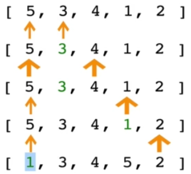

source: [JS Algorithms and Data Structures Masterclass](https://www.udemy.com/course/js-algorithms-and-data-structures-masterclass/)


source: [Python Plain English](https://python.plainenglish.io/selection-sort-examples-in-python-python-coding-c0df8a46bb60)

- It works by finding the smallest element in the array and swapping it with the first element.
- In the first loop, Compare first two value, find the small value and set the index on it and move on till find a smaller value.
- When hit the baseline, swap the first value with the smallest value that was found.
- Repeat the process with second starting point and so on till every element is sorted.
- For optimal result: if minimum is not the one to begin with, swap the two values.

##### Example of Selection Sort

```js
function selectionSort(arr) {
  for (let i = 0; i < arr.length; i++) {
    let min = i;
    for (let j = i + 1; j < arr.length; j++) {
      // comparing the current min with the next value
      console.log(i, j);
      // assign the smaller to the min
      if (arr[j] < arr[min]) {
        min = j;
      }
    }]
    // min is not the first value, swap them
    if (i !== min) {
      swap(arr, i, min);
    }
    // swap the index of the min with the first index
    let temp = arr[i];
    arr[i] = arr[min];
    arr[min] = temp;
  }
  return arr;
}
```

##### Big O of Selection Sort

- Roughly, it compares every item with every other item in the array.
- In best, average and worst case, it's O(n^2), because it consists of two nested loops
  - It compares a lot but only swaps one time at the end of the loop.
  - It's only effective when trying to minimize the number of swapping.
  - swaps only happen O(n) times and it could be useful for space complexity wise. 
<!-- NOTE very confusing one -->
#### 1.6.5. <a name='InsertionSort'></a>Insertion Sort


source: [geeksforgeeks](https://www.geeksforgeeks.org/insertion-sort/)

- It builds up the sort by gradually creating a larger left half which is always sorted.
- It takes each element and place it where it should go in the sorted half.
- The value being compared moves to the left sorted array by comparing it to the value to the left.
- It gets slower as array grows larger,

##### Example of Insertion Sort

```js
function insertionSort(arr) {
  // we already know the first is sorted
  for (let i = 1; i < arr.length; i++) {
    let currentVal = arr[i];
    let j = i - 1;
    // only compare when the value is smaller than the left
    while (j >= 0 && arr[j] > currentVal) {
      arr[j + 1] = arr[j];
      j--;
    }
    arr[j + 1] = currentVal;
  }
  return arr;
}
```

- First, pick up the second element in the array.q
- Compares the picked up element with the left one and swap it if it's needed.
- Go to next element and if it's in wrong order(or smaller), swap it with the left one.
- Repeat until the array is sorted.

##### Big O of Insertion Sort

- Worst and average case is quadratic O(n^2) when the array is completely inversed.
- Best case would be when the data is almost sorted, it's O(n) because it only swaps once.
- Best usage could be a stream of data in real time, where the items are already pretty much sorted.

#### 1.6.6. <a name='ComparingBubbleSelectionandInsertionSort'></a>Comparing Bubble, Selection and Insertion Sort

<!-- FIXME move these two visual aid after finising sorting part -->


source: [Toptal Sorting Animation](https://www.toptal.com/developers/sorting-algorithms)

| Algorithm      | Big Omega(best) | Big Theta(avg) | Big O(worst) | Space Complexity |
|----------------|-----------------|----------------|--------------|------------------|
| Bubble Sort    | O(n)            | O(n^2)         | O(n^2)       | O(1)             |
| Insertion Sort | O(n)            | O(n^2)         | O(n^2)       | O(1)             |
| Selection Sort | O(n^2)          | O(n^2)         | O(n^2)       | O(1)             |

Tested locally

|   10^5 rnd arr of int  | Bubble Sort | Selection Sort | Insertion Sort |
|:-------------------:|:-----------:|:--------------:|:--------------:|
|       Time took     |     21s     |       6s       |       3s       |


- Bubble and Insertion Sort only works well with nearly sorted data but inefficient in most scenario.
- Selection Sort doesn't work well with nearly sorted data.
- Three of them don't work well if data is scaled up.
- Space Complexities are all same because it is not creating any space(new array or object).
- Though it's inefficient compared to more complex algorithms, all in all it still works well in the small set of data.

#### 1.6.7. <a name='MergeSort'></a>Merge Sort


source: [wikipedia](https://www.wikiwand.com/en/Merge_sort)

- It also uses divide and conquer approach like quick sort.
- It's a combination of splitting, merging and sorting.
- Arrays of 0 or 1 element are always sorted.
- It works by decomposing an array into smaller arrays of 0 or 1 elements, then building up a newly sorted array(divide and conquer)

##### Merge Helper Function

- For implementing merge sort, it's useful to first implement a separated function for merging two sorted arrays.
- Given two sorted arrays, this helper function will create a new array which is also sorted, and consists of all the elements from the two arrays.
- This function should run in O(n+m) time and O(n+m) space, and should not modify the parameters passed in.

```js
function merge(arr1, arr2) {
  let result = [];
  let i = 0;
  let j = 0;
  while (i < arr1.length && j < arr2.length) {
    if (arr1[i] < arr2[j]) {
      result.push(arr1[i]);
      i++;
    } else {
      result.push(arr2[j]);
      j++;
    }
  }
  while (i < arr1.length) {
    result.push(arr1[i]);
    i++;
  }
  while (j < arr1.length) {
    result.push(arr2[j]);
    j++;
  }
  return result;
}

// or

function merge(arr1, arr2) {
  let result = [];
  while (arr1.length && arr2.length) {
    if (arr1[0] < arr2[0]) {
      result.push(arr1.shift());
    } else {
      result.push(arr2.shift());
    }
  }
  return result.concat(arr1, arr2);
} 
```

- Create an empty array, take a look at the smallest values in each input array.
- While there are still left over values:
  - If the value in the first array is SMALLER than the value in the second array, push the valaue in the first array into our results and move on to the next value in the first array.
  - If the value in the first array is LARGER than the value in the second array, push the value in the second array into our results and move on to the next value in the second array.
  - Once we finish one array, push in all remaining values from the other array.

##### Example of Merge Sort

```js
function mergeSort(arr) {
  if (arr.length <= 1) {
    return arr;
  }
  let mid = Math.floor(arr.length / 2);
  let left = mergeSort(arr.slice(0, mid));
  let right = mergeSort(arr.slice(mid));
  return merge(left, right);
}
```

- Break up the array into halves until you have arrays that are empty or have one element.
- Once you have smaller sorted arrays, merge those arrays with other sroted arrays until you have one sorted array.
- Once the array has been merged back together, return the merged/sorted array.

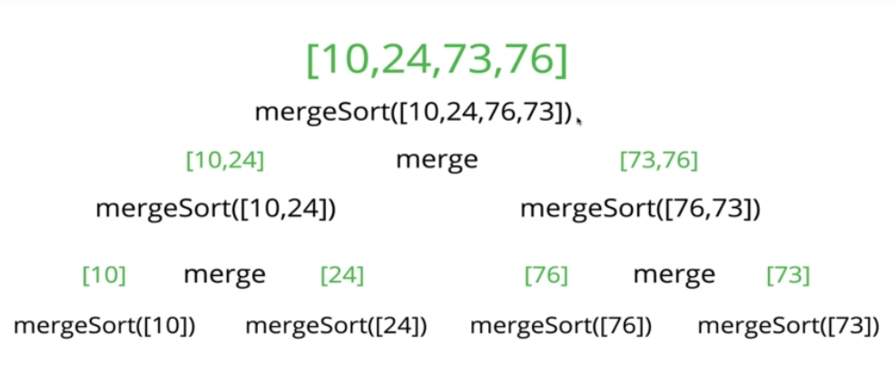

source: [JS Algorithms and Data Structures Masterclass](https://www.udemy.com/course/js-algorithms-and-data-structures-masterclass/)
##### Big O of Merge Sort

| Best       | Avg        | Worst      | Space Complexity |
|------------|------------|------------|------------------|
| O(n log n) | O(n log n) | O(n log n) | O(n)             |

- Best, average and worst case all have the same time complexity.
- No edge case, it doesn't matter if the array is sorted or not, it's still O(n log n).
- Time complexity O(n log n) comes from:
  - `merge()`, it takes O(n) as a size of array to merge grows linearly.
  - `mergeSort()`, it takes O(log n) as the size of array grows logarithmically.
- Space complexity O(n) takes linear growth of the size of the array, It doesn't work well with large data.


source: [JS Algorithms and Data Structures Masterclass](https://www.udemy.com/course/js-algorithms-and-data-structures-masterclass/)

#### 1.6.8. <a name='QuickSort'></a>Quick Sort


- First, like merge sort, it exploits the fact that arrays of 0 or 1 elements are always sorted.
- it works by selecting one element(pivot) and and finding the index where the pivot should end up in the sorted array.
- once the pivot is positionted properly, quick sort can be applied on either side of the pivot recursively.

##### Quick Sort Pivot Helper Function

- in order to implement quick sort, it's useful to first implement a function responsible for arranging elements in an array on either side of a pivot(partition).
- Given an array, this helper function should designate an element as the pivot.
  - it should then rearrange elements in the array so that all values less than the pivot are moved to the left of the pivot,
  - and all values greater than the pivot are moved to the right of the pivot.
- the order of elements on either side of the pivot doesn't matter.
- this helper function should do this in place, should not create a separated array.
- finally, this function should return the index of the pivot.

##### Picking a Pivot

- the runtime of quick sort depends in part on how one select the pivot.
- the best pivot is the median of the first, middle and last element of the array. But we still don't know the shape of the data beforehand.
  - e.g. if the array is [1, 2, 3, 4, 5, 6, 7, 8, 9, 10], the median is 5.
- for simple implementation, the first element of the data will be used as the pivot.

##### Pivot Helper Pseudocode

- It accepts three argument: an array, start index and end index.
- Grab the pivot from the start of the array.
- Store the current pivot index in a variable(this will keep track of where the pivot should end up).
- Loop through the array from the start to the end.
  - If the pivot is greater than the current element, increment the pivot index variable and then swap the current element with the element at the pivot index.
- Swap the starting element(pivot) with the pivot index.
- Return the pivot index.

##### Pivot Helper

```js
function pivot(arr, start = 0, end = arr.length + 1) {
  const swap = (arr, idx1, idx2) => {
    [arr[idx1], arr[idx2]] = [arr[idx2], arr[idx1]];
  };
  // first element as pivot
  const pivot = arr[start];
  let swapIdx = start;
  // loop while omit the first element
  for (let i = start + 1; i < arr.length; i++) {
    // compare pivot to current element
    if (pivot > arr[i]) {
      // move to next
      swapIdx++;
      swap(arr, swapIdx, i);
    }
  }
  swap(arr, start, swapIdx);
  return swapIdx;
}

const arr = [4, 8, 2, 1, 5, 7, 6, 3]
const pivotRes = pivot(arr);
// 3
```

##### Quicksort Pseudocode

- First, call the pivot helper on the array.
- When the helper returnes the index of the pivot, recursively call the pivot helper on the subarray to the left of the pivot, and the subarray to the right of the pivot.
- Base case happens when there is a subarray with less than 2 elements.

##### Quicksort Implementation

```js
function quickSort(arr, left = 0, right = arr.length - 1) {
  if (left < right) {
    // call the pivot helper to get the pivot index and save it
    let pivotIndex = pivot(arr, left, right);
    // recursively call the quick sort on the sub arrays
    // left
    quickSort(arr, left, pivotIndex - 1);
    // right
    quickSort(arr, pivotIndex + 1, right);
  }
  return arr;
}

const arr = [4, 8, 2, 1, 5, 7, 6, 3]
const qsRes = quickSort(arr);
console.log(qsRes);
// [ 1, 2, 3, 4, 5, 6, 7, 8 ]
```

##### Big O of Quick Sort

| Best Time Complexity | Average    | Worst  | Space Complexity |
|----------------------|------------|--------|------------------|
| O(n log n)           | O(n log n) | O(n^2) | O(log n)         |

```
       8
   4         12
 2   6   10      14
1  3 5 7 9  11  13  15 
```

- At best,
  - it consists of 5 decomposition O(log n) steps and each decomposition process
  - it also has a O(n) comparisons per each decomposition process, so best case is O(n log n).

```
[1, 2, 3, 4, 5, 6, 7, 8, 9, 10, 11, 12, 13, 14, 15]
1
 2
  3
   4
    5
     6
      7
       8
        9
         10
          11
           12
            13
             14
              15
```

- At worst is already sorted data,
  - in this case 1 would be the pivot, compares to every single item in the array but it's still the smallest, i.e. decomposition only returns a single item.
  - eventually each decomposition always returns only single item till the end of array.
  - then the time complexity is O(n^2), quadratic time for the worst case.
  - it occurs when pivot is min value in the array or max value in the array all the time.
  - random pivot or median pivot can solve the problem but there is a chance that next decomposition will return only single item.

***


# Data Structure

## 1. <a name='analysis-of-data-structures'></a>Analysis of Data Structures

- Data structures are collections of values, the relationships among them, and the functions or operations that canbe applied to the data.
- It's a essential for computer science and each has their own advantages and disadvantages.
- e.g.
  - For map/location data, graph would be the best data structure. (for shortest path/distance/GPS data/coordinates etc)
  - For input job for adding a value at the beginning/end of the ordered list, linked list could be the best case.
  - For scraping nested HTML, tree structure could be the best data structure.

### 1.1. <a name='before-get-started-with-javascript..'></a>Before get started with Javascript

Javascript is prototype based language and doesn't have OOP concept per se but there are some syntactic sugar for it since ES2015.

#### 1.1.1. <a name='class'></a>Class

A blueprint for creating objects with pre-defined properties and methods.

```js
// define a pattern
class Student {
  constructor(firstName, lastName, point, items) {
    this.firstName = firstName;
    this.lastName = lastName;
    this.point = point; 
    this.items = [];
  }
  // method that is.. public to the instances?
  fullName() {
    return `Full name is ${this.firstName} ${this.lastName}.`;
  }
  markPoint(n) {
    this.point += n;
    return `${this.firstName} ${this.lastName} got ${this.point} grade point.`;
  }
  addItems(item) {
    this.items.push(item);
    return `${this.firstName} got ${this.items}.`;
  }

  // utility subclass / function
  static enrollStudents(...students) {
    return `${students.length} has enrolled.`;
  }
}

// instantiate an object
let okja = new Student("Okja", "The Cute Dog", 3, "Carrot");

// okja.lastName -> "The Cute Dog"
// okja.fullName(); -> "Full name is Okja The Cute Dog." 
// okja.markPoint(-2); -> "Okja got 1 grade point."
// okja.addItems("Carrot"); -> "Okja got Carrot."
// okja.enrollStudents(okja, jongwoo); -> error
// Student.enrollStudents(okja, jongwoo); -> "2 has enrolled."
```

- The method to create new objects __must__ be called `constructor`.
- The class keyword create a constant, you can't change the structure of the class.
- Class instances are created with `new` keyword.
- `this` keyword is used to access the properties and methods of the class, it refers to the object created from that class.
- `static` keyword defines a static method or property for a class, which can be called without instantiating an object from the class and can't be called through individual instances.  [MDN static reference](https://developer.mozilla.org/en-US/docs/Web/JavaScript/Reference/Classes/static)

### 1.2. <a name='arrays'></a>Arrays


source: [educative](https://www.educative.io)

- array is a data structure that holds an ordered list of values.
- each array has a fixed number of cells decided on its creation, and each element has a unique number which is index.
  - index is a integer that start from 0, representing the position of the element in the array.
- it's the foundation for complex data structure and simple to create and yse.
- because of its linear structure, it's expensive to insert/delete values except at the end of the array.

#### 1.2.1. <a name='array-operations'></a>Array Operations

There is no guarantee that worst case specifed below is correct case because of how array performs based on various JS engines but generally it follows it.

Access

- concat(): O(n)
  - it create a new array with the union of the current array and the array passed as an argument.

- slice(): O(n)
  - it creates a new array with a portion of the current array.

Search

- indexOf(): O(n)
  - it returns the first index of the element that exists in the array, and if not exists return -1.

- filter(): O(n)
  - it creates a new array with the elements that apply the given condition.

- find(): O(n)
  - it returns the first element that apply the given condition, and if not exists return undefined.

- includes(): O(n)
  - it returns true if the element exists in the array, or it returns false.

Insertion

- push():
  - it adds a new element to the end of the array.

- unshift:
  - it adds one or more elements in the beginning of the array.
  - it's O(n) because it needs to shift all the elements in the array.

Deletion

- pop():
  - it removes the last element of the array.

- shift():
  - it removes the first element of the array.
  - it's O(n) because it needs to shift all the elements in the array.

| Array     | Avg  | Worst |
|-----------|------|-------|
| Access    | O(1) | O(1)  |
| Search    | O(n) | O(n)  |
| Insertion | O(n) | O(n)  |
| Deletion  | O(n) | O(n)  |

### 1.3. <a name='linked-list'></a>Linked List

#### 1.3.1. <a name='what-is-a-linked-list?'></a>What is a Linked List?

- A data structure that contains a head(beginning), tail(end) and length property.
- Linked lists consist of nodes(each element), and each node has a value and a pointer to another node or null.
- E.g.
  - Singly linked list has each node that is only connected to next node in one direction.
  - Double linked list has each node that is connected to next node in both direction.


source: [JS Algorithms and Data Structures Masterclass](https://www.udemy.com/course/js-algorithms-and-data-structures-masterclass/)

#### 1.3.2. <a name='comparisons-with-array'></a>Comparisons with Array

- List:
  - There is no indexes.
  - Connected via nodes with a __next__ pointer.
  - Raandom access is not possible.
  - Insertion/Deletion is cheap.
- Array:
  - Indexed in order.
  - Insertion and deletion is expensive, every node has to be re-indexed.
  - Node can be accessed quickly with a specific index.

#### 1.3.3. <a name='singly-linked-list'></a>Singly Linked List

- linked list has a pointer to the head of the list and a pointer to the tail.

##### Push

- push add a value at the end of the list.

###### Push Pseudocode

- this function should accept a value.
- create a new node using the value passed to the function.
- if there is no head property on the list, set the head and tail to be the newly created node.
- otherwise set the next property on the tail to be the new node and set the tail property on the list to be the newly created node.
- increment the length by one.
- return the linked list.

###### Push Implementation

```js
// push
class Node {
  constructor(val) {
    this.val = val;
    this.next = null;
  }
}

class SinglyLinkedList {
  constructor() {
    this.head = null;
    this.tail = null;
    this.length = 0;
  }
  push(val) {
    const newNode = new Node(val);
    if (!this.head) {
      this.head = newNode;
      this.tail = this.head;
    } else {
      this.tail.next = newNode;
      this.tail = newNode;
    }
    this.length++;
    return this;
  }
}

const list = new SinglyLinkedList()
list.push("goodbye");
list.push("cruel");
list.push("world");

consoole.log(list);
// SinglyLinkedList {
//   head: Node { val: 'goodbye', next: Node { val: 'cruel', next: [Node] } },
//   tail: Node { val: 'world', next: null },
//   length: 3
// }
```

##### Pop

- pop removes the last element of the list.

###### Pop Pseudocode

- if there are no nodes in the list, return undefined
- loop through the list until you reach the tail
- set the next property of the 2nd to last node to be null.
- set the tail to be the second to last node.
- decrement the length of the list by 1.
- return the value of the node removed.

###### Pop Implementation

```js
...SinglyLinkedList

pop() {
  if (!this.head) return undefined;
  let current = this.head;
  let newTail = current;
  while (current.next) {
    newTail = current;
    current = current.next;
  }
  this.tail = newTail;
  this.tail.next = null;
  this.length--;
  // in case list is empty
  if (this.length === 0) {
    this.head = null;
    this.tail = null;
  } 
  return current;
}

...
```

##### Shift

- shift removes a new node from the beginning of the linked list and return it.

###### Shift Pseudocode

- If there are no nodes, return undefined
- store the current head property in a variable
- update the head property to be the current head's next property
- decrement the length by 1
- return the value of the node removed

###### Shift Implementation

```js
...SingglyLinkedList
shift() {
  if (!this.head) return undefined;
  let currentHead = this.head;
  this.head = currentHead.next;
  this.length--;
  if (this.length === 0) {
    this.tail = null;
  }
  return currentHead;
} 
...
```

##### Unshift

- opposite of shift, it adds a anew node to the beginning of the linked list.

###### Unshift Pseudocode

- unshift accepts a value to be put.
- create a new node using the value passed to the function.
  - if there is no head property in the list, set the head and tail to be the newly created node.
- set the newly created node's next property to be the current head property in the list.
- set the head property on the list to be that newly created node.
- increment the length of the list by 1
- return the linked list.

###### Unshift Implementation

```js
...SinglyLinkedList
unshift() {
  let newNode = new Node(val);
  if (!this.head) {
    this.head = newNode;
    this.tail = this.head;
  } else {
    newNode.next = this.head;
    this.head = newNode;
  }
  this.length++;
  return this;
}
...
```

##### Get

- get is a method that takes a number(index) and returns the item in that position.
- i.e. it takes a number and traverse the list n times to get the item at that index.

###### Get Pseudocode

- it should take an index as a argument.
- if the index is less than 0 or greater than or equal to the length of the list, return undefined.
- loop through the list until you reach the index and return the node at that specific index.

###### Get Implementation

```js
...SinglyLinkedList
get(index) {
  if(index < 0 || index >= this.length) return undefined;
  let counter = 0;
  let current = this.head;
  while (counter !== index) {
    current = current.next;
    counter++;
  }
  return current;
}
...
```

##### Set

- method set is same as get() but it changes to the given value at the given position.

###### Set Pseudocode

- it accepts a value and an index.
- use get() to find the note at the given index.
  - if there is no node, return false.
  - else there is a node, set the node's value to be the given value and return true.
  
###### Set Implementation

```js
...SinglyLinkedList
set(index, val) {
  let foundNode = this.get(index);
  if (foundNode) {
    foundNode.val = val;
    return true;
  } 
  return false;
}
...
```

##### Insert

- similar to set(), it accepts an index and a value but it inserts the value at the given index.

###### Insert Pseudocode

- it accepts an index and a value.
- if the index is less than zero or greather than the length, return false.
- if the index is the same as the length(end of list), just use push() a new node to the end of the list.
- if the index is 0(beginning of list), just use unshift() a new node to the beginning of the list.
- else, use get() to find the node at the given index - 1 to prepare insertion.
  - set the next property on that node to be the new node.
  - set the next property on the new node to be the previous next.
- increment the length of the list by 1.
- return true.

###### Insert Implementation

```js
...SinglyLinkedList
insert(index, val) {
  if (index < 0 || index > this.length) return false;
  // double negation to return bool of true in this case
  if (index === this.length) return !!this.push(val); 
  if (index === 0) return !!this.unshift(val);

  let newNode = new Node(val);
  let prev = this.get(index-1);
  let temp = prev.next;
  newNode.next = temp;
  this.length++;
  return true;
}
...
```

##### Remove

- it's a method that removes a node from the linked list at a specific position.

###### Remove Pseudocode

- if the index is less than zero or greater than the length, return undefined.
- if the index is the same as the last(length - 1), pop the last node.
- if the index is 0 at the beginning, shift the note from the beginning of the list.
- otherwise, using get() method, access the node at the index - 1.
  - set the next property on that node to be the next of the next node.
  - decrement the length.
  - return the value of the node removed.

###### Remove Implementation

```js
...SinglyLinkedList
remove(index) {
  if (index < 0 || index >= this.length) return undefined;
  if (index === this.length - 1) return this.pop();
  if (index === 0) return this.shift();

  let prev = this.get(index - 1);
  let removed = prev.next;
  prev.next = removed.next;
  this.length--;
  return removed;
}
...
```

##### Reverse

- Opposite of traverse, it reverses the linked list by replacing heads and tails in an opposite direction.

###### Reverse Pseudocode

- swap the head and tail
- create a variable called next
- create a variable called prev
- create a variable called node and initialize it to the head property
- loop through the list
- set next to be the next property on whataever node is
- set the next property on the node to be whatever prev is
- set prev to be the value of the node variable
- set the node variable to be the value of the next variable

###### Reverse Implementation

```
// 13 -> 27 -> 32 -> 71
// (h to 27)         t

// 13 <- 27 <- 32 <- 71
// (t to 27)         h
```

```js
...SinglyLinkedList
reverse() {
  let node = this.head;
  this.head = this.tail;
  this.tail = node;

  let next;
  let prev = null;

  for (let i = 0; i < this.length; i++) {
    next = node.next;
    node.next = prev;
    prev = node;
    node = next;
  }
  return this;
}
...
```

##### Time Complexity of Singly Linked Lists

|           | Avg  | Worst        | Space Complexity |
|-----------|------|--------------|------------------|
| Insertion | O(1) | O(1)         | O(n)             |
| Removal   | O(1) | O(n)         | O(n)             |
| Searching | O(n) | O(n)         | O(n)             |
| Access    | O(n) | O(n)         | O(n)             ||                                                                     

- Insertion is constant time O(1) that doesn not depend on the size of array, it just puts the new node at the begining/end of the list and update the head/tail. 
- Removal depends on the position of target node, it takes O(1) to remove the node at the begining/end of the list and O(n) to remove the node in the middle of the list.
- Searching starts from the very beginning of the list and it checks every single node until it finds the target node, so it takes O(n) time. 
- Same goes for access, it also depends on the size of the array to reach the base case, so it takes O(n) time.
- Singly linked lists excel at __insertion__ and __deletion__ compared to array becaus there is no index.
- The idea of a list data structure that consists of head, tail and nodes is the foundation for other data structures like Stacks and Queues.


#### 1.3.4. <a name='doubly-linked-list'></a>Doubly Linked List


source: [JS Algorithms and Data Structures Masterclass](https://www.udemy.com/course/js-algorithms-and-data-structures-masterclass/)

- Almost identical to singly linked list, except every node has extra pointer to the previous node.
- Comparing to singly linked list, it takes more space(memory) but more flexible.

##### Doubly Linked List Constructor

```js
class Node {
  constructor(val) {
    this.val = val;
    this.next = null;
    this.prev = null;
  }
}

class DoublyLinkedList {
  constructor() {
    this.head = null;
    this.tail = null;
    this.length = 0;
  }
}
// Same as singly linked list but has 'prev' node
```

##### Push

- it adds a node to the end of the doubly linked list.
- it finds the tail at the end and add a next node with prev property.

###### Push Pseudocode

- Create a new node with the value passed to the function.
- If the head property is null, set the head and tail to be the newly created node.
- if not, set th next property on the tail to be that node.
- set the previous property on the newly created node to be the tail.
- set the tail to be the newly created node.
- increment the length.
- return the doubly linked list.

###### Push Implementation

```js
...DoublyLinkedList

push(val) {
    let newNode = new Node(val);
    if (this.length === 0) {
      this.head = newNode;
      this.tail = newNode;
    } else {
      this.tail.next = newNode;
      newNode.prev = this.tail;
      this.tail = newNode;
    }
    this.length++;
    return this;
  }
```

##### Pop

- it removes a node from the end of the doubly linked list and return it.

###### Pop Pseudocode

- first check if there is no head, return undefined.
- store the current tail in a variable to return later.
- if the length is 1, set the head and tail to be null
- update the tail to be the previous node.
- set the new tail's next to be null.
- decrement the length.
- return the value removed.

###### Pop Implementation

```js
pop() {
  if (!this.head) return undefined
  let poppedNode = this.tail;
  if (this.length === 1) {
    this.head = null;
    this.tail = null;
  } else {
    this.tail = poppedNode.prev;
    this.tail.next = null;
    poppedNode.prev = null;
  }
  this.length--;
  return poppedNode;
}
```

##### Shift

- it removes a node from the beginning of the doubly linked list and return it.
- it finds the head at the beginning and remove it.

###### Shift Pseudocode

- if length is 0, return undefined.
- store the current head property in a variable as an old head.
- if the length is one.
  - set the head to be null.
  - set the tail to be null.
- update the head to be the next of the old head.
- set the head's prev property to be null.
- set the old head's next to null.
- decrement the length.
- return old head.

###### Shift Implementation

```js
shift() {
  if (this.length === 0) return undefined;
  let oldHead = this.head;
  if (this.length === 1) {
    this.head = null;
    this.tail = null;
  } else {
    this.head = oldHead.next;
    // remove the connection between old head and new head
    this.head.prev = null;
    oldHead.next = null;
  }
  this.length--;
  return oldHead
}
```

##### Unshift

- It adds a node to the beginning of the doubly linked list and return the list.

###### Unshift Pseudocode

- create a new node with the value passed to the function.
- if the length is 0
  - set the head to be the new node.
  - set the tail to be the new node.
- else
  - set the prev property on the head of the list tobe the new node.
  - set the next property on the new node to be the head property.
  - set the head property to be the new node.
- increment the length.
- return the list.

###### Unshift Implementation

```js
unshift(val) {
    let newNode = new Node(val);
    if (this.length === 0) {
      this.head = newNode;
      this.tail = newNode;
    } else {
      this.head.prev = newNode;
      newNode.next = this.head;
      this.head = newNode;
    }
    this.length++;
    return this;
  }
```

##### Get

- it accesses a node in a doubly linked list by its position.
- it returns the value of the node at the position passed to the function.
- Same as get() in singly linked list, but it can start from the tail, depend on the index provided.

###### Get Pseudocode

- if index is less than 0 or greater or equal to the length, return undefined.
- if index is less than or equal to half of the length
  - loop through the list starting from the __head__ and loop towards the middle.
  - return the node once it is found.
- if index is greather than laf of the length
  - loop through the list starting from the __tail__ and loop towards the middle.
  - return the node once it is found.

###### Get Implementation

```js
get(index) {
  let count, current;
  if (index < 0 || index >= this.length) return undefined;
  if (index <= this.length / 2) {
    count = 0;
    current = this.head;
    while (count !== index) {
      current = current.next;
      count++;
    }
  } else {
    count = this.length - 1;
    current = this.tail;
    while (count !== index) {
      current = current.prev;
      count--;
    }
  }
  return current;
}
```

##### Set

- it replaces the value of a node in a doubly linked list by its position.
- it works same as get(), but it update the given value of the node at the position passed to the function.

###### Set Pseudocode

- create a variable which is the result of the get() method, at the index passed to the function.
  - if the get() returns a valid result, set the value of that node to be the given value and return true.
  - else, return false.

###### Set Implementation

```js
set(index, val) {
    let foundNode = this.get(index);
    if (foundNode) {
      foundNode.val = val;
      return true;
    }
    return false;
  }
```

##### Insert

- it adds a node in a doubly linked list by a certain position and returns the list.
- it accepts an index, value and position and it creates a anew node with that value and adds it at the position to the lengthy list.
- it uses get() to retrieve the node at the index passed to the function.

###### Insert Pseudocode

- if index is less than 0 or greater than or equal to the length, return false.
- if index is 0, unshift.
- if index is the same as the length, push.
- else, use get() to access the index -1.
  - set the next and prev properties on the correct nodes to link everything together
- increment the length.
- return true.

###### Insert Implementation

```js
insert(index, val) {
  if (index < 0 || index > this.length) return false;
  if (index === 0) return !!this.unshift(val);
  if (index === this.length) return !!this.push(val);

  let newNode = new Node(val);
  let beforeNode = this.get(index - 1);
  let afterNode = beforeNode.next;

  beforeNode.next = newNode, newNode.prev = beforeNode;
  newNode.next = afterNode, afterNode.prev = newNode;
  this.length++;
  return true;
}
```

##### Remove

- it takes an index or position as argument and removes a node in a doubly linked list on a certain position and returns the removed item.
- it works similar as get() to check the position from head or tail.

###### Remove Pseudocode

- if index is less than zero or greater than or equal to length, return undefined.
- if index is 0, shift.
- if index is the same as the length - 1, pop.
- otherwise, use get() to retrieve the item to be removed.
- update the next and prev properties to remove the found node from the list.
- set next and prev to null on the found node.
- decrement the length.
- return the removed node.

###### Remove Implementation

```js
remove(index) {
  if (index < 0 || index >= this.length) return undefined;
  if (index === 0) return this.shift();
  if (index === this.length - 1) return this.pop();
  let removedNode = this.get(index);
  // connecting in between the nodes before and after the removed node
  let beforeNode = removedNode.prev;
  let afterNode = removedNode.next;
  beforeNode.next = afterNode;
  afterNode.prev = beforeNode;
  
  // remove the connection of the target node 
  removedNode.next = null;
  removedNode.prev = null;
  this.length--;
  return removedNode;
}
```

##### Time Complexity of Doubly Linked Lists

|           | Avg  | Worst | Space Complexity |
|-----------|------|-------|------------------|
| Insertion | O(1) | O(1)  | O(n)             |
| Removal   | O(1) | O(1)  | O(n)             |
| Searching | O(n) | O(n)  | O(n)             |
| Access    | O(n) | O(n)  | O(n)             |

- Lots of cases are similar with singly linked list.
- Insertion excels with both constant O(1), singly and doubly linked list.
  - It doesn't matter where to put the value or how long the list is.
- Removal for doubly linked list is always constant, unlike traversing for same in singly linked list.
- Searching is O(n/2) -> O(n) because it starts from start or end of the list to the middle.
- Access is O(n) because it still needs to go through the whole list to find the node.

##### Comparison with singly linked list

- Doubly linked lists are almost same as singly linked list, except there is an additional pointer to previous node.
- It fits in a situation where linear backward traversal is needed as much as forward. i.e. history, re/undo, etc.
- It works better than singly linked list for finding nodes and can be done in half the time.
- It takes more (almost twice)space given the extra pointer.

### 1.4. <a name='stacks-and-queues'></a>Stacks and Queues

#### 1.4.1. <a name='stack'></a>Stack

- it is not a built-in data structure in Javascript.
- it is an abstracted collection of data that abide by LIFO data structure.
  - __LIFO__: Last In First Out i.e. last element added to the stack will be the first element removed from the stack.
  - e.g. STACKS of books, STACKS of plates and so on, as it being piled up, the last thing is what gets removed first.


source: [JS Algorithms and Data Structures Masterclass](https://www.udemy.com/course/js-algorithms-and-data-structures-masterclass/)

##### Where Stacks Are Used

- managing function invocations as call stack
- history object: undo/redo, backward/forward, routing

##### Create Stack

###### With Array

- push, pop for last and shift, unshift for first node for LIFO can be used but adding node at the beginning with array with shift/unshift is not efficient cause every rest of element need to be reindexed.
- that said, stack with array for shift/unshift might not be a good fit.

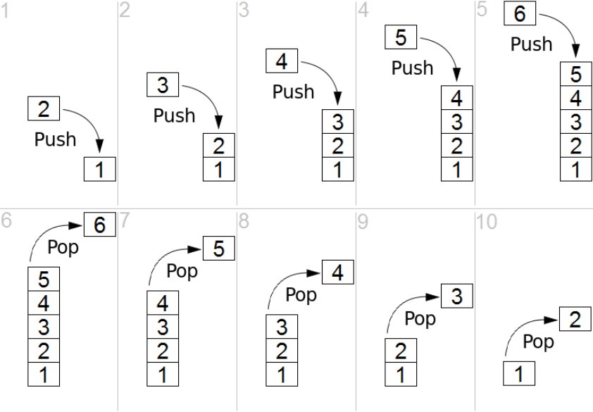

source: [wikipedia](https://www.wikiwand.com/en/Stack_(abstract_data_type))

###### With Linked List Implementation

- stack is supposed to be constant time but push/pop with array occurs traversing, thus using stack with list makes more sense in this case.
- it uses similar structure of class constructor used above.

```js
class Stack {
  constructor() {
    // unlike linked list, terms are for LIFO
    this.first = null;
    this.last = null;
    this.size = 0;
  }
}

class Node {
  constructor(value) {
    this.value = value;
    this.next = null;
  }
}
```

###### Push Pseudocode

- creeate a function push that create a node which  accept a value.
- if there are no nodes in the stack, set the first and last property to be the newly create node.
- if there is one node, create a varialble that stores the current first property on the stack.
- reset the first property to be the newly created node.
- set the next property on the node to be the previously created variable.
increment the size of the stack by 1.

```js
push(val) {
  let newNode = new Node(val);
  if (!this.first) {
    this.first = newNode;
    this.last = newNode;
  } else {
    let temp = this.first;
    this.first = newNode;
    this.first.next = temp;
  }
  return this.size++;
}
```

###### Pop Pseudocode

- if there are no nodes in the stack, return undefined.
- create a temporary variable to store the first property on the stack.
- if there is only one node, set the first and last property to be null.
- otherwise, set the first property to be the next property on the current first.
- decrement the size by 1.
- return the value of the node removed.

```js
pop() {
  if (!this.first) return undefined;
  let temp = this.first;
  if (this.first === this.last) {
    this.last = null;
  }
  this.first = this.first.next;
  this.size--;
  return temp.value;
}
```

##### Time Complexity of Stacks

|           | Average | Worst | Space Compexity |
|-----------|---------|-------|-----------------|
| Insertion | O(1)    | O(1)  | O(n)            |
| Removal   | O(1)    | O(1)  | O(n)            |
| Searching | O(n)    | O(n)  | O(n)            |
| Access    | O(n)    | O(n)  | O(n)            |

- Stack is all about insertion and removal, prioritized on mutating data at the beginning and both are constant and efficient.
- For searching/accessing, it has to start at the beginning and just traverse the entire stack one by one, so it is O(n).

#### 1.4.2. <a name='queues'></a>Queues

- it's similar to stack but with FIFO data structure.
  - __FIFO__: FIrst In First Out, i.e. first element added to the queue will be the first element removed from the queue.
  - e.g. background task, uploading resources, printing like task processing in general.
- Due to nature of FIFO, handling first elements in array with queue is more costly because of re-indexing every rest of element, thus using shift/unshift with queue is better being done in a customized class in linked list.

##### Create Queue

- Queue involves with enqueue and dequeue operations.
  - enqueue: add a new node to the end of the queue.
  - dequeue: remove the first node from the queue.

###### With Array

- First In could be done with array.unshift() and First Out could be done with array.shift() but it is inefficient because of re-indexing.

###### With Linked List Implementation

```js
class Node {
  constructor(val) {
    this.val = val;
    this.next = null;
  }
}

class Queue {
  constructor() {
    this.first = null;
    this.last = null;
    this.size = 0;
  }
}
```

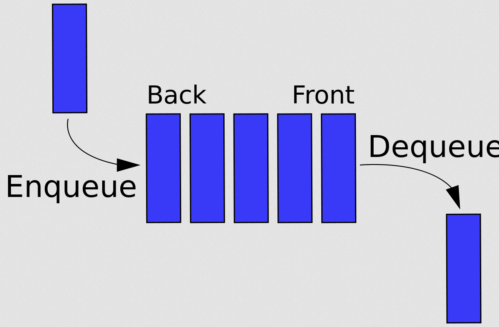

source: [wikipedia](https://www.wikiwand.com/en/Queue_(abstract_data_type))

###### Enqueue Pseudocode

- create a function enqueue that accepts a value.
- create a new node that value passed to the function.

###### Enqueue Implementation

```js
enqueue(value) {
  let newNode = new Node(val);
  if (!this.first) {
    this.first = newNode;
    this.last = newNode;
  } else {
    this.last.next = newNode;
    this.last = newNode;
  }
  return this.size++;
}
```

###### Dequeue psesudocode

- if there is no first property, just return undefined.
- store the first property in a variable.
- see if the first is the same as the last(check if there is only one node).
  - if yes, set the first and last property to be null.
  - else, set the first property to be the next property of first.
- decrement the size by 1.
- return the value of the node dequeued.

###### Dequeue Implementation

```js
// almost identical to pop() in linked list
dequeue() {
  if (!this.first) return undefined;
  let temp = this.first;
  if (this.first === this.last) {
    this.last = null;
  }
  this.first = this.first.next;
  this.size--;
  return temp.val;
}
```

##### Time Complexity of Queue

|           | Average | Worst | Space Compexity |
|-----------|---------|-------|-----------------|
| Insertion | O(1)    | O(1)  | O(n)            |
| Removal   | O(1)    | O(1)  | O(n)            |
| Searching | O(n)    | O(n)  | O(n)            |
| Access    | O(n)    | O(n)  | O(n)            |

- Like stack, Time Complexity of insertion and removal on queue is constant O(1) but it would be O(n) if array is used.
- Search and removal is O(n) because it has to start at the beginning and just traverse the entire queue one by one, it is not efficient.

### 1.5. <a name='hash-tables'></a>Hash Tables

#### 1.5.1. <a name='what-is-hash-table?'></a>What is Hash Table?

- It's often called hash maps too.
- Hash table is a data structure that stores __key-value__ pairs.
- It is like array, but the keys are not ordered.
- Unlike array, hash tables are fast for all of following:
  - finding values
  - adding new values
  - removing values
- It is widely used because of efficiency.
- It is..
  - dictionary in Python
  - objects and maps in Javascript
  - Maps in Java, Go and Scala
  - Hashes in Ruby
- It gives a human-readable representation of the data.

#### 1.5.2. <a name='hash-function'></a>Hash Function

- To impelement a hash table, array will be used in this case.
- In order to look up the value by key, keys are needed to be converted into valid array index.
  - Hash function can be performed to convert the key into valid array index.
  - It can takes a string or any type of data and converts it to number or index.

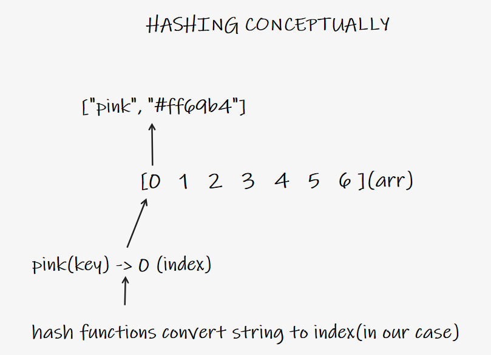

##### More of Hash Function Basics

- it's a function that takaes data of arbitrary size, and converts it to a number. e.g. hash() in python
- hashed output result cannot be reversed, key cannot be extracted from the output.
- it has to be fast in constant time for its purpose.
- it should not cluster outputs at specific indices, but distributes them evenly.
- it has to be deterministic, reproducible. same input should result same output.

##### Simple Hash Function Implementation

```js
function hash(key, arrayLength) {
  let total = 0;
  for (let char of key) {
    // a = 1, b = 2..
    let value = char.charCodeAt(0) - 96;
    // remainder of total of position num divided by length
    total = (total + value) % arrayLength;
  }
  return total;
}
```

Problems:

- it only works with strings.
- it's a function that takes a string and returns a number within array length range.
- not fast: it has a linear time complexity of array length.
- there is a collision: output's not totally random.

##### Simple Hash Function Slightly Improved Implementation

```js
function hash(key, arrayLength) {
  let total = 0;
  let WEIRD_PRIME = 31;
  for (let i = 0; i < Math.min(key.length, 100); i++) {
    let char = key[i];
    let value = char.charCodeAt(0) - 96;
    total = (total * WEIRD_PRIME + value) % arrayLength;
  }
}
```

- Prime number seed is used for reducing collisions(much less, but still happens)

[Relation between array length size of prime number and hash table implemenation](https://www.quora.com/Does-making-array-size-a-prime-number-help-in-hash-table-Implementation-Why)

- It is conditionally constant time.
- In this case, loop runs based on smaller value of length of key   or 100 for testing purpose.

##### Dealing with Collisions

- Collisions are inevitable even with greater array and prime number seed but it can be reduced via:
  - Separate chaining
    - it stores value using a more nested data structure at each index in array with an array or linked list.
    - this allows for storing multiple key-value pairs at the same index.

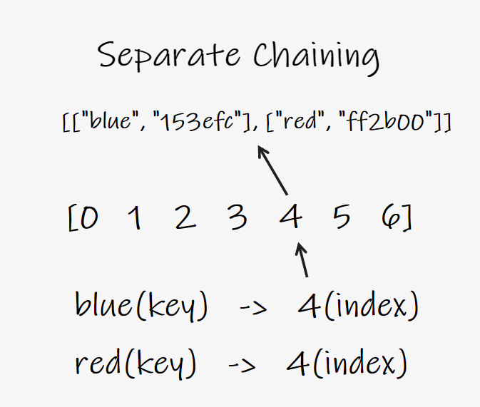

  - Linear probing
    - data is only stored at each index unlike separate chaining.;
    - when collision is found, it search through the array to find the next empty slot.
    - but it has a limitted number of key as array length.


##### Hash Table Implementation

- Hash Table class

```js
class HashTable {
  // arbitrary small size array for test
  constructor(size = 5) {
    this.keyMap = new Array(size);
  }

  _hash(key) {
    let total = 0;
    let WEIRD_PRIME = 31;
    for (let i = 0; i < Math.min(key.length, 100); i++) {
      let char = key[i];
      let value = char.charCodeAt(0) - 96;
      total = (total * WEIRD_PRIME + value) % this.keyMap.length;
    }
    return total;
  }
}
```

##### Set

- it accepts a key and a value
- it hashes the key.
- it stores the key-value pair in the hash table array via separate chaianing.

```js
set(key, value) {
  let index = this._hash(key);
  // if empty, set new array
  if (!this.keyMap[index]) {
    this.keyMap[index] = [];
  }
  // or set nested key value pair
  this.keyMap[index].push([key, value]);
  return index;
}

// intantiate hash table
let ht = new HashTable();
ht.set("Hello World", "Good World");
ht.set("color", "brown");
ht.set("name", "okgu");
ht.set("attr", "cute");

/*
ht.keyMap = [
  [
    ["Hello World", "Good World"],       -> nested array at index 0
    ["color", "brown"]
  ],
  [
    ["name", "okgu"]
  ],
  [
    ["attr", "cute"]
  ]
]
*/
```

##### Get

- it accepts a key.
- it hashes the key.
- retrieves the key-value pair in the given index(possibly more than one).
  - return the value of exact match in sub array.
- if key is not found, returns undefined.

```js
get(key) {
  let index = this._hash(key);
  if (this.keyMap[index]) {
    // traverse the array to fiind the index
    for (let i = 0; i < this.keyMap[index].length; i++) {
      // look for exact match in sub array
      if (this.keyMap[index][i][0] === key) {
        // return the value of exact match
        return this.keyMap[index][i][1];
      }
    }
  }
  return undefined;
}

// ht.get("name") -> okgu
```

#### 1.5.3. <a name='hash-table-keys-and-values-method'></a>Hash Table Keys and Values Method

- key:
  - it loops through the hash table array and returns an array of keys in the table.
  - it is unique.

- value:
  - it loops through the hash table array and returns an array of values in the table.
  - it is often not unique.

```js
values() {
  let valuesArr = [];
  for (let i = 0; i < this.keyMap.length; i++) {
    if (this.keyMap[i]) {
      for (let j = 0; j < this.keyMap[i].length; j++) {
        // filter duplicate values
        if (!valuesArr.includes(this.keyMap[i][j][1])) {
          // push each second item(value) in array into values arr
          valuesArr.push(this.keyMap[i][j][1]);
        }
      }
    }
    return valuesArr;
  }
}
```

#### 1.5.4. <a name='time-complexity-of-hash-tables'></a>Time Complexity of Hash Tables

|           | Average | Worst | Space Compexity |
|-----------|---------|-------|-----------------|
| Insertion | O(1)    | O(n)  | O(n)            |
| Removal   | O(1)    | O(n)  | O(n)            |
| Searching | O(1)    | O(n)  | O(n)            |
| Access    | O(1)    | O(n)  | O(n)            |

- Insertion, deletion and access of average and best case can be constant time of O(1), but it heavily depends on
  - how fast hash function it self is.
  - how evenly it distributes keys.
  - how suppressed collisions are.
- Hash function still heavily depends on the chracter of the data. e.g.cryptographic hash function
- Hash functions are widely researched area, it is often not recommended to writing own hash function.
- In worst case, searching value can be O(n) because it has to check every single item in the array.


source: [JS Algorithms and Data Structures Masterclass](https://www.udemy.com/course/js-algorithms-and-data-structures-masterclass/)

### 1.6. <a name='trees'></a>Trees

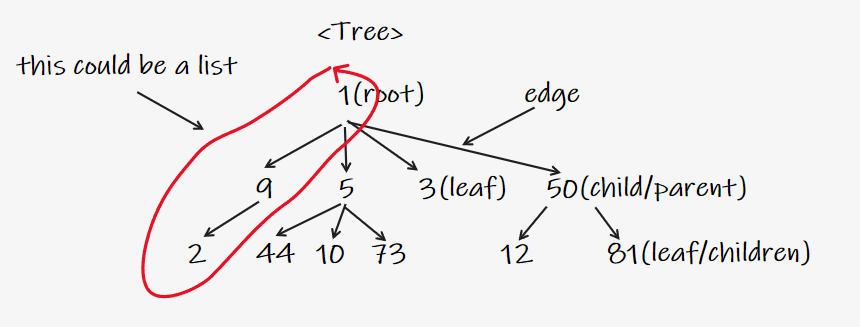

- It's a top-down data structure that consists of nodes in a parent/child relationship with branching structure.
- Unlike linear behavior in lists, trees are non-linear.
- Tree is consist of
  - root: the top node in a tree.
  - child: a node directly connected to another node when moving away from the root.
  - parent: the converse notion of a child.
  - siblings: a group of nodes with the same parent.
  - leaf: a node with no children.
  - edge: the connection between one node and another.
- Tree node can only point to the child node.
- Tree node can only have one root.

#### 1.6.1. <a name='what-is-tree-for?'></a>What is Tree For?

- Html DOM

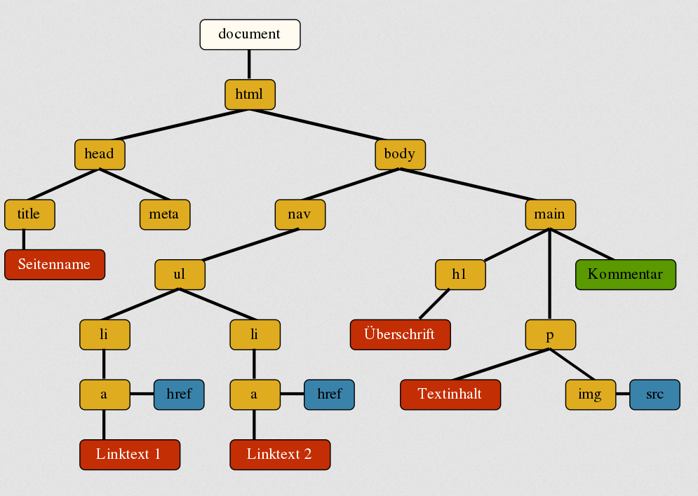

source:[SelfHTML](https://wiki.selfhtml.org/wiki/JavaScript/DOM) 

- network routing
- abstract syntax tree

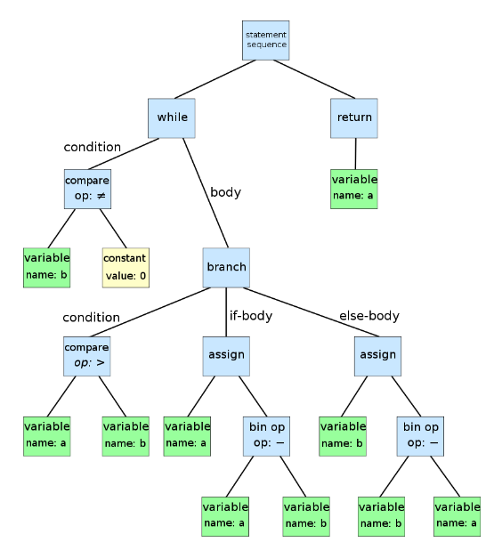

source:[wikipedia](https://www.wikiwand.com/en/Abstract_syntax_tree) 

- artificial intelligence/machine learning decision tree

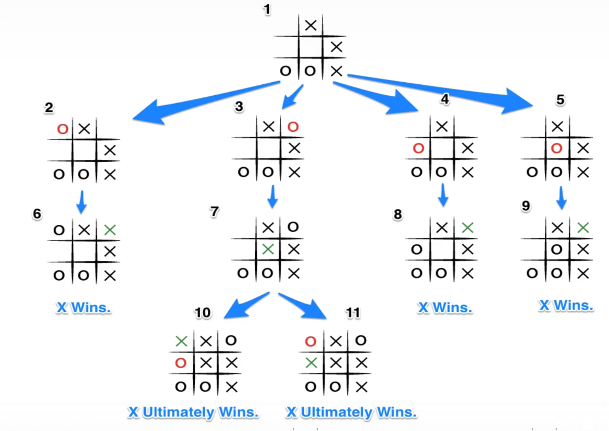

source: [DZone](https://dzone.com/articles/skps-ai-ml-dm-series-01-tic-tac-toe-using-the-mini)

- folder/directory file structure in OS


- JSON

#### 1.6.2. <a name='binary-tree'></a>Binary Tree

- it has a special condition that it can only have two children at most.(0, 1 or at most 2 children)

#### 1.6.3. <a name='binary-search-tree'></a>Binary Search Tree

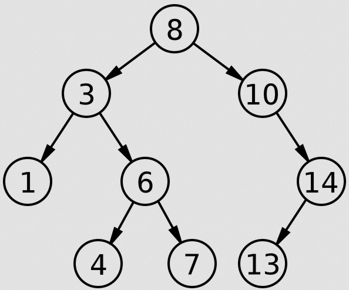

- it's similar with binaray tree but property must be kept in order.
- it is used to store data that can be compared that is sortable.
- left side of children of binary search tree are always less than the parent.
- right side of children of binary search tree are always greater than the parent.

##### Binary Search Tree Implementation

- binary search tree and node class

  ```js
  class BinarySearchTree {
    constructor() {
      this.root = null;
    }
  }

  class Node {
    constructor(value) {
      this.value = value;
      this.left = null;
      this.right = null;
    }
  }
  ```

###### insertion Pseudocode

- create a new node.
- starting at the root,
  - if no root, new node becomes the root.
  - if root, check if new node value is greater or less than the value of root.
  - if new value is greater,
    - check if there is a child node on the right
      - if there is, move to that node and repeat the process
      - if not, add that node as a right property
  - if new value is smaller,
    - check if there is a node on the left
      - if there is, move to that node and repeat the process.
      - if not, add that node as a left property.
- return the result.

###### insertion Implementation

```js
insert(value) {
  let newNode = new Node(value);
  // if no root, set root to new node
  if (this.root === null) {
    this.root = newNode;
    return this;
  } else {
    let current = this.root;
    while (true) {
      // duplicate values
      if (value === current.value) return undefined;
      // if value is less than current node, go left
      if (value < current.value) {
        if (current.left === null) {
          current.left = newNode;
          return this;
        } else {
          // if left node, set current to left node
          current = current.left;
        }
      } else {
        if (current.right === null) {
          current.right = newNode;
          return this;
        } else {
          current = current.right;
        }
      }
    }
  }
}
```

###### find Pseudocode

- start at the root.
  - check if there is root,
    - if not, return undefined.
    - if root, check if value of new node is equal to the value of root.
      - if equal, return the value of root.
      - if not, check to see if value is greater than or less than the value of the root.
        - if greater,
          - check if there is a right node.
            - if there is, move to that node and repeat the process.
        - if less,
          - check if there is a left node.
            - if there is, move to that node and repeat the process.
  - if neither, return undefined.

###### find Implementation

```js
find(value) {
  if (this.root === null) return undefined;
  let current = this.root,
    found = false;
  while (current && !found) {
    if (value < current.value) {
      current = current.left;
    } else if (value > current.value) {
      current = current.right;
    } else {
      found = true;
    }
  }
  if (!found) return undefined;
  return current;
}
```

##### Time Complexity of Binary Search Tree

|           | Average(not always)   | Worst | Space Compexity |
|-----------|-----------|-------|-----------------|
| Insertion | O(log(n)) | O(n)  | O(n)            |
| Removal   | O(log(n)) | O(n)  | O(n)            |
| Searching | O(log(n)) | O(n)  | O(n)            |
| Access    | O(log(n)) | O(n)  | O(n)            |

- In best and average case,

| n of nodes | extra step |
|------------|------------|
| 2          | 1          |
| 4          | 2          |
| 8          | 3          |

- It is not guaranteed but on average case, operations are both efficient logarithmic O(log(n)).
  - even if the data size is doubling, it only increases the number of process to insert/find by 1 if data is balanced.
  - it is not always guaranteed, it heavily depend on the shape of the tree. if tree structure resembles with one sided linked list, it could be O(n).


Sad Unbalanced Binary Tree

source: [JS Algorithms and Data Structures Masterclass](https://www.udemy.com/course/js-algorithms-and-data-structures-masterclass/)

- If the tree isn't balanced like above, operations needs to be traverse every single  node and could be O(n).

### 1.7. <a name='tree-traversal'></a>Tree Traversal

- Unlike linked list, traversing every node in tree structure is much more complicated.
- There are two ways to archieve this:
  - Breadth-first search(BFS)
    - it goes horizontally first, then vertically.
  - Depth-first search(DFS)
    - it goes vertically first, then horizontally.

#### 1.7.1. <a name='breadth-first-search'></a>Breadth-First Search

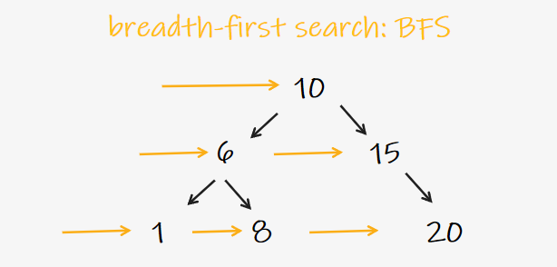

- General approach of BFS is, it looks for every sibling nodes before looking at a child node regardless of tree structure.
- In this case, it would be `[10, 6, 15, 1, 8, 20]` in order.

##### BFS Pseudocode

- initiate a queue/array and a variable to store the values of nodes visited.
- place the root node in the queue
- loop as long as there is anything in the queue
  - dequeue a node from the queue and push the value of the node into the variable that stores the node.
  - if there is a left property on the node dequeued, add it to the queue.
  - if there is a right property on the node dequeued, add it to the queue.
- return the variable that stores the node values.

##### BFS Implementation

```js
BFS() {
  let node = this.root;
  let visited = [];
  let queue = [];
  queue.push(node);

  while (queue.length) {
    node = queue.shift();
    visiited.push(node.value);
    if (node.left) queue.push(node.left);
    if (node.right) queue.push(node.right);
  }
  return visited;
}
```

#### 1.7.2. <a name='depth-first-search'></a>Depth-First Search

- It traverse nodes vertically down to the end of the tree before visiting sibling nodes.

##### DFS PreOrder


- DFS PreOrder has three steps: visit the node first, traverse to the left and then right.
- in this case, it would be `[10, 6, 1, 8, 15, 20]`.

###### DFS PreOrder Pseudocode

- create a variable to store the values of nodes visited.
- store the root of the BST in a variable called current.
- write a helper function which accepts a node
  - push the value of the node to the variable that stores the values.
  - if the node has a left property, call the helper function with the left property on the node.
  - if the node has a right property, call the helper function with the right property on the node.
- call the helper function with current variable.
- return the array of visited.

###### DFS PreOrder Implementation

```js
  DFSPreOrder() {
    // visited
    let data = [];
    let current = this.root;

    function traverse(node) {
      
      // check left and right and push to data recursively until empty
      data.push(node.value);
      if (node.left) traverse(node.left);
      if (node.right) traverse(node.right);

    }
    traverse(current);
    return data;
  }
```

##### DFS PostOrder


- it's similar with DFS PreOrder, but it traverses the left, right nodes __first__ and then visiting the node.
- root is the last node visited.
- in this case, it would be `[1, 8, 6, 20, 15, 10]`.

###### DFS PostOrder Pseudocode

- it's similar with DFS PreOrder but slightly different order in recursive helper function as it looks for left, right and the node.

###### DFS PostOrder Implementation

```js
DFSPostOrder() {
  let data = [];
  let current = this.root;
  function traverse(node) {

    if (node.left) traverse(node.left);
    if (node.right) traverse(node.right);
    data.push(node.value);

  }
  traverse(current);
  return data;
}
```

##### DFS InOrder


- It traverses the entire left side first, visit the node, and then traverse the right side.
- In this case, it would be `[1, 6, 8, 10, 15, 20]`.

###### DFS InOrder Pseudocode

- it's same pseudo code as other DFS search method except helper function, it traverse the left and push the value to the array and then traverse the right recursively.

###### DFS InOrder Implementation

```js
 DFSInOrder() {
    let data = [];
    let current = this.root;
    function traverse(node) {

      if (node.left) traverse(node.left);
      data.push(node.value);
      if (node.right) traverse(node.right);

    }
    traverse(current);
    return data;
  }
```

#### 1.7.3. <a name='bfs-or-dfs-comparison'></a>BFS or DFS Comparison

- Time complexity in general is the same.
- Space complexity could vary depend on wide or deep tree structure.
  - in wide tree, BFS could take up more space.
  - in deep tree, DFS could take up more space.
- If tree structure is sad one that looks like a one sided list, queue takes only one item at each level and space doesn't matter in this case but it's inefficient.

#### 1.7.4. <a name='dfs-variants-comparison'></a>DFS Variants Comparison

- DFS InOrder returns an ordered result.
- DFS PreOrder can be used to be exported so that it can be easily reconstructed or copied because tree structure can be replicated easily based on order.
- At the end of the day, it can be switched each other easily and result may depend on the target data structure itself.

### 1.8. <a name='graphs'></a>Graphs

- A graph data structure consists of a finite(and possibly mutable) set of vertices or nodes or points, together with a set of unordered pairs of these vertices for an undirected graph or a set of ordered pairs for a directed graph. [wikipedia](https://www.wikiwand.com/en/Graph)
- That said, it is a collection of nodes and edges(connections).


- Node position doesn't matter because there is no starting point like tree but connection between nodes is much more important.


- This graph is also valid one.
- List and tree can be a subset of graph.

#### 1.8.1. <a name='use-case-of-graphs'></a>Use Case of Graphs

- Location/Mapping
- Routing algorithms

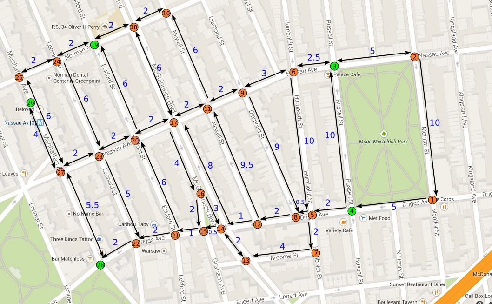

source: [Google Map](https://www.google.com/maps)

Each point of interest represents a node and routing between nodes is represented by edges.

- Visual hierarchy

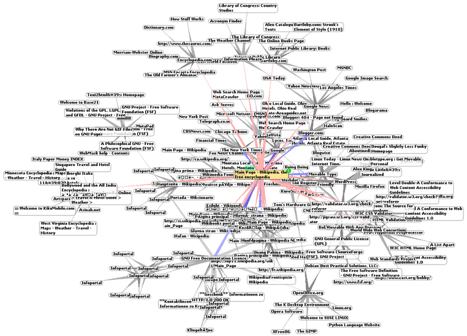

source: [wikipedia](https://www.wikiwand.com/en/Graph_drawing)

Tiny part of internet map hierarchy

- File system optimizations
- Recommendation engine
- Any structure that requires complex relationships

#### 1.8.2. <a name='terminology-of-graphs'></a>Terminology of Graphs

- vertex: a node in a graph.
- edge: a connection between two nodes.
- directed/undirected graph:
  - directed graph:
    - edges have direction or polarity.
      - e.g. instagram one-way follower graph
  - undirected graph:
    - edges have no direction or polarity, it goes either way.
      - e.g. facebook two-way friend graph
- weighted/unweighted graph:
  - unweighted graph:
    - edges have no weight. there is no information in the connection itself.
  - weighted graph:
    - edges have weight. there is a information about the connection itself.

Examples

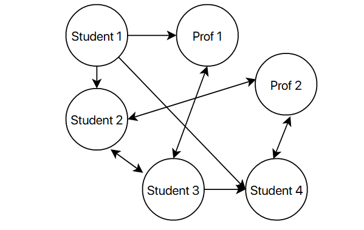

Unweighted directed graph, relationships between people

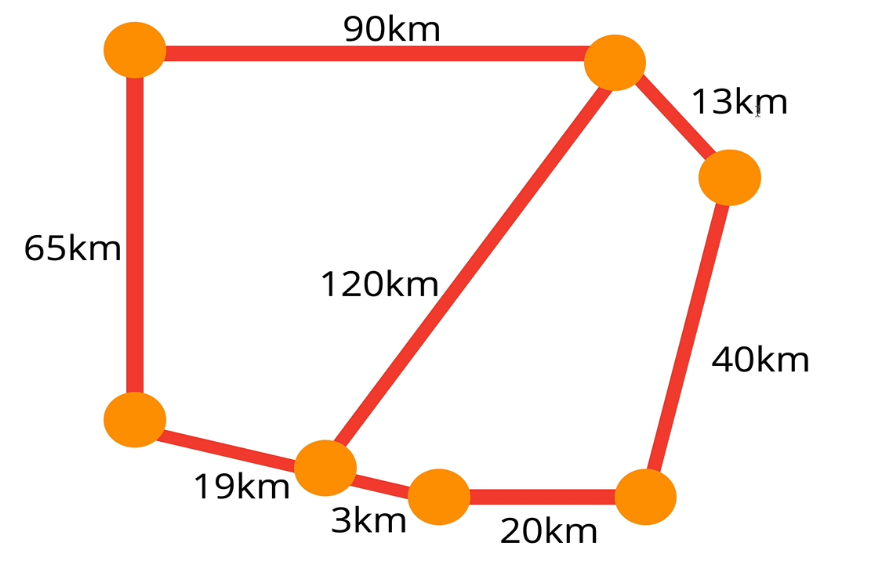

Weighted undirected graph, map

#### 1.8.3. <a name='breakdown-of-graphs'></a>Breakdown of Graphs

Adjacency matrix


- In adjacency matrix, edges are represented as a boolean in rows/columns in matrix.
  - Matrix: two dimensional structure that usually implemented with nested array

Adjacency list


- In adjacency list, data can be represented as a array based on index or hash table based on key value.

#### 1.8.4. <a name='time-complexity-of-adjacency-matrix-and-list'></a>Time Complexity of Adjacency Matrix and List

- |V|: number of vertices
- |E|: number of edges

| Operation     | Adjacency List   | Adjacency Matrix |
|---------------|------------------|------------------|
| Add vertex    | O(1)             | O(\|V^2\|)       |
| Add edge      | O(1)             | O(1)             |
| Remove Vertex | O(\|V\| + \|E\|) | O(\|V^2\|)       |
| Remove edge   | O(\|E\|)         | O(1)             |
| Query         | O(\|V\| + \|E\|) | O(1)             |
| Storage       | O(\|V\| + \|E\|) | O(\|V^2\|)       |

- Adjacency list time complexity grows more linearly depend on the number of vertices and edges because its structure - array based on index.
  - it can take less space in sparse graphs.
  - it's fster to iterate over all edges. (it skips the vertices that don't have any edges)
  - it can be slower to look u[ the specific edge.
- Adjacency matrix time complexity grows more exponentially based on the number of vertices because its structure - square matrix.
  - it doesn't matter much how many connections are in adjacency matrix.
  - it takes up more space in sparse graphs.
  - it's slower to iterate over all edges. (it looks over every single one)
  - it's faster to look up specific edge.
  - if data is sparse, don't have many edges, it's better not to use adjacency matrix.

- Real world data generally tends to be sparse(lots of node, relationship but not everything is connected), it's better to use adjacency list.
- If data is dense and relationship is strong, it's better to use adjacency matrix.

#### 1.8.5. <a name='creating-graph'></a>Creating Graph

```js
class Graph {
  constructor() {
    this.adjacencyList = {};
  }
}
```

###### Adding Vertex Pseudocode

- write a method called addVertex that accepts a name of a vertex.
- it should add a key to the adjacency list wit thhe name of the vertex and set its value to be an empty array.

###### Adding Vertex Implementation

```js
  addVertex(vertex) {
    if (!this.adjacencyList[vertex]) {
      this.adjacencyList[vertex] = [];
    }
  }
```

###### Adding Edge Pseudocode

- it should accept two vertices as argument, call it vertex1 and vertex2.
- the function should find in the adjacency list the key of vertex 1 and push vertex 2 to the array.
- it should find in the adjacency list the key of vertex2 and push vertex1 to the array.

###### Adding Edge Implementation

```js
addEdge(v1, v2) {
  this.adjacencyList[v1].push(v2);
  this.adjacencyList[v2].push(v1);
}

/*
// init
{
  "berlin": [],
  "paris": [],
  "amsterdam": [],
}

g.addEdge("berlin", "paris");

{
  "berlin": ["paris"],
  "paris": ["berlin"],
  "amsterdam": [],
}
*/
```

###### Removing Edge Pseudocode

- it should accept two vertices as v1 and v2.
- it should reassign the key of v1 to be an array that does not contain v2.
- it should reassign the key of v2 to be an array that does not contain v1.

###### Removing edge Implementation

```js
removeEdge(v1, v2) {
  this.adjacencyList[v1] = this.adjacencyList[v1].filter(
    v => v !== v2
  );
  this.adjacencyList[v2] = this.adjacencyList[v2].filter(
    v => v !== v1
  );
}
```

###### Removing Vertex Pseudocode

- it should accept a vertex to remove.
- it should loop as long as there are any other vertieces in the adjency list for that vertex.
  - inside of the loop, call removeEdge() with the vertex to remove and any values in the adjacency list for that vertex.
- delete the key in the adjacency list.

###### Removing Vertex Implementation

```js
removeVertex(vertex) {
    while (this.adjacencyList[vertex].length) {
      const adjacentVertex = this.adjacencyList[vertex].pop();
      this.removeEdge(vertex, adjacentVertex);
    }
    delete this.adjacencyList[vertex];
  }
```

### 1.9. <a name='graph-traversal'></a>Graph Traversal

- Graph traversal is a process of visiting all vertices connected to a starting vertex.
- Unlike tree with root, graph can start from anywhere, so it has to have a starting vertex.

#### 1.9.1. <a name='graph-traversal-uses'></a>Graph Traversal Uses

- Peer to peer networking
- Web crawlers
- Finding the closed matches/recommendations
- Routing for shorted path
  - GPS navigation
  - Solving mazes
  - AI for finding shortest path to win the game

#### 1.9.2. <a name='depth-first-search-graph-traversal'></a>Depth First Search Graph Traversal

1 DFS Graph Traversing based on number


2 DFS Graph Traversing alphabetically


3 DFS Graph Traversing alphabetically 


```js
// adjacency list of graph 3
{
  "A": ["B", "C"],
  "B": ["A", "D"],
  "C": ["A", "E"],
  "D": ["B", "E", "F"],
  "E": ["C", "D", "F"],
  "F": ["D", "E"],
}
```

- It priortizes deepening of the traversal rather than widening it out to the siblings in tree. (but it doesn't actually look like deepening because of shape of the graph structure..)
- It's done by following one neighbor at a time.
- It explores as far as possible down one branch before 'backtracking'.
- Order of visiting vertices can be different on situations - it can be random, it can be topological, alphabetical or any other order.
- Vertices can be removed after being traversed in the adjacency list.

##### Depth First Search Graph Recursively Pseudocode

- It should accept a starting vertex.
- Create a list to store the visited vertices.
- Create a helper function that accepts a vertex.
  - the helper function should return early if vertex is empty.
  - the helpfer function should place the vertex in the visited list.
  - loop over every neighbors for that vertex.
  - if any of the neighbors is not in the visited list, recursively call the helpfer function with that vertex.

##### Depth First Search Graph Recursively Implementation

```js
depthFirstRecursive(start) {
  const result = [];
  let visited = {};

  // context of this would change in helper function
  const adjacencyList = this.adjacencyList;

  (function dfs(vertex) {
    if (!vertex) return null;
    visited[vertex] = true;
    result.push(vertex);
    adjacencyList[vertex].forEach(neighbor => {
      if (!visited[neighbor]) {
        return dfs(neighbor);
      }
    })
  }(start)); // IIFE 

  return result;
}
```

##### Depth First Search Graph Iteratively Pseudocode

- it should accept a starting vertex.
- create a stack to help use keep track of vertices using array.
- create a list that stores the end result, to be returned at the end.
- create an object to store visited vertices.
- add the starting vertex to the stack, and mark it visited.
- while stack is not empty:
  - pop the next vertex from the stack
  - if the vertax is not visited
    - mark it as visited.
    - add it to the result list.
    - push all of its neighbors onto the stack.
- return the result array.

##### Depth First Search Graph Iteratively Implementation

```js
depthFirstIterative(start) {
  // init start at the stack and mark it as visited
  const stack = [start];
  const result = [];
  const visited = {};

  let currentVertex;
  visited[start] = true;
  while (stack.length) {
    currentVertex = stack.pop();
    result.push(currentVertex);
    // accessing neighbor
    this.adjacencyList[currentVertex].forEach(neighbor => {
      if (!visited[neighbor]) {
        // mark and push visited
        visited[neighbor] = true;
        stack.push(neighbor);
      }
    })
  }
  return result;
}
```

#### 1.9.3. <a name='breadth-first-search-graph-traversal'></a>Breadth First Search Graph Traversal

BFS Graph with height map


BFS Graph with alphabetical order


- It visites neighbors at current depth first.
- That said, it visits vertices at the same height horizontally.

##### Breadth First Search Graph Traversal Pseudocode

- it should accept a starting vertex.
- create a queue or array and initiate the starting vertex in it.
- create an array to store the verticex visited.
- create an object to store the vertices visited.
- mark the starting vertex as visited.
- while there is anything left in the queue,
  - remove the first vertex from the queue and push it into the array that stores vertices visited.
  - loop over each vertex in the adjacency list for the vertex youo are visiting.
  - if it's not inside the object that stores vertices visited, mark it as visited and enqueue the vertex.
- return the array of visited verticies.

##### Breadth First Search Graph Traversal Implementation

```js
breadthFirst(start) {
  // init start at the stack and mark it as visited
  const queue = [start];
  const result = [];
  const visited = {};
  visited[start] = true;

  let currentVertex;
  while (queue.length) {
    // remove the first vertex in the queue
    currentVertex = queue.shift();
    // and push it into result
    result.push(currentVertex);
    this.adjacencyList[currentVertex].forEach(neighbor => {
      if (!visited[neighbor]) {
        visited[neighbor] = true;
        queue.push(neighbor);
      }
    })
  }
  return result;
}
```

***

# References

* Udemy Javascript Algorithms and Data Structures Masterclass
  - https://www.udemy.com/javascript-algorithms-and-data-structures-masterclass
* Wikipedia
  - https://www.wikiwand.com/en/Fast_inverse_square_root
  - https://www.wikiwand.com/en/Binary_search_algorithm
  - https://www.wikiwand.com/en/Merge_sort
  - https://www.wikiwand.com/en/Stack_(abstract_data_type)
  - https://www.wikiwand.com/en/Queue_(abstract_data_type)
  - https://www.wikiwand.com/en/Abstract_syntax_tree
  - https://www.wikiwand.com/en/Graph
  - https://www.wikiwand.com/en/Graph_drawing
* Kheri
  - https://kheri.net/binary-search-algorithm-java-example
* Geeksforgeeks
  - https://www.geeksforgeeks.org/insertion-sort
* Visualgo: Visualization/animation of various algorithm and data structure methods
  - https://visualgo.net/en/sorting
* Freecodecamp
* Learn From Examples: LFX
* Diagram/pictures without source is self made